# Twitter Timeline Export

## Entry 1
### Policy Tensor
- Username: @policytensor
- Tweet ID: `2064280559702909010`
- Date: [2026-06-09 09:36 UTC](https://x.com/policytensor/status/2064280559702909010)

An Equilibrium Model of Counter-Base War in the Western Pacific, by @policytensor https://t.co/DOAYbvr7zF https://t.co/MoVdZY0mmL

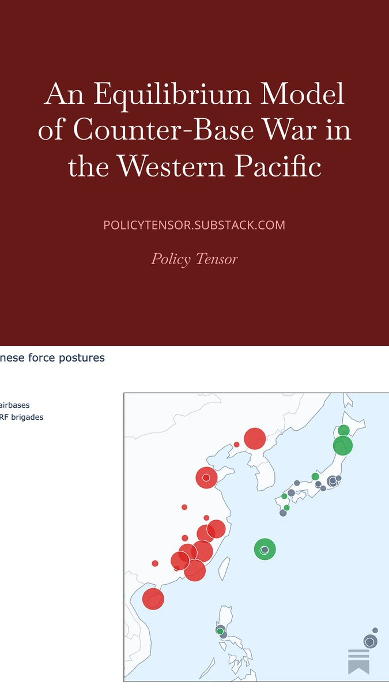

---

## Entry 2
### Policy Tensor
- Username: @policytensor
- Tweet ID: `2063717503872737422`
- Date: [2026-06-07 20:19 UTC](https://x.com/policytensor/status/2063717503872737422)

This is what I meant. It looks very much like they used Khorramshahr missiles with submunitions warhead in an apron attack on Ramat David Air Base.

**Quoted Forward:**
> ### Policy Tensor
> - Username: @policytensor
> - Tweet ID: `2063095712720605485`
> - Date: [2026-06-06 03:08 UTC](https://x.com/policytensor/status/2063095712720605485)
> 
> One is getting the sense that the Iranians will soon conclude that their self-imposed restraints are counterproductive, allowing the US to continue its salami tactics.
> 

---

## Entry 3
### Policy Tensor
- Username: @policytensor
- Tweet ID: `2063715427809743339`
- Date: [2026-06-07 20:11 UTC](https://x.com/policytensor/status/2063715427809743339)

RT @S_Mahendrarajah: Promises made, promises kept
5th wave launched… https://t.co/sdxu7uaXGw

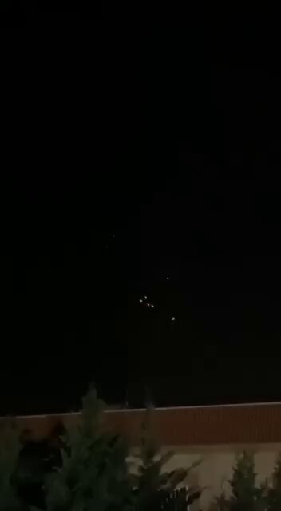

**Reposted:**
> ### Shivan Mahendrarajah
> - Username: @S_Mahendrarajah
> - Tweet ID: `2063706797773303829`
> - Date: [2026-06-07 19:36 UTC](https://x.com/S_Mahendrarajah/status/2063706797773303829)
> 
> Promises made, promises kept
> 5th wave launched… https://t.co/sdxu7uaXGw
> 
> 
> 
> **Quoted Forward:**
> > ### IRIB (Islamic Republic of Iran Broadcasting)
> > - Username: @iribnews_irib
> > - Tweet ID: `2062272446724477109`
> > - Date: [2026-06-03 20:37 UTC](https://x.com/iribnews_irib/status/2062272446724477109)
> > 
> > 🚨 BREAKING
> > Araghchi: In the event of any attack on Beirut, Iran's military forces will attack Israel.
> > 

---

## Entry 4
### Policy Tensor
- Username: @policytensor
- Tweet ID: `2063708247274684906`
- Date: [2026-06-07 19:42 UTC](https://x.com/policytensor/status/2063708247274684906)

(1) Markets have delivered a 50bps tightening since the war. This will continue to climb as long as Hormuz remains closed. One can read this from the 2Y-3mo term spread. 

(2) Cyclical growth expectations have fallen. This is suggested by the 10Y-2Y term spread.

(3) But risk https://t.co/fEhDQ8CU55

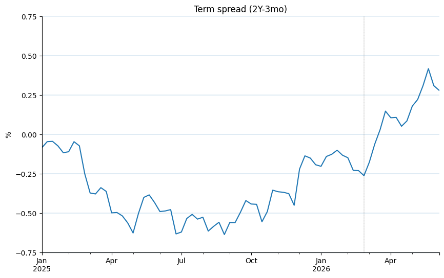
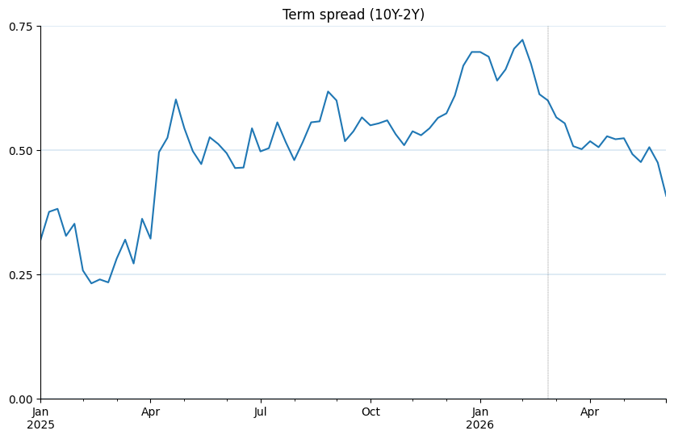
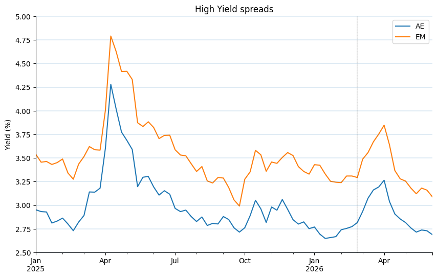

---

## Entry 5
### Policy Tensor
- Username: @policytensor
- Tweet ID: `2063712949307322814`
- Date: [2026-06-07 20:01 UTC](https://x.com/policytensor/status/2063712949307322814)

Same risk appetite signal in the dollar index. Tight during the war. Totally crashed on the day of the ceasefire. https://t.co/2ZlfdOfWAX

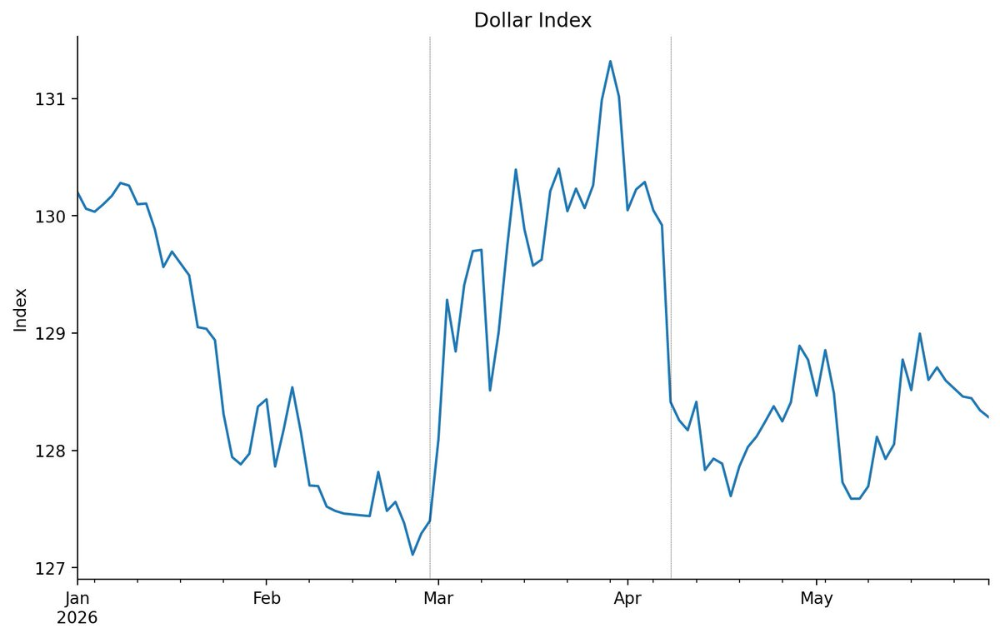

---

## Entry 6
### Policy Tensor
- Username: @policytensor
- Tweet ID: `2063713892191162418`
- Date: [2026-06-07 20:05 UTC](https://x.com/policytensor/status/2063713892191162418)

By risk appetite, I mean the risk appetite of US securities broker-dealers; roughly, how much they are juicing the machine. The wager of the claim is that when this data is updated, we'll find the graph rise significantly above the already high level in 2025Q4. https://t.co/D1HdXbCkQ6

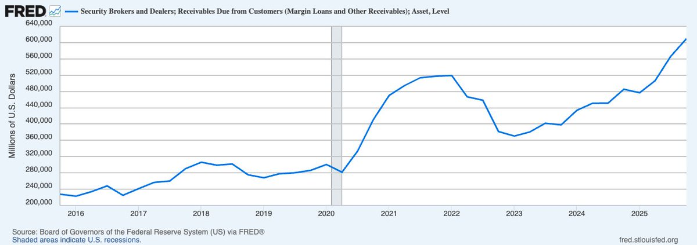

---

## Entry 7
### Policy Tensor
- Username: @policytensor
- Tweet ID: `2063518139300581391`
- Date: [2026-06-07 07:07 UTC](https://x.com/policytensor/status/2063518139300581391)

The problem with our military policy cannot be solved without the correct Iran policy. At a minimum, said policy must recognize Iranian power. We need to repurpose the quartet as the diluter of that power in a regional six power framework. Both Iran and Israel need regional

---

## Entry 8
### Policy Tensor
- Username: @policytensor
- Tweet ID: `2063521010695966936`
- Date: [2026-06-07 07:18 UTC](https://x.com/policytensor/status/2063521010695966936)

It is in the US interest to leave the Middle East. This would be a rationalization of the Middle East RSC. If we are nowhere close to this understanding of our interests it is bc of extra-rational rigidities of political economy.  The lobby and the Blob and all the rest of it.

---

## Entry 9
### Policy Tensor
- Username: @policytensor
- Tweet ID: `2063546990982533418`
- Date: [2026-06-07 09:01 UTC](https://x.com/policytensor/status/2063546990982533418)

By quartet, I mean the Saudi-engineered concert of the Sunni powers.

---

## Entry 10
### Policy Tensor
- Username: @policytensor
- Tweet ID: `2063544135844282391`
- Date: [2026-06-07 08:50 UTC](https://x.com/policytensor/status/2063544135844282391)

Dunno. Look more like casualties of elite overproduction.

**Quoted Forward:**
> ### Assal Rad
> - Username: @AssalRad
> - Tweet ID: `2062948723240673547`
> - Date: [2026-06-05 17:24 UTC](https://x.com/AssalRad/status/2062948723240673547)
> 
> A professor in the U.S. was suspended for mentioning Palestinians, just days after Hasan Piker was barred from the UK for condemning a genocide.
> 
> Your rights are being stripped away in service of Israel’s impunity. https://t.co/N6iB8g1L7j
> 
> 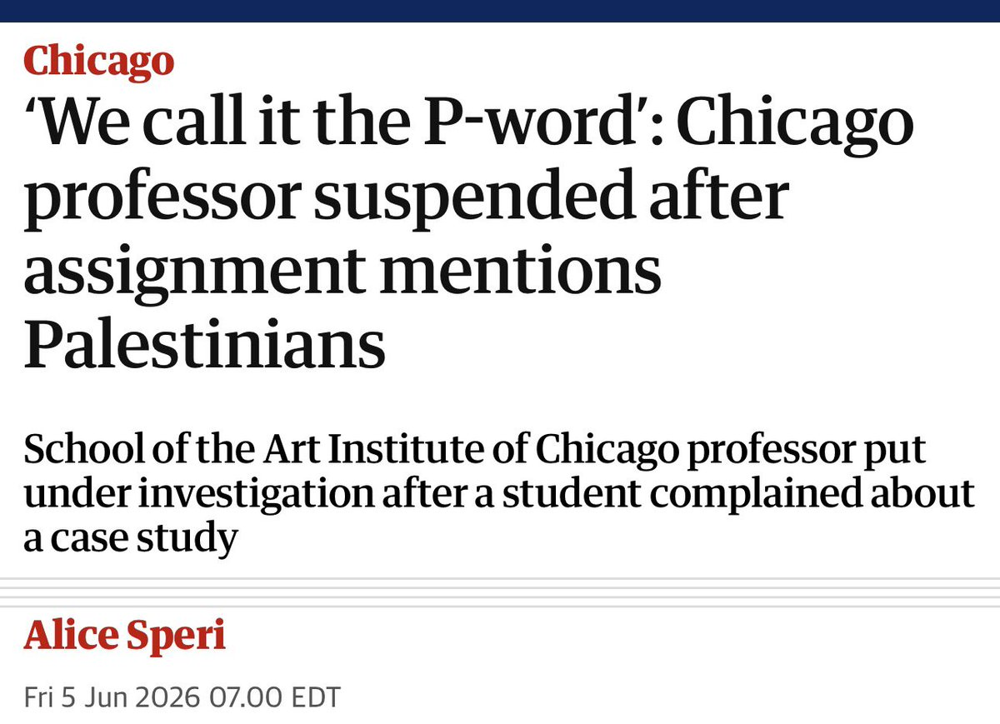
> 

---

## Entry 11
### Policy Tensor
- Username: @policytensor
- Tweet ID: `2063543576294781314`
- Date: [2026-06-07 08:48 UTC](https://x.com/policytensor/status/2063543576294781314)

Dunno man. Money is fungible. Does it really matter if the US has to hand out 100 to give Iran 20? Sounds to me like the most American way of saving face.

**Quoted Forward:**
> ### Murtaza Hussain
> - Username: @MazMHussain
> - Tweet ID: `2063536706712728060`
> - Date: [2026-06-07 08:21 UTC](https://x.com/MazMHussain/status/2063536706712728060)
> 
> This would result in the continuation of the war indefinitely and the infliction of much more damage beyond a point that is even recoverable. This is another attempt to compel the Arab countries one way or another to remain the permanent front line of an Israeli-US war against
> 

---

## Entry 12
### Policy Tensor
- Username: @policytensor
- Tweet ID: `2063541936040923140`
- Date: [2026-06-07 08:41 UTC](https://x.com/policytensor/status/2063541936040923140)

Um, Neanderthals are the original northern population. There is no evidence of any northern population eating insects. It is entirely a tropical phenomenon.  

“A new genomic study from Spain’s Institute of Evolutionary Biology analyzed dental calculus (tartar) from 745 ancient

**Quoted Forward:**
> ### Owen Lewis
> - Username: @is_OwenLewis
> - Tweet ID: `2063405822781313129`
> - Date: [2026-06-06 23:40 UTC](https://x.com/is_OwenLewis/status/2063405822781313129)
> 
> Sources: https://t.co/GRUHqJ1y1D
> 
> https://t.co/np13FUMxQC
> 

---

## Entry 13
### Policy Tensor
- Username: @policytensor
- Tweet ID: `2063538433365004452`
- Date: [2026-06-07 08:27 UTC](https://x.com/policytensor/status/2063538433365004452)

RT @DalrympleWill: Congratulations @SamDalrymple123! 
"Eight works of non-fiction and eight novels have been shortlisted for the 2026 Orwel…

**Reposted:**
> ### William Dalrymple
> - Username: @DalrympleWill
> - Tweet ID: `2062621626521313789`
> - Date: [2026-06-04 19:44 UTC](https://x.com/DalrympleWill/status/2062621626521313789)
> 
> Congratulations @SamDalrymple123! 
> "Eight works of non-fiction and eight novels have been shortlisted for the 2026 Orwell Prize" https://t.co/ChsfnCXgrV
> 

---

## Entry 14
### Policy Tensor
- Username: @policytensor
- Tweet ID: `2063538306416026052`
- Date: [2026-06-07 08:27 UTC](https://x.com/policytensor/status/2063538306416026052)

Recall @HamidRezaAz telling us that the Iranians think their position is being eroded. But perhaps Pape’s point is structural. Iran’s power grows as the noose tightens. Time is Iran’s great power ally. Although, if they do not know it does it matter?

**Quoted Forward:**
> ### Robert A. Pape
> - Username: @ProfessorPape
> - Tweet ID: `2063233711760343466`
> - Date: [2026-06-06 12:17 UTC](https://x.com/ProfessorPape/status/2063233711760343466)
> 
> US- Iran strikes are escalating beyond isolated violations of a ceasefire 
> 
> Iran hitting US military bases and their host countries, US trying to blunt the strikes 
> 
> This is a pressure campaign against Gulf states that will grow as oil inventories run dry
> 
> Iran’s leverage grows https://t.co/yJGPvLEqhb
> 
> 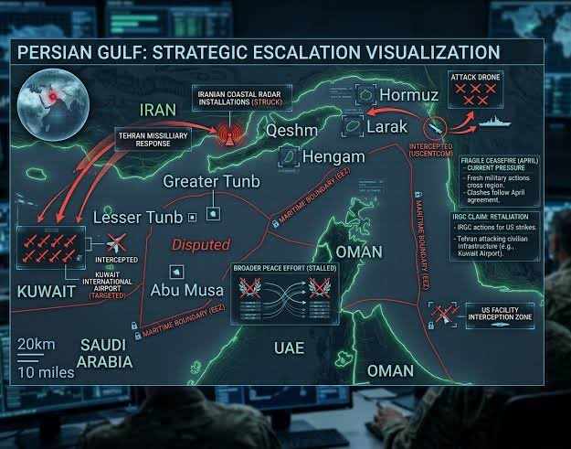
> 

---

## Entry 15
### Policy Tensor
- Username: @policytensor
- Tweet ID: `2063537339708711108`
- Date: [2026-06-07 08:23 UTC](https://x.com/policytensor/status/2063537339708711108)

The strangest of things.

**Quoted Forward:**
> ### Javier Blas
> - Username: @JavierBlas
> - Tweet ID: `2063499844174410049`
> - Date: [2026-06-07 05:54 UTC](https://x.com/JavierBlas/status/2063499844174410049)
> 
> 100 days of US-Iran war
> 
> But oil is below $100
> 

---

## Entry 16
### Policy Tensor
- Username: @policytensor
- Tweet ID: `2063534764691243295`
- Date: [2026-06-07 08:13 UTC](https://x.com/policytensor/status/2063534764691243295)

RT @uncleTomat0: 中日韩眼中的对方……哈哈哈🤣 https://t.co/1ZlPS9yQ07

**Reposted:**
> ### 番茄大叔🇨🇳
> - Username: @uncleTomat0
> - Tweet ID: `2063269529447551141`
> - Date: [2026-06-06 14:39 UTC](https://x.com/uncleTomat0/status/2063269529447551141)
> 
> 中日韩眼中的对方……哈哈哈🤣 https://t.co/1ZlPS9yQ07
> 
> 
> 

---

## Entry 17
### Policy Tensor
- Username: @policytensor
- Tweet ID: `2063534468552425815`
- Date: [2026-06-07 08:12 UTC](https://x.com/policytensor/status/2063534468552425815)

RT @keithdorejel: Haha what a loser https://t.co/vFXV4AC8Z4

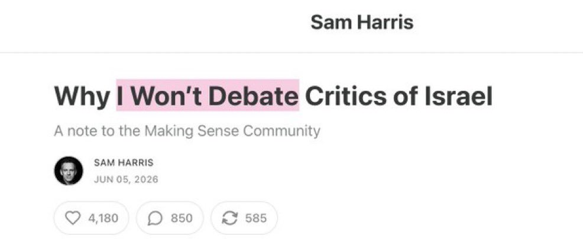

**Reposted:**
> ### Keith Orejel
> - Username: @keithdorejel
> - Tweet ID: `2063464443032285623`
> - Date: [2026-06-07 03:33 UTC](https://x.com/keithdorejel/status/2063464443032285623)
> 
> Haha what a loser https://t.co/vFXV4AC8Z4
> 
> 
> 

---

## Entry 18
### Policy Tensor
- Username: @policytensor
- Tweet ID: `2063534270962884745`
- Date: [2026-06-07 08:11 UTC](https://x.com/policytensor/status/2063534270962884745)

RT @phenomenalworld: “I do think there is justification for saying this is an empire on suicide watch: the leadership at the center is acti…

**Reposted:**
> ### Phenomenal World
> - Username: @phenomenalworld
> - Tweet ID: `2063268920262377862`
> - Date: [2026-06-06 14:36 UTC](https://x.com/phenomenalworld/status/2063268920262377862)
> 
> “I do think there is justification for saying this is an empire on suicide watch: the leadership at the center is actively undermining the very foundations of American power.”
> 
> An interview with Herman Mark Schwartz. 
> 
> https://t.co/ArPFmffTrB https://t.co/9Lm3ztr6rI
> 
> 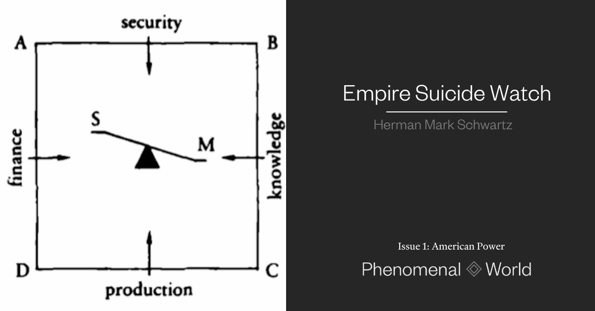
> 

---

## Entry 19
### Policy Tensor
- Username: @policytensor
- Tweet ID: `2063532893092073919`
- Date: [2026-06-07 08:05 UTC](https://x.com/policytensor/status/2063532893092073919)

There is no four year masters program for film at NYU.

**Quoted Forward:**
> ### Hollywood Gadfly
> - Username: @Hwdgfly
> - Tweet ID: `2063284782507704344`
> - Date: [2026-06-06 15:40 UTC](https://x.com/Hwdgfly/status/2063284782507704344)
> 
> Hollywood’s favorite story: the broke outsider who self-financed an $80k movie on credit cards.
> 
> The receipts: a ~$1M elite education, $330k+ in grants on her prior film, and a father - a Chinese real-estate and equity investor - credited as an executive producer.
> 
> I call it https://t.co/sRE69kLatj
> 
> 
> 

---

## Entry 20
### Policy Tensor
- Username: @policytensor
- Tweet ID: `2063527709154726327`
- Date: [2026-06-07 07:45 UTC](https://x.com/policytensor/status/2063527709154726327)

At no point is the great man theory less persuasive than when an outlaw president delivers on the loudest demands of established foreign policy elites. The continuities kill the exceptionalism claim.

**Quoted Forward:**
> ### Brandon Weichert
> - Username: @WeTheBrandon
> - Tweet ID: `2063495665406124194`
> - Date: [2026-06-07 05:37 UTC](https://x.com/WeTheBrandon/status/2063495665406124194)
> 
> Brent Johnson makes a fatal mistake that many of us made during COVID: that Trump is playing 5D chess. It’s all part of a plan. It’s not. The president isn’t a planner. He’s a kinetic operator. And he’s shat the bed in Iran. That’s all. This thing will go upside down fast because
> 

---

## Entry 21
### Policy Tensor
- Username: @policytensor
- Tweet ID: `2063526724680163691`
- Date: [2026-06-07 07:41 UTC](https://x.com/policytensor/status/2063526724680163691)

Until China makes ten times as many as Taiwan. You see how that works?

**Quoted Forward:**
> ### Jojje Olsson
> - Username: @jojjeols
> - Tweet ID: `2063154163501109513`
> - Date: [2026-06-06 07:00 UTC](https://x.com/jojjeols/status/2063154163501109513)
> 
> Palmer Luckey suggests that "Taiwan should be making 10 times more weapons than it needs for itself, which would be good for the economy, international relations, and its own weapons stockpiles." https://t.co/9TBSyst4G5
> 

---
