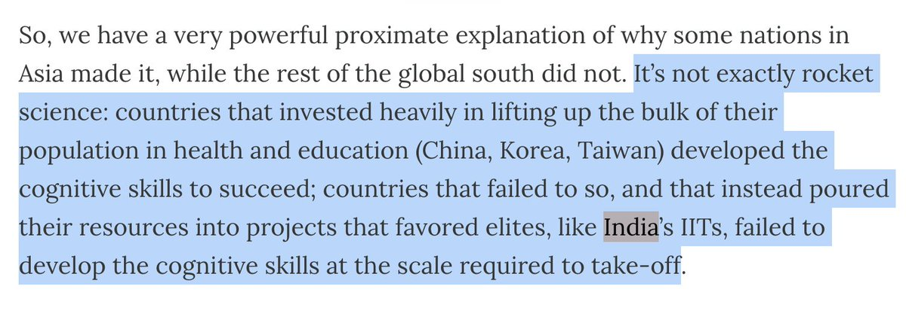
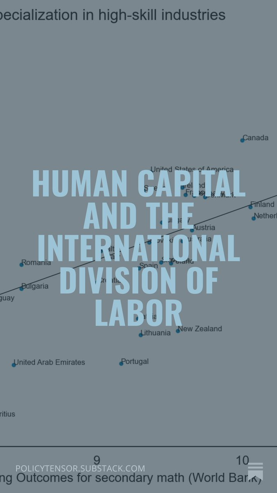
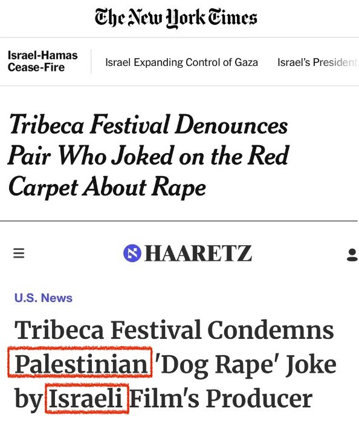
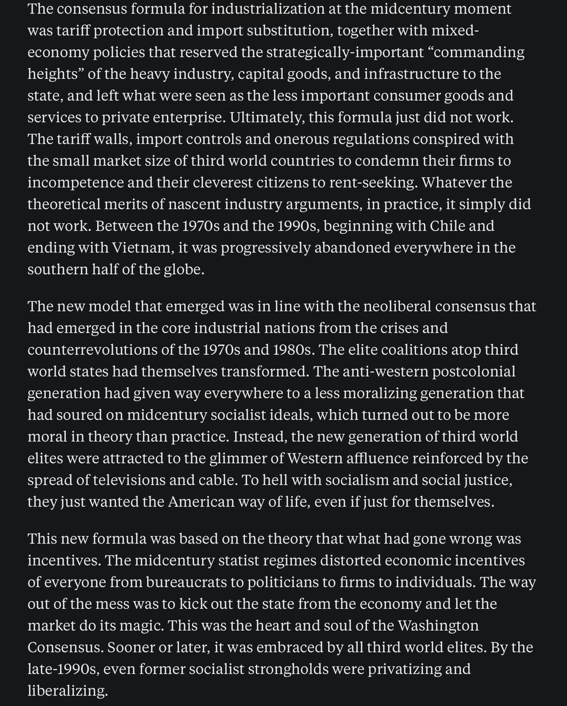
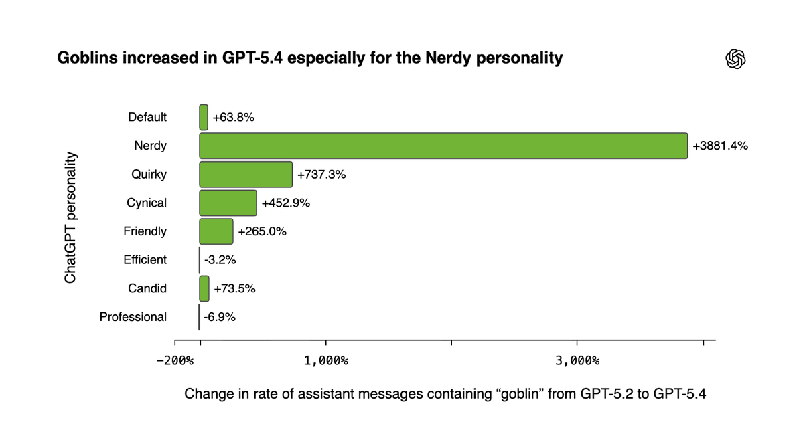

# Twitter Timeline Export

## Entry 1
### Policy Tensor
- Username: @policytensor
- Tweet ID: `2064280559702909010`
- Date: [2026-06-09 09:36 UTC](https://x.com/policytensor/status/2064280559702909010)

An Equilibrium Model of Counter-Base War in the Western Pacific, by @policytensor https://t.co/DOAYbvr7zF https://t.co/MoVdZY0mmL

---

## Entry 2
### Policy Tensor
- Username: @policytensor
- Tweet ID: `2064229085241393276`
- Date: [2026-06-09 06:12 UTC](https://x.com/policytensor/status/2064229085241393276)

Why do you think @grok that “Haha” is Filipino? https://t.co/wc3j58b798

**Quoted Forward:**
> ### Policy Tensor
> - Username: @policytensor
> - Tweet ID: `2064159229372445094`
> - Date: [2026-06-09 01:34 UTC](https://x.com/policytensor/status/2064159229372445094)
> 
> @KtunaxaAmerika @AngelicaOung Haha!
> 

---

## Entry 3
### Policy Tensor
- Username: @policytensor
- Tweet ID: `2064226383388156175`
- Date: [2026-06-09 06:01 UTC](https://x.com/policytensor/status/2064226383388156175)

Can’t suppress the air defenses then? This is neither drones nor ballistic missiles holding these choppers at risk. Could be snipers, machine guns, artillery, or, most likely, surface-to-air missiles. Whatever the weapon, we have denial.

**Quoted Forward:**
> ### Al Jazeera English
> - Username: @AJEnglish
> - Tweet ID: `2064203276199903626`
> - Date: [2026-06-09 04:29 UTC](https://x.com/AJEnglish/status/2064203276199903626)
> 
> A flight crew has been safely rescued after a US military Apache attack helicopter went down near the Strait of Hormuz, US media has reported, citing two people briefed on the incident.
> 
> 🔴 LIVE updates: https://t.co/OInPvcZzaQ https://t.co/wN53XHiQme
> 
> 
> 

---

## Entry 4
### Policy Tensor
- Username: @policytensor
- Tweet ID: `2064221915594543506`
- Date: [2026-06-09 05:43 UTC](https://x.com/policytensor/status/2064221915594543506)

RT @KtunaxaAmerika: @policytensor @AngelicaOung Behave! 🙃 https://t.co/sOcQiMBqmV

**Reposted:**
> ### Noa Kt 🇺🇸
> - Username: @KtunaxaAmerika
> - Tweet ID: `2064156346052956424`
> - Date: [2026-06-09 01:23 UTC](https://x.com/KtunaxaAmerika/status/2064156346052956424)
> 
> @policytensor @AngelicaOung Behave! 🙃 https://t.co/sOcQiMBqmV
> 
> 
> 

---

## Entry 5
### Policy Tensor
- Username: @policytensor
- Tweet ID: `2064210033114579180`
- Date: [2026-06-09 04:56 UTC](https://x.com/policytensor/status/2064210033114579180)

There is no escaping the instability of the spelling of my last name. @SamDalrymple123 uses “Faruqi.” Personally, even though my family uses Farooqui, I think @BjoernGehrmann’s spelling, Farooqi is probably best because it is closest to the sound: fah-roo-kee. https://t.co/V7YhM1iTwc

**Quoted Forward:**
> ### Bjoern Gehrmann
> - Username: @BjoernGehrmann
> - Tweet ID: `2064019893897281913`
> - Date: [2026-06-08 16:21 UTC](https://x.com/BjoernGehrmann/status/2064019893897281913)
> 
> The „Farooqi critique“ of @DAcemogluMIT et al. 👇
> 

---

## Entry 6
### Policy Tensor
- Username: @policytensor
- Tweet ID: `2064199584281182481`
- Date: [2026-06-09 04:15 UTC](https://x.com/policytensor/status/2064199584281182481)

Don’t give the Israelis ideas. They might be feeling expansive about their harebrained Yinon idea.

**Quoted Forward:**
> ### Carl Worker
> - Username: @carlworker
> - Tweet ID: `2064082365677547733`
> - Date: [2026-06-08 20:29 UTC](https://x.com/carlworker/status/2064082365677547733)
> 
> That should set the cat among the pigeons. One obvious caveat is “As long as it lasts”, given the succession challenge in a system like China’s.
> 

---

## Entry 7
### Policy Tensor
- Username: @policytensor
- Tweet ID: `2064197631761424751`
- Date: [2026-06-09 04:07 UTC](https://x.com/policytensor/status/2064197631761424751)

RT @arun_42: This is a central thesis of Ashoka Mody's book. 

The health &amp; education divide in India becomes extremely apparent on the gro…

**Reposted:**
> ### Arun Jadhav (ಅರುಣ್ ಜಾಧವ್)
> - Username: @arun_42
> - Tweet ID: `2064192320363446457`
> - Date: [2026-06-09 03:46 UTC](https://x.com/arun_42/status/2064192320363446457)
> 
> This is a central thesis of Ashoka Mody's book. 
> 
> The health &amp; education divide in India becomes extremely apparent on the ground. 
> 
> The well off teens are going places but the cognitive abilities of a 30yo who was left behind in terms of education &amp; health is well below that of https://t.co/skcqh7Rpv4
> 
> 
> 
> **Quoted Forward:**
> > ### Policy Tensor
> > - Username: @policytensor
> > - Tweet ID: `2064090724849660323`
> > - Date: [2026-06-08 21:02 UTC](https://x.com/policytensor/status/2064090724849660323)
> > 
> > The international division of labor is the great polarizer of the world. Everyone wants to climb the ladder. The big question is how? How could poor nations overcome the entrenched advantages of the rich nations and grab a share of the high-skill work? https://t.co/tMLkfVQnAP
> > 
> > 
> > 

---

## Entry 8
### Policy Tensor
- Username: @policytensor
- Tweet ID: `2064194512012902870`
- Date: [2026-06-09 03:54 UTC](https://x.com/policytensor/status/2064194512012902870)

RT @TheStalwart: An argument you hear about slowing any AI development is basically, "Well then China will race ahead". But if you believe…

**Reposted:**
> ### Joe Weisenthal
> - Username: @TheStalwart
> - Tweet ID: `2064182842452762727`
> - Date: [2026-06-09 03:08 UTC](https://x.com/TheStalwart/status/2064182842452762727)
> 
> An argument you hear about slowing any AI development is basically, "Well then China will race ahead". But if you believe the American AI community (particularly Anthropic) China is where it's at (in large part) because it can draft off of American progress.
> 

---

## Entry 9
### Policy Tensor
- Username: @policytensor
- Tweet ID: `2064194274044887159`
- Date: [2026-06-09 03:54 UTC](https://x.com/policytensor/status/2064194274044887159)

RT @AssalRad: Compare these two headlines. You think @nytimes left out those details on accident? https://t.co/JsMbP7WPZj

**Reposted:**
> ### Assal Rad
> - Username: @AssalRad
> - Tweet ID: `2064174641497956397`
> - Date: [2026-06-09 02:35 UTC](https://x.com/AssalRad/status/2064174641497956397)
> 
> Compare these two headlines. You think @nytimes left out those details on accident? https://t.co/JsMbP7WPZj
> 
> 
> 

---

## Entry 10
### Policy Tensor
- Username: @policytensor
- Tweet ID: `2064192959965171839`
- Date: [2026-06-09 03:48 UTC](https://x.com/policytensor/status/2064192959965171839)

Yes, the onus is clearly on the working-class Black kid he met to kick his addiction to gambling and social media. Policymakers should stay out of it. Let the great predators prey. This is the American way. There is a reason why Spencer was big in America. https://t.co/9EHZNbcm5K

**Quoted Forward:**
> ### Oren Cass
> - Username: @oren_cass
> - Tweet ID: `2062626382807433662`
> - Date: [2026-06-04 20:03 UTC](https://x.com/oren_cass/status/2062626382807433662)
> 
> At @AmerCompass's New World Gala on Tuesday, I asked @SecScottBessent what we can do about young people no longer believing the system works for them.
> 
> He said we need to move away from "the gambling society" and the desire  "to economically play the lottery." https://t.co/2lDgk9yM1Z
> 
> 
> 

---

## Entry 11
### Policy Tensor
- Username: @policytensor
- Tweet ID: `2064189413215617108`
- Date: [2026-06-09 03:34 UTC](https://x.com/policytensor/status/2064189413215617108)

In order to understand how neoliberalism became globally hegemonic, one has to pay attention to what the strategy was and why it failed; as well as the process of capitulation. For neoliberalism was a great capitulation. Power was handed off to the technocracy and investors. https://t.co/zzzmUvWlKG

**Quoted Forward:**
> ### Policy Tensor
> - Username: @policytensor
> - Tweet ID: `2064090724849660323`
> - Date: [2026-06-08 21:02 UTC](https://x.com/policytensor/status/2064090724849660323)
> 
> The international division of labor is the great polarizer of the world. Everyone wants to climb the ladder. The big question is how? How could poor nations overcome the entrenched advantages of the rich nations and grab a share of the high-skill work? https://t.co/tMLkfVQnAP
> 
> 
> 

---

## Entry 12
### Policy Tensor
- Username: @policytensor
- Tweet ID: `2064177065583059446`
- Date: [2026-06-09 02:45 UTC](https://x.com/policytensor/status/2064177065583059446)

The Kennedy clan is well-known for shenanigans. She makes a nice fit. 🍿

**Quoted Forward:**
> ### ICIJ
> - Username: @ICIJorg
> - Tweet ID: `2064076253494173840`
> - Date: [2026-06-08 20:05 UTC](https://x.com/ICIJorg/status/2064076253494173840)
> 
> Former Trump administration adviser and intelligence official Amaryllis Fox Kennedy previously helped her father secure at least $12M from a Russian investment bank that cooperated with the Kremlin, leaked documents show.
> 
> Read the story: https://t.co/uzOx0PXXYT
> 

---

## Entry 13
### Policy Tensor
- Username: @policytensor
- Tweet ID: `2064168533483778537`
- Date: [2026-06-09 02:11 UTC](https://x.com/policytensor/status/2064168533483778537)

The US has benefited in similar ways from the competition between the fifty states. We understand very well how this works. The question for Americans is why this precise mechanism went from being a source of dynamism to a massive rent-seeking boondoggle.

**Quoted Forward:**
> ### Xiao Ma
> - Username: @maxiaoalex
> - Tweet ID: `2062910059550744843`
> - Date: [2026-06-05 14:50 UTC](https://x.com/maxiaoalex/status/2062910059550744843)
> 
> Key takeaways: China's EV success isn't a top-down planning triumph you can replicate with "industrial policy." It's the emergent product of decentralized competition, regulatory arbitrage, and local-private alliances—messy, risky, and very hard to copy.
> 

---

## Entry 14
### Policy Tensor
- Username: @policytensor
- Tweet ID: `2064152606130176171`
- Date: [2026-06-09 01:08 UTC](https://x.com/policytensor/status/2064152606130176171)

The new species is really starting to grow on me. :)

https://t.co/Nl7wj7e629 https://t.co/xEdnbDf2tu

**Quoted Forward:**
> ### Policy Tensor
> - Username: @policytensor
> - Tweet ID: `2064151065109406003`
> - Date: [2026-06-09 01:02 UTC](https://x.com/policytensor/status/2064151065109406003)
> 
> Does anyone understand why half these thirst bots are named Matilda? 🤣 Feels like a weird model wart. Reminds me of the goblins: https://t.co/xB7JvyZ2jk https://t.co/TNoEPEPofg
> 
> 
> 

---

## Entry 15
### Policy Tensor
- Username: @policytensor
- Tweet ID: `2064151065109406003`
- Date: [2026-06-09 01:02 UTC](https://x.com/policytensor/status/2064151065109406003)

Does anyone understand why half these thirst bots are named Matilda? 🤣 Feels like a weird model wart. Reminds me of the goblins: https://t.co/xB7JvyZ2jk https://t.co/TNoEPEPofg

---

## Entry 16
### Policy Tensor
- Username: @policytensor
- Tweet ID: `2064146859699114203`
- Date: [2026-06-09 00:45 UTC](https://x.com/policytensor/status/2064146859699114203)

Seconded. Over the policy relevant horizon, while China’s population is set to decline by a few percent, output per worker is set to grow by an order of magnitude until the entire gap with the US goes away. 

Recall that there is a lot of steam left in the Chinese modernization

**Quoted Forward:**
> ### Nik Stankovic
> - Username: @nikstankovic_
> - Tweet ID: `2064114985396039957`
> - Date: [2026-06-08 22:38 UTC](https://x.com/nikstankovic_/status/2064114985396039957)
> 
> @RodDMartin China is overpopulated. A 50% drop will improve quality of life and GDP per capita. It will also make the inevitable takeover of AI and robots of many jobs a lot easier to handle socially and economically.
> 
> A 50% drop for China means in 2100 it will have twice as many people as
> 

---

## Entry 17
### Policy Tensor
- Username: @policytensor
- Tweet ID: `2064092108382732724`
- Date: [2026-06-08 21:08 UTC](https://x.com/policytensor/status/2064092108382732724)

RT @carlworker: “The key takeaway is that U.S. military power simply doesn’t reach as far or have the staying power that it used to. Just a…

**Reposted:**
> ### Carl Worker
> - Username: @carlworker
> - Tweet ID: `2064074726994325788`
> - Date: [2026-06-08 19:58 UTC](https://x.com/carlworker/status/2064074726994325788)
> 
> “The key takeaway is that U.S. military power simply doesn’t reach as far or have the staying power that it used to. Just as seriously, the war in Iran suggests that the insolvency of the current U.S. military position is systemic and strategic, not simply a question of lack of
> 
> **Quoted Forward:**
> > ### Defense Priorities
> > - Username: @defpriorities
> > - Tweet ID: `2064004961608798215`
> > - Date: [2026-06-08 15:21 UTC](https://x.com/defpriorities/status/2064004961608798215)
> > 
> > The U.S. failure in Iran will leave U.S. leaders with a crucial choice: controlled retrenchment now or forced retrenchment later.
> > 
> > @jekavanagh in @amconmag: https://t.co/oayMiZeOxc
> > 

---

## Entry 18
### Policy Tensor
- Username: @policytensor
- Tweet ID: `2064091990535356591`
- Date: [2026-06-08 21:07 UTC](https://x.com/policytensor/status/2064091990535356591)

But we are.

**Quoted Forward:**
> ### joseph francis
> - Username: @joefrancis505
> - Tweet ID: `2063932133064724589`
> - Date: [2026-06-08 10:32 UTC](https://x.com/joefrancis505/status/2063932133064724589)
> 
> Why aren't ecologists celebrating the falling fertility rate?
> 

---
