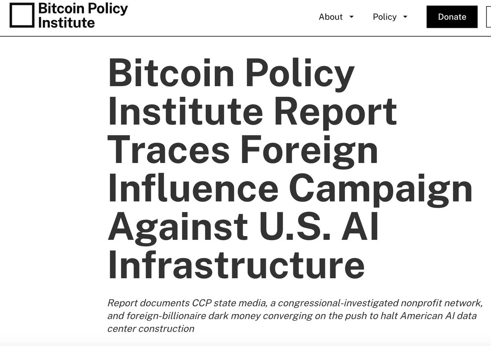
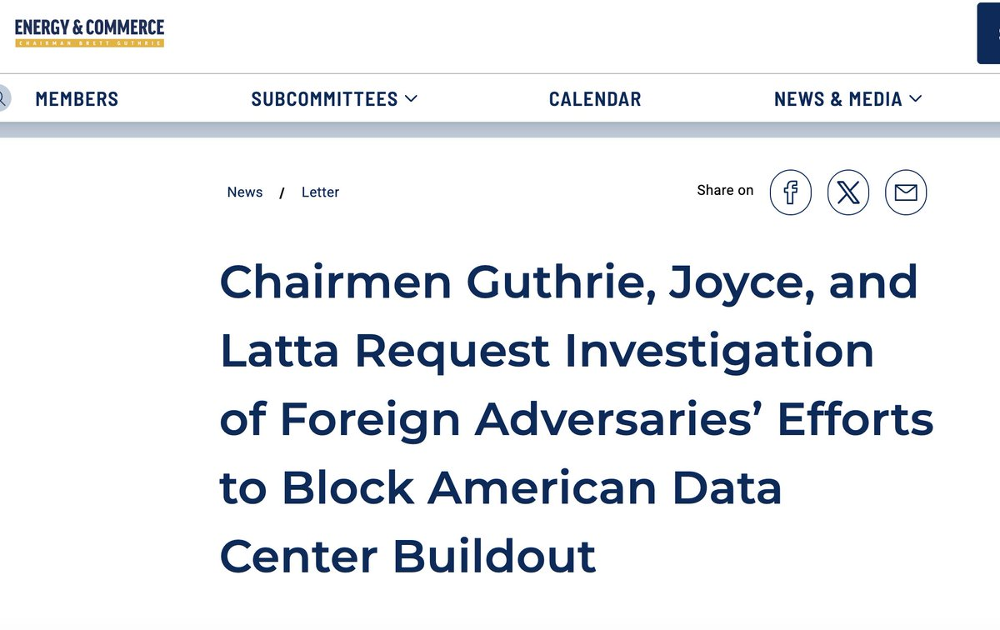
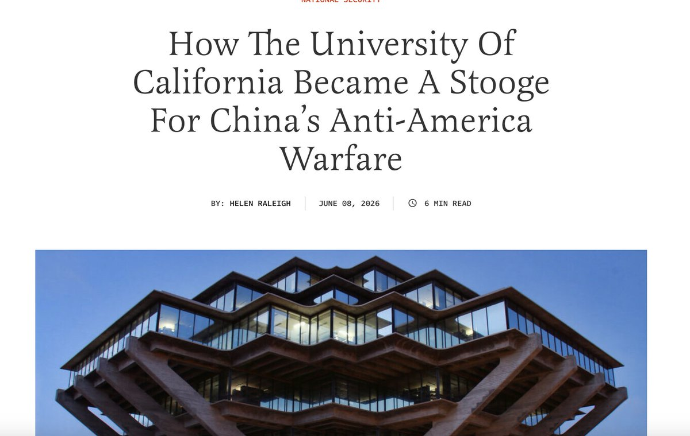
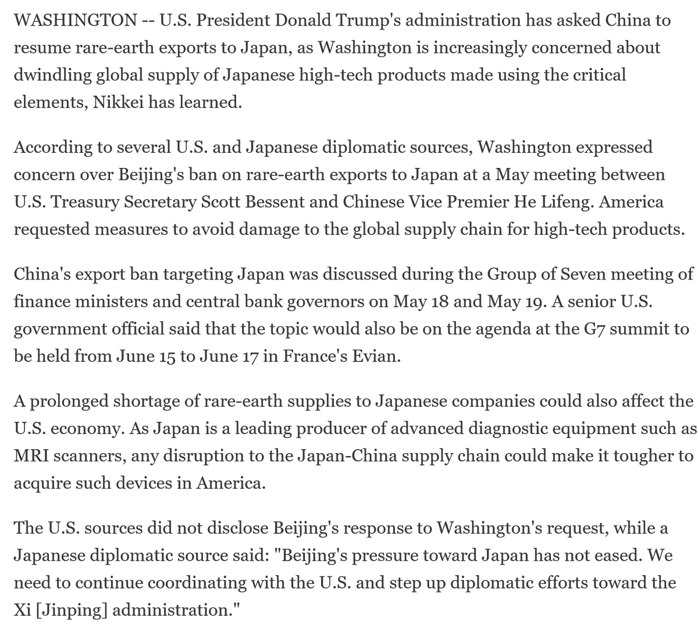
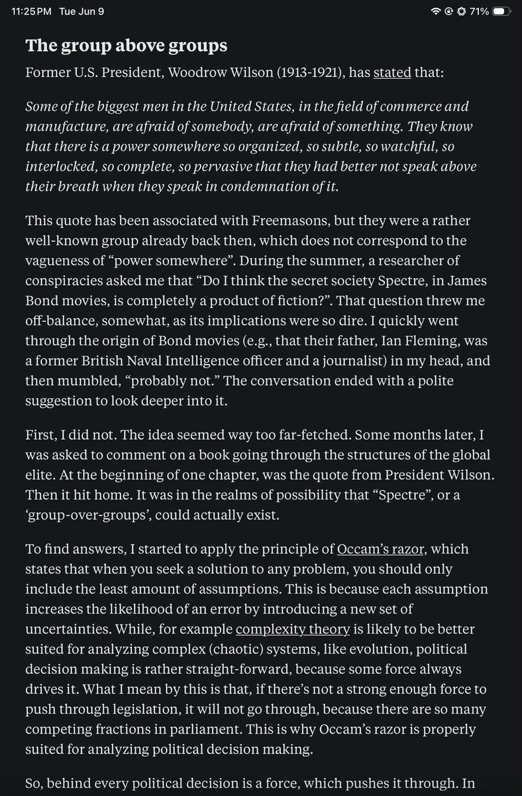
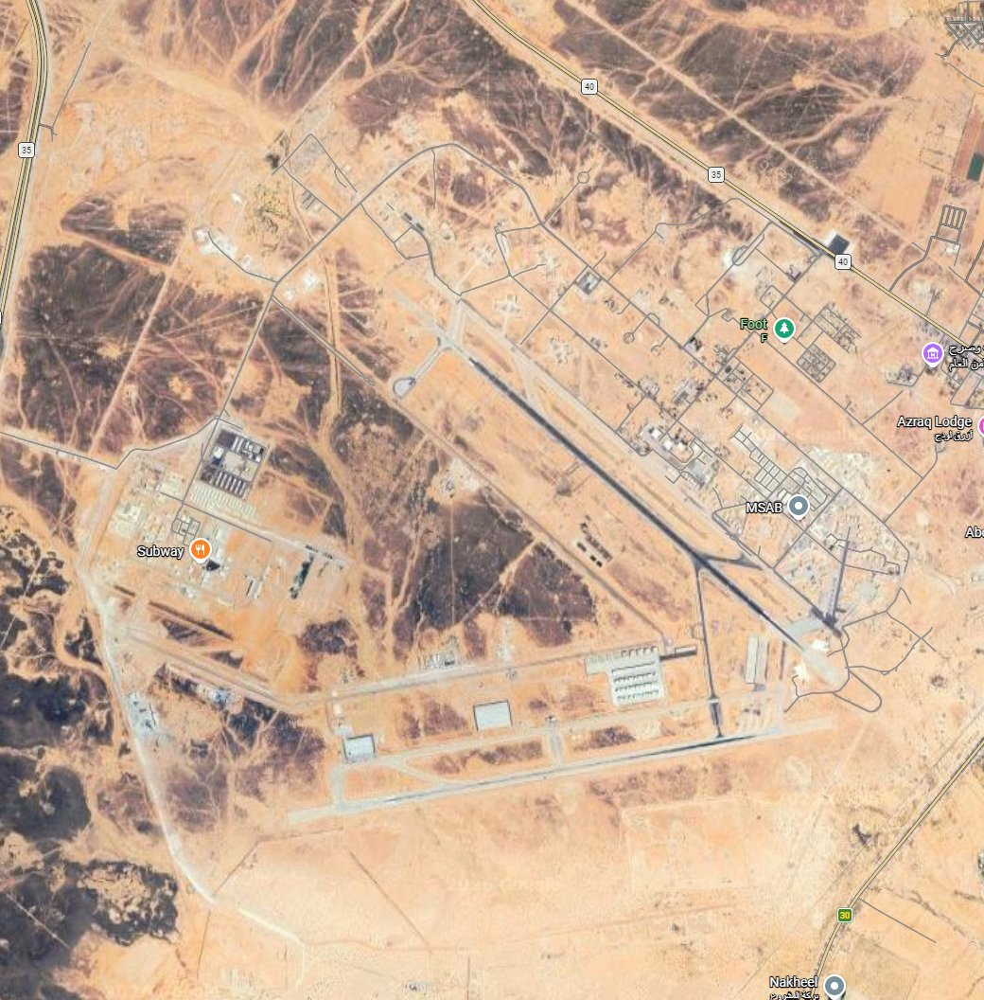
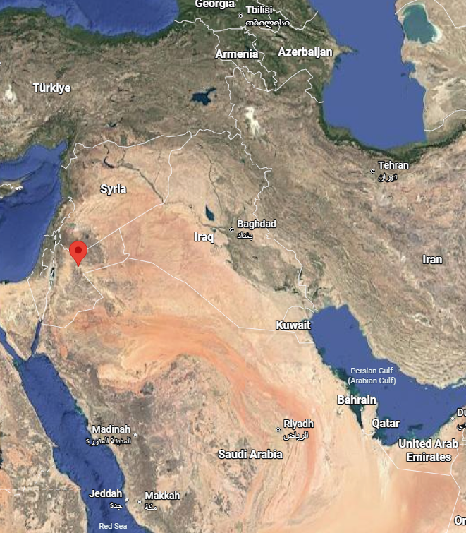
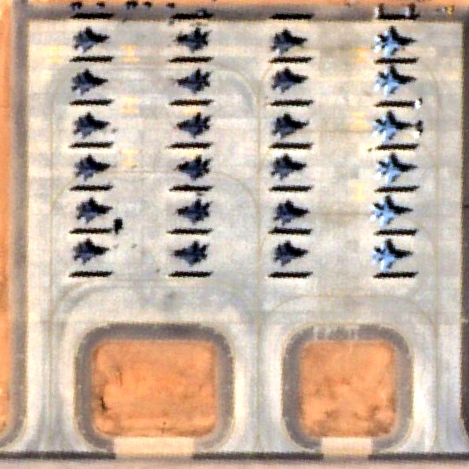
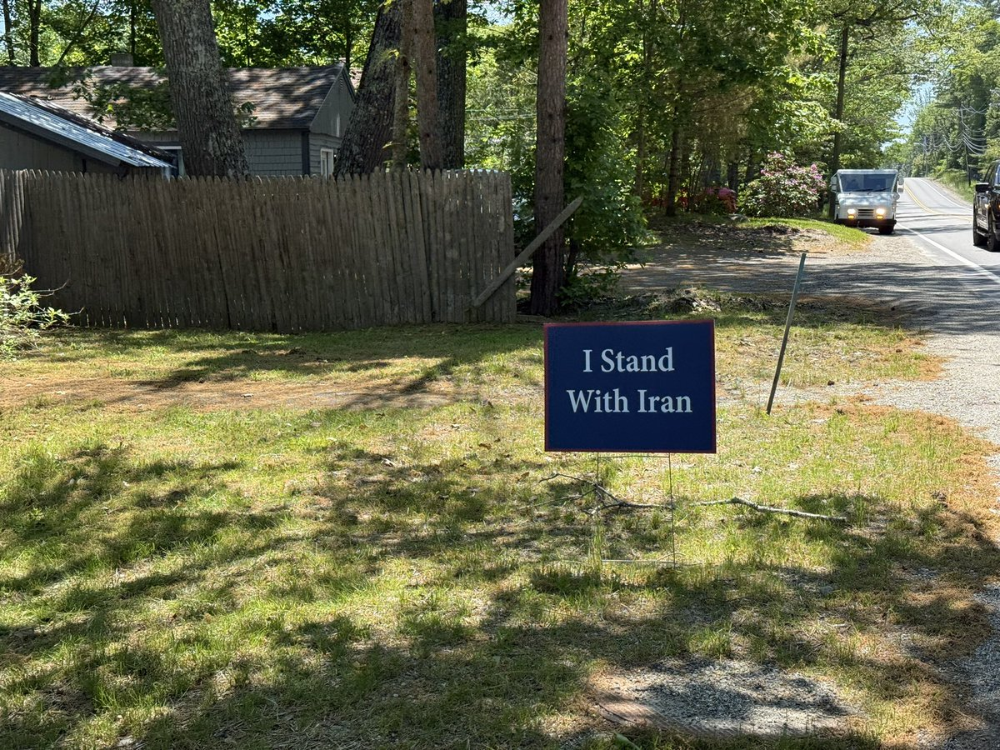

# Twitter Timeline Export

## Entry 1
### Policy Tensor
- Username: @policytensor
- Tweet ID: `2064280559702909010`
- Date: [2026-06-09 09:36 UTC](https://x.com/policytensor/status/2064280559702909010)

An Equilibrium Model of Counter-Base War in the Western Pacific, by @policytensor https://t.co/DOAYbvr7zF https://t.co/MoVdZY0mmL

---

## Entry 2
### Policy Tensor
- Username: @policytensor
- Tweet ID: `2064605907158282479`
- Date: [2026-06-10 07:09 UTC](https://x.com/policytensor/status/2064605907158282479)

““Dubai’s days are over,” insists an Iranian coffee-trader who recently moved his regional headquarters to Muscat, the capital. “Now it’s Oman.””

---

## Entry 3
### Policy Tensor
- Username: @policytensor
- Tweet ID: `2064589931486257556`
- Date: [2026-06-10 06:06 UTC](https://x.com/policytensor/status/2064589931486257556)

I told you I don’t buy the numbers peddled by British intelligence. But what is a good estimate of fatalities on both sides of the Ukraine war? 

Kobak et al. (2024) estimated 58,500 Russian excess male deaths in 2022-2023. ACLED reports 80,306 fatalities in Ukraine for

---

## Entry 4
### Policy Tensor
- Username: @policytensor
- Tweet ID: `2064585262257021364`
- Date: [2026-06-10 05:47 UTC](https://x.com/policytensor/status/2064585262257021364)

Life is wonderful here, mama. You must come visit! https://t.co/BfbOUTvKl9

**Quoted Forward:**
> ### Pop Base
> - Username: @PopBase
> - Tweet ID: `2064507350346793062`
> - Date: [2026-06-10 00:38 UTC](https://x.com/PopBase/status/2064507350346793062)
> 
> Gwyneth Paltrow stars in new campaign for Israel luxury housing development ‘51PARK’ in Herzliya. https://t.co/otQlxBEMwk
> 
> 
> 
> 

---

## Entry 5
### Policy Tensor
- Username: @policytensor
- Tweet ID: `2064577857586635168`
- Date: [2026-06-10 05:18 UTC](https://x.com/policytensor/status/2064577857586635168)

The Cold War was an excellent device to impose discipline at home. No doubt US elites desperately want one with China for the same reason. The problem is that we will lose Cold War they want so bad, and lose a hot war if we’re stupid enough to fight China.

**Quoted Forward:**
> ### Bethany 貝書穎
> - Username: @BethanyAllenEbr
> - Tweet ID: `2064549050683432990`
> - Date: [2026-06-10 03:23 UTC](https://x.com/BethanyAllenEbr/status/2064549050683432990)
> 
> I increasingly find that my primary role in the "China influence" space these days is to debunk a lot of very, very poor quality "China influence" research reports that have been coming out. 
> 
> I don't think it would be an overreach to call this slate of reports "China influence https://t.co/CcrSME0lIf
> 
> 
> 
> 
> 
> 

---

## Entry 6
### Policy Tensor
- Username: @policytensor
- Tweet ID: `2064574900472258659`
- Date: [2026-06-10 05:06 UTC](https://x.com/policytensor/status/2064574900472258659)

Short of a formal apology by Iron Lady, really hard to see the Chinese oblige. Should’ve thought things through before declaring Taiwan a Japanese protectorate.

**Quoted Forward:**
> ### Bonnie Glaser / 葛來儀
> - Username: @BonnieGlaser
> - Tweet ID: `2064369760725299698`
> - Date: [2026-06-09 15:31 UTC](https://x.com/BonnieGlaser/status/2064369760725299698)
> 
> US asks China to resume rare-earth exports to Japan 
> https://t.co/2grIpsvUr0 via @NikkeiAsia https://t.co/W3d5ao9bPF
> 
> 
> 

---

## Entry 7
### Policy Tensor
- Username: @policytensor
- Tweet ID: `2064565012216050031`
- Date: [2026-06-10 04:27 UTC](https://x.com/policytensor/status/2064565012216050031)

There may be a case for bases around the world. But none within the range of short-range missiles of a great missile power. The bases on the Gulf littoral should be abandoned wholesale. And the bases that are not abandoned have to be hardened.

**Quoted Forward:**
> ### Sean Mathews
> - Username: @SeanPmathews
> - Tweet ID: `2064302876701098078`
> - Date: [2026-06-09 11:05 UTC](https://x.com/SeanPmathews/status/2064302876701098078)
> 
> The U.S.-Israeli war on Iran has shown that the era of big military bases in the Gulf is over, U.S. officials and analysts tell me. 🧵 https://t.co/vTySdBnpsZ
> 
> 
> 

---

## Entry 8
### Policy Tensor
- Username: @policytensor
- Tweet ID: `2064552426431009047`
- Date: [2026-06-10 03:37 UTC](https://x.com/policytensor/status/2064552426431009047)

The chopper was almost certainly an excuse.

**Quoted Forward:**
> ### Daniel Davis Deep Dive
> - Username: @DanielLDavis1
> - Tweet ID: `2064540797819551836`
> - Date: [2026-06-10 02:50 UTC](https://x.com/DanielLDavis1/status/2064540797819551836)
> 
> So while everybody is trying to discover how much damage was done by the US strike against Iran, or how much retaliatory damage was done to US bases by Iran’s reply, it’s time we start asking the bigger question:
> 
> What comes next?
> 
> OK, so President Trump got angry because https://t.co/3LAC5Kf9ft
> 
> 
> 

---

## Entry 9
### Policy Tensor
- Username: @policytensor
- Tweet ID: `2064552026747371681`
- Date: [2026-06-10 03:35 UTC](https://x.com/policytensor/status/2064552026747371681)

RT @DropSiteNews: ⭕️ Israeli Health Ministry Reports 9,125 Injured Since Start of Iran War

The Israeli Health Ministry said the number of…

**Reposted:**
> ### Drop Site
> - Username: @DropSiteNews
> - Tweet ID: `2064548811997872228`
> - Date: [2026-06-10 03:22 UTC](https://x.com/DropSiteNews/status/2064548811997872228)
> 
> ⭕️ Israeli Health Ministry Reports 9,125 Injured Since Start of Iran War
> 
> The Israeli Health Ministry said the number of people injured since the war on Iran began on February 28 has risen to 9,125, after 13 new injuries were recorded today, Al Mayadeen reported.
> 
> 🔸 By the
> 

---

## Entry 10
### Policy Tensor
- Username: @policytensor
- Tweet ID: `2064550142582120452`
- Date: [2026-06-10 03:28 UTC](https://x.com/policytensor/status/2064550142582120452)

I apologize for sharing that. Turns out, Malinen is a conspiracy theory nut job. https://t.co/cxTtuPDpyD

**Quoted Forward:**
> ### Policy Tensor
> - Username: @policytensor
> - Tweet ID: `2064528292258910560`
> - Date: [2026-06-10 02:01 UTC](https://x.com/policytensor/status/2064528292258910560)
> 
> “[T]wo weeks ago it was brought to my knowledge that our president, Alexander Stubb, is a likely CIA recruit.” 
> 
> From Malinen’s Substack.
> 

---

## Entry 11
### Policy Tensor
- Username: @policytensor
- Tweet ID: `2064542923983573004`
- Date: [2026-06-10 02:59 UTC](https://x.com/policytensor/status/2064542923983573004)

RT @btselem: New footage obtained by B’Tselem uncovers the moments when the Abu Haikal family was shot. Seven-month-old Sam Abu Haikal was…

**Reposted:**
> ### B'Tselem בצלם بتسيلم
> - Username: @btselem
> - Tweet ID: `2064406597389185453`
> - Date: [2026-06-09 17:57 UTC](https://x.com/btselem/status/2064406597389185453)
> 
> New footage obtained by B’Tselem uncovers the moments when the Abu Haikal family was shot. Seven-month-old Sam Abu Haikal was killed in the shooting, and both his parents were injured. The footage clearly shows that the Israeli soldier fired at the car as it was slowing to a https://t.co/rYNeMClLlj
> 
> 
> 

---

## Entry 12
### Policy Tensor
- Username: @policytensor
- Tweet ID: `2064542052537229579`
- Date: [2026-06-10 02:55 UTC](https://x.com/policytensor/status/2064542052537229579)

Looks consistent with the 150 percent doctrine.

**Quoted Forward:**
> ### Policy Tensor
> - Username: @policytensor
> - Tweet ID: `2064506229032935654`
> - Date: [2026-06-10 00:33 UTC](https://x.com/policytensor/status/2064506229032935654)
> 
> I shouldn’t be so sanguine. It’s entirely possible that Iran responds disproportionately, in line with the new 150% policy. Maybe 30, not 10.
> 

---

## Entry 13
### Policy Tensor
- Username: @policytensor
- Tweet ID: `2064541743911944697`
- Date: [2026-06-10 02:54 UTC](https://x.com/policytensor/status/2064541743911944697)

This is an elementary problem with @davidshor-ism. You just can’t give them what they want. It also has to work!

**Quoted Forward:**
> ### Andy Masley
> - Username: @AndyMasley
> - Tweet ID: `2064473884183740849`
> - Date: [2026-06-09 22:25 UTC](https://x.com/AndyMasley/status/2064473884183740849)
> 
> I basically think the average voter is pretty wrong on:
> 
> 1) Nuclear power (it's good)
> 2) Foreign aid (we spend very little on it and should spend more)
> 3) Climate change (a majority say they're not willing to have any additional amounts of their tax money spent on climate. The
> 

---

## Entry 14
### Policy Tensor
- Username: @policytensor
- Tweet ID: `2064539340152140206`
- Date: [2026-06-10 02:45 UTC](https://x.com/policytensor/status/2064539340152140206)

RT @DropSiteNews: Al-Azraq Air Base and Muwaffaq Salti Air Base are two names for the same facility, located in Azraq in eastern Jordan, ab…

**Reposted:**
> ### Drop Site
> - Username: @DropSiteNews
> - Tweet ID: `2064538582660899326`
> - Date: [2026-06-10 02:42 UTC](https://x.com/DropSiteNews/status/2064538582660899326)
> 
> Al-Azraq Air Base and Muwaffaq Salti Air Base are two names for the same facility, located in Azraq in eastern Jordan, about 100 km east of Amman.
> 
> In February 2026, satellite imagery showed more than 60 U.S. jets at the base — about three times the usual number — including 30
> 
> **Quoted Forward:**
> > ### OSINTtechnical
> > - Username: @Osinttechnical
> > - Tweet ID: `2064525895067472015`
> > - Date: [2026-06-10 01:51 UTC](https://x.com/Osinttechnical/status/2064525895067472015)
> > 
> > Iran's IRGC says it has attacked Muwaffaq Salti Air Base in Jordan with a salvo of medium-range ballistic missiles. 
> > 
> > The base serves as a major staging point for USAF forces in the region. https://t.co/EpD0XIxCIm
> > 
> > 
> > 
> > 

---

## Entry 15
### Policy Tensor
- Username: @policytensor
- Tweet ID: `2064537125781934125`
- Date: [2026-06-10 02:36 UTC](https://x.com/policytensor/status/2064537125781934125)

Think they were consolidated at Ben Gurion and Prince Sultan to share the bmd umbrella given the scarcity of interceptors.

**Quoted Forward:**
> ### Egypt's Intel Observer
> - Username: @EGYOSINT
> - Tweet ID: `2064536601456267428`
> - Date: [2026-06-10 02:34 UTC](https://x.com/EGYOSINT/status/2064536601456267428)
> 
> In the early days of the war, the U.S. Air Force positioned its F-35A Lightning II fighters on this tarmac at Muwaffaq al-Salti Air Base in Jordan. 
> 
> It’s unclear whether they’re still there, but if they are, a strike on that site would likely cause significant damage. https://t.co/vkVxCZynqX
> 
> 
> 

---

## Entry 16
### Policy Tensor
- Username: @policytensor
- Tweet ID: `2064535328254304759`
- Date: [2026-06-10 02:29 UTC](https://x.com/policytensor/status/2064535328254304759)

RT @ReedReports: Fascinating politics up here in Ellsworth, Maine https://t.co/cHW8LSzrUv

**Reposted:**
> ### Nathaniel Reed
> - Username: @ReedReports
> - Tweet ID: `2064389373898928411`
> - Date: [2026-06-09 16:49 UTC](https://x.com/ReedReports/status/2064389373898928411)
> 
> Fascinating politics up here in Ellsworth, Maine https://t.co/cHW8LSzrUv
> 
> 
> 

---

## Entry 17
### Policy Tensor
- Username: @policytensor
- Tweet ID: `2064534631035097406`
- Date: [2026-06-10 02:26 UTC](https://x.com/policytensor/status/2064534631035097406)

You can watch the genocide from the comfort of your penthouse at 51 Park.

**Quoted Forward:**
> ### DD Geopolitics
> - Username: @DD_Geopolitics
> - Tweet ID: `2064371416628420608`
> - Date: [2026-06-09 15:37 UTC](https://x.com/DD_Geopolitics/status/2064371416628420608)
> 
> Gwyneth Paltrow promotes $10M penthouses in Herzliya while Gaza burns and Lebanon bleeds.
> 
> While children are buried under rubble in Gaza, while Lebanese families flee Israeli airstrikes, while Gazans starve under total blockade, she is is fronting an ad campaign for "51 Park," a https://t.co/Exl7JVKmTm
> 
> 
> 

---

## Entry 18
### Policy Tensor
- Username: @policytensor
- Tweet ID: `2064534084936683775`
- Date: [2026-06-10 02:24 UTC](https://x.com/policytensor/status/2064534084936683775)

Mukesh Ambani is no mere billionaire. The man is worth something like $100 billion and a good claim at being the most powerful oligarch in Asia!

**Quoted Forward:**
> ### Josh Kaplan
> - Username: @js_kaplan
> - Tweet ID: `2064289781098369523`
> - Date: [2026-06-09 10:13 UTC](https://x.com/js_kaplan/status/2064289781098369523)
> 
> NEW: An Indian billionaire was in Trump’s crosshairs. Then he poured millions into an obscure startup secretly backed by Donald Trump Jr. https://t.co/2iwJp53vbB
> 
> w/ @JustinElliott @Amierjeski
> 

---

## Entry 19
### Policy Tensor
- Username: @policytensor
- Tweet ID: `2064532957612646422`
- Date: [2026-06-10 02:19 UTC](https://x.com/policytensor/status/2064532957612646422)

Not conserving the MRBMs then. How deep is the magazine? Maybe Patty was right bout their stockpiling over the years. I thought older missiles would be less accurate. But apparently they’ve all been updated.

---

## Entry 20
### Policy Tensor
- Username: @policytensor
- Tweet ID: `2064531098189590562`
- Date: [2026-06-10 02:12 UTC](https://x.com/policytensor/status/2064531098189590562)

RT @DropSiteNews: 🔺 IRGC Claims Strikes on U.S. Air Base in Jordan, Says 21 Targets Hit Across Region

The IRGC issued a statement claiming…

**Reposted:**
> ### Drop Site
> - Username: @DropSiteNews
> - Tweet ID: `2064530909643063487`
> - Date: [2026-06-10 02:11 UTC](https://x.com/DropSiteNews/status/2064530909643063487)
> 
> 🔺 IRGC Claims Strikes on U.S. Air Base in Jordan, Says 21 Targets Hit Across Region
> 
> The IRGC issued a statement claiming it struck 21 targets at U.S. air and naval bases across the region and separately targeted Al-Azraq Air Base in Jordan, according to Khabar Fouri.
> 
> The
> 

---
