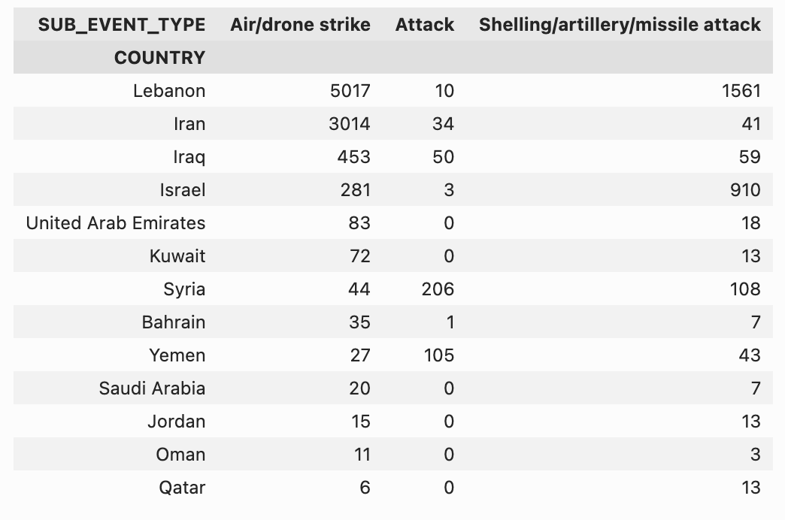
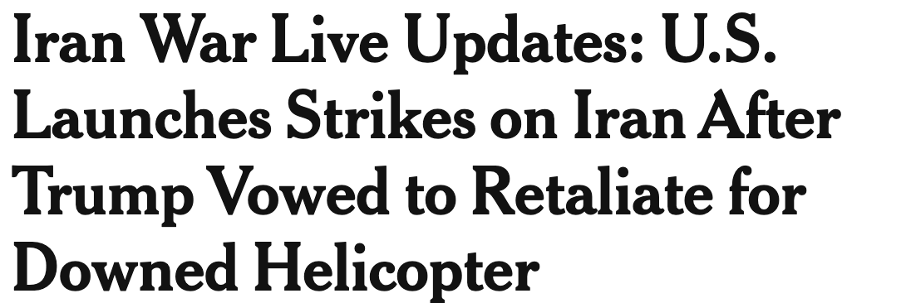
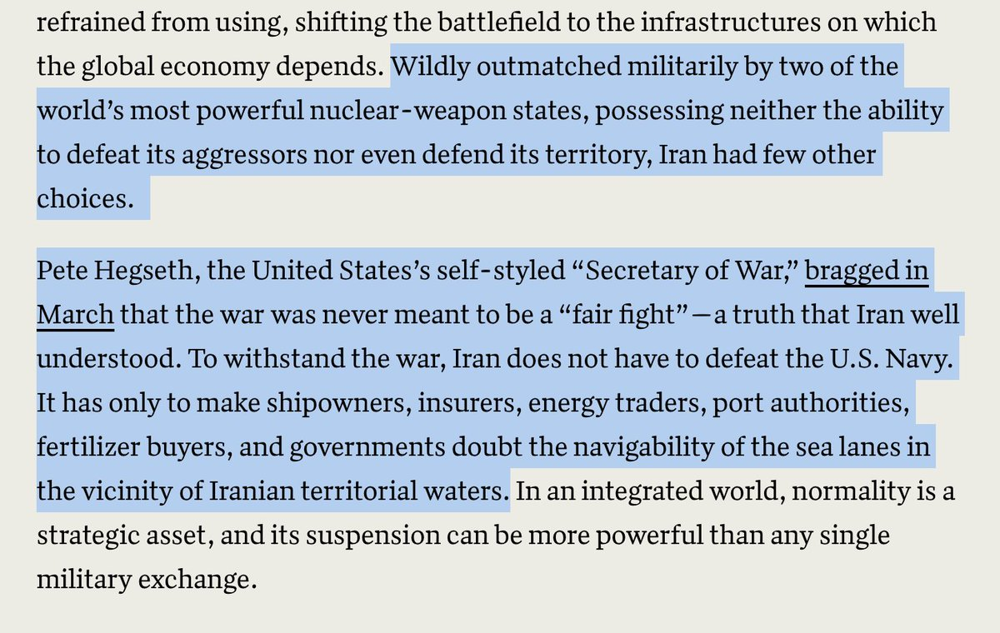

# Twitter Timeline Export

## Entry 1
### Policy Tensor
- Username: @policytensor
- Tweet ID: `2064280559702909010`
- Date: [2026-06-09 09:36 UTC](https://x.com/policytensor/status/2064280559702909010)

An Equilibrium Model of Counter-Base War in the Western Pacific, by @policytensor https://t.co/DOAYbvr7zF https://t.co/MoVdZY0mmL

---

## Entry 2
### Policy Tensor
- Username: @policytensor
- Tweet ID: `2064528292258910560`
- Date: [2026-06-10 02:01 UTC](https://x.com/policytensor/status/2064528292258910560)

“[T]wo weeks ago it was brought to my knowledge that our president, Alexander Stubb, is a likely CIA recruit.” 

From Malinen’s Substack.

**Quoted Forward:**
> ### Tuomas Malinen
> - Username: @mtmalinen
> - Tweet ID: `2055579985797095439`
> - Date: [2026-05-16 09:23 UTC](https://x.com/mtmalinen/status/2055579985797095439)
> 
> These was also Valerie Plame, who @alexstubb met in Brugge in 1995. @washingtonpost identified Plame as a CIA operative in an article published in 14 July 2003. 
> 
> Plame ended his contact with Stubb after her cover was blown. She was a CIA recruiter.
> 

---

## Entry 3
### Policy Tensor
- Username: @policytensor
- Tweet ID: `2064523209332920453`
- Date: [2026-06-10 01:41 UTC](https://x.com/policytensor/status/2064523209332920453)

Iran will …

---

## Entry 4
### Policy Tensor
- Username: @policytensor
- Tweet ID: `2064510968332275803`
- Date: [2026-06-10 00:52 UTC](https://x.com/policytensor/status/2064510968332275803)

If they really wanted to restore deterrence, they need to do something new. But a warship might be too escalatory. Maybe the delay is because they are debating the merits of this.

---

## Entry 5
### Policy Tensor
- Username: @policytensor
- Tweet ID: `2064508745023885810`
- Date: [2026-06-10 00:43 UTC](https://x.com/policytensor/status/2064508745023885810)

Perhaps they are attacking water tanks because they cannot locate the drone and missile production sites and inventories.

**Quoted Forward:**
> ### Drop Site
> - Username: @DropSiteNews
> - Tweet ID: `2064506760413741237`
> - Date: [2026-06-10 00:35 UTC](https://x.com/DropSiteNews/status/2064506760413741237)
> 
> 🔹Two strategic water storage tanks were destroyed in a U.S. missile strike on the Bamani district of Iran’s southern Hormozgan Province early Wednesday, according to the head of the provincial Water and Wastewater Company.
> 
> Abdulhamid Hamzehpour said the attack destroyed a
> 

---

## Entry 6
### Policy Tensor
- Username: @policytensor
- Tweet ID: `2064506229032935654`
- Date: [2026-06-10 00:33 UTC](https://x.com/policytensor/status/2064506229032935654)

I shouldn’t be so sanguine. It’s entirely possible that Iran responds disproportionately, in line with the new 150% policy. Maybe 30, not 10.

---

## Entry 7
### Policy Tensor
- Username: @policytensor
- Tweet ID: `2064505642056855969`
- Date: [2026-06-10 00:31 UTC](https://x.com/policytensor/status/2064505642056855969)

RT @HormuzLetter: BREAKING: Iran launches 3 ballistic missiles from Isfahan towards US bases in the Gulf.

**Reposted:**
> ### The Hormuz Letter
> - Username: @HormuzLetter
> - Tweet ID: `2064503669429588270`
> - Date: [2026-06-10 00:23 UTC](https://x.com/HormuzLetter/status/2064503669429588270)
> 
> BREAKING: Iran launches 3 ballistic missiles from Isfahan towards US bases in the Gulf.
> 

---

## Entry 8
### Policy Tensor
- Username: @policytensor
- Tweet ID: `2064505371574595992`
- Date: [2026-06-10 00:30 UTC](https://x.com/policytensor/status/2064505371574595992)

They also need to learn the scale of the US attack to determine how many missiles and drones to fire off. :)

**Quoted Forward:**
> ### OSINTWarfare
> - Username: @OSINTWarfare
> - Tweet ID: `2064503315581325328`
> - Date: [2026-06-10 00:22 UTC](https://x.com/OSINTWarfare/status/2064503315581325328)
> 
> A second UAV has reportedly been intercepted. The response appears to be delayed due to the presence of U.S. drones in Iranian airspace, which are attempting to detect and suppress any potential ballistic missile launches. The IRGC appears to be avoiding unnecessary risks,
> 

---

## Entry 9
### Policy Tensor
- Username: @policytensor
- Tweet ID: `2064504575814492554`
- Date: [2026-06-10 00:27 UTC](https://x.com/policytensor/status/2064504575814492554)

Maybe too little too late.

**Quoted Forward:**
> ### Dr Andreas Krieg
> - Username: @andreas_krieg
> - Tweet ID: `2064402476107714830`
> - Date: [2026-06-09 17:41 UTC](https://x.com/andreas_krieg/status/2064402476107714830)
> 
> Tahnoon bin Zayed is eager to repair Iran UAE relations through entanglement and commercial interdependence 
> 
> It wont be bullet proof as an insurance policy but the only way to complement deterrence
> 

---

## Entry 10
### Policy Tensor
- Username: @policytensor
- Tweet ID: `2064501157070868553`
- Date: [2026-06-10 00:13 UTC](https://x.com/policytensor/status/2064501157070868553)

https://t.co/v9TtKiH6Dz

---

## Entry 11
### Policy Tensor
- Username: @policytensor
- Tweet ID: `2064496233067041024`
- Date: [2026-06-09 23:53 UTC](https://x.com/policytensor/status/2064496233067041024)

Not only have more people been killed and displaced in Lebanon than Iran, the scale of violence meted out to Lebanon is vastly larger. ACLED data shows 5,017 airstrikes and 1,561 attacks with indirect weapons since 2/27. Cf. 3,014 and 41 for Iran. Note that these are event https://t.co/3b1pmCMAAd

---

## Entry 12
### Policy Tensor
- Username: @policytensor
- Tweet ID: `2064487969981948148`
- Date: [2026-06-09 23:21 UTC](https://x.com/policytensor/status/2064487969981948148)

Exactly right. The skirmishes have a purpose. To chip away at the Iranian position. Recall @HamidRezaAz’s last dispatch. Together with the Israeli escalation in Lebanon, this is what pushed the Iranians into their new strategy.

**Quoted Forward:**
> ### Guy Laron
> - Username: @guy_laron
> - Tweet ID: `2064475662207873305`
> - Date: [2026-06-09 22:32 UTC](https://x.com/guy_laron/status/2064475662207873305)
> 
> 1. Is the U.S. secretly reopening Hormuz? What's unfolding off Iran's coast is a premeditated stealth campaign to bleed Tehran's leverage one tanker at a time. It's Tanker War 2.0, not a haphazard series of operations. https://t.co/yb6T26HEIg
> 
> 
> 

---

## Entry 13
### Policy Tensor
- Username: @policytensor
- Tweet ID: `2064484834202849774`
- Date: [2026-06-09 23:08 UTC](https://x.com/policytensor/status/2064484834202849774)

https://t.co/NKEhtd5hCM

---

## Entry 14
### Policy Tensor
- Username: @policytensor
- Tweet ID: `2064484046722208255`
- Date: [2026-06-09 23:05 UTC](https://x.com/policytensor/status/2064484046722208255)

The Iranian response will likely use SRBMs, conserving the MRBMs for Israel or general escalation. This means that they will hit US bases on the Gulf littoral. I doubt that they will escalate. Should be a tit for tat. Maybe a salvo of ten.

---

## Entry 15
### Policy Tensor
- Username: @policytensor
- Tweet ID: `2064483017188405596`
- Date: [2026-06-09 23:01 UTC](https://x.com/policytensor/status/2064483017188405596)

Bâli is right about so much and wrong about so much. She nails it on the emerging China-centric electrostate order, on proliferation, and especially this: “A regional order organized around Israeli impunity requires levels of coercion that are accelerating American decline.”

**Quoted Forward:**
> ### Policy Tensor
> - Username: @policytensor
> - Tweet ID: `2064469879986544652`
> - Date: [2026-06-09 22:09 UTC](https://x.com/policytensor/status/2064469879986544652)
> 
> Still reading the essay everyone is raving about. Just want to note that this is totally ignorant of military facts, above all, the scale of Iranian firepower that has been revealed. Any picture of the Ramadan War that ignores Iranian counter-base attacks is totally wrong. https://t.co/cR1XXGHJBm
> 
> 
> 

---

## Entry 16
### Policy Tensor
- Username: @policytensor
- Tweet ID: `2064478689639768392`
- Date: [2026-06-09 22:44 UTC](https://x.com/policytensor/status/2064478689639768392)

RT @RKelanic: Full-scale resumption of hostilities is unlikely after the latest U.S.-Iran skirmish in Hormuz:
-Iran &amp; US uninterested in de…

**Reposted:**
> ### Rosemary Kelanic
> - Username: @RKelanic
> - Tweet ID: `2064474648843018689`
> - Date: [2026-06-09 22:28 UTC](https://x.com/RKelanic/status/2064474648843018689)
> 
> Full-scale resumption of hostilities is unlikely after the latest U.S.-Iran skirmish in Hormuz:
> -Iran &amp; US uninterested in derailing talks
> -no change to strategic equilibrium
> -fundamentals the same: stalemate
> 

---

## Entry 17
### Policy Tensor
- Username: @policytensor
- Tweet ID: `2064478319119126776`
- Date: [2026-06-09 22:42 UTC](https://x.com/policytensor/status/2064478319119126776)

Hi @LJBilmes. Would love to read your blog but the link to it on your website appears to be broken. Is it still online? Thanks in advance! 

https://t.co/kfB0spoAVN

---

## Entry 18
### Policy Tensor
- Username: @policytensor
- Tweet ID: `2064474227248337395`
- Date: [2026-06-09 22:26 UTC](https://x.com/policytensor/status/2064474227248337395)

They have to respond.

---

## Entry 19
### Policy Tensor
- Username: @policytensor
- Tweet ID: `2064469879986544652`
- Date: [2026-06-09 22:09 UTC](https://x.com/policytensor/status/2064469879986544652)

Still reading the essay everyone is raving about. Just want to note that this is totally ignorant of military facts, above all, the scale of Iranian firepower that has been revealed. Any picture of the Ramadan War that ignores Iranian counter-base attacks is totally wrong. https://t.co/cR1XXGHJBm

---

## Entry 20
### Policy Tensor
- Username: @policytensor
- Tweet ID: `2064470035549102539`
- Date: [2026-06-09 22:09 UTC](https://x.com/policytensor/status/2064470035549102539)

https://t.co/vLza357N7s

---
