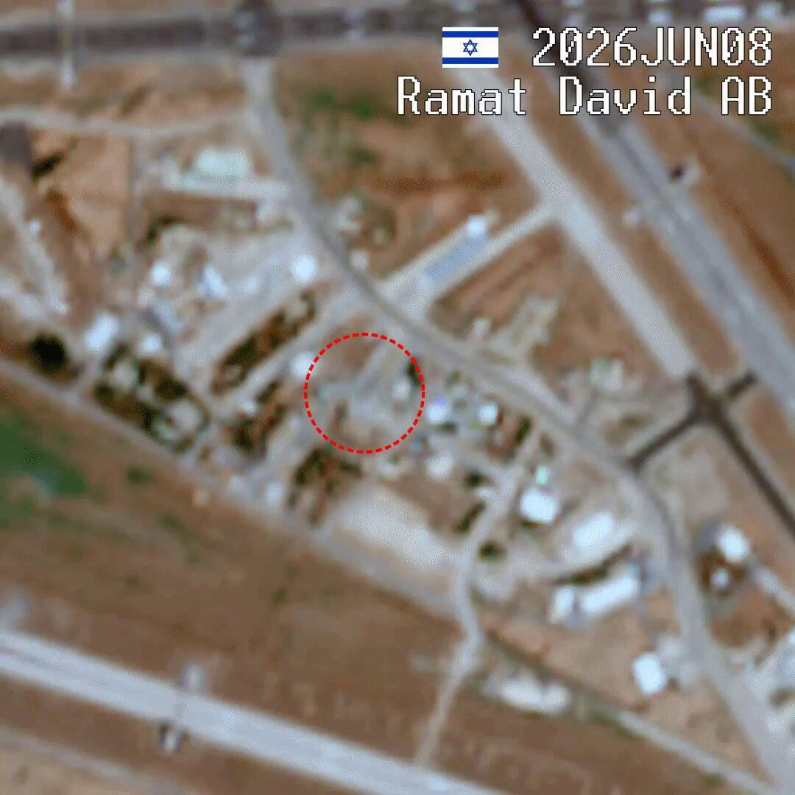
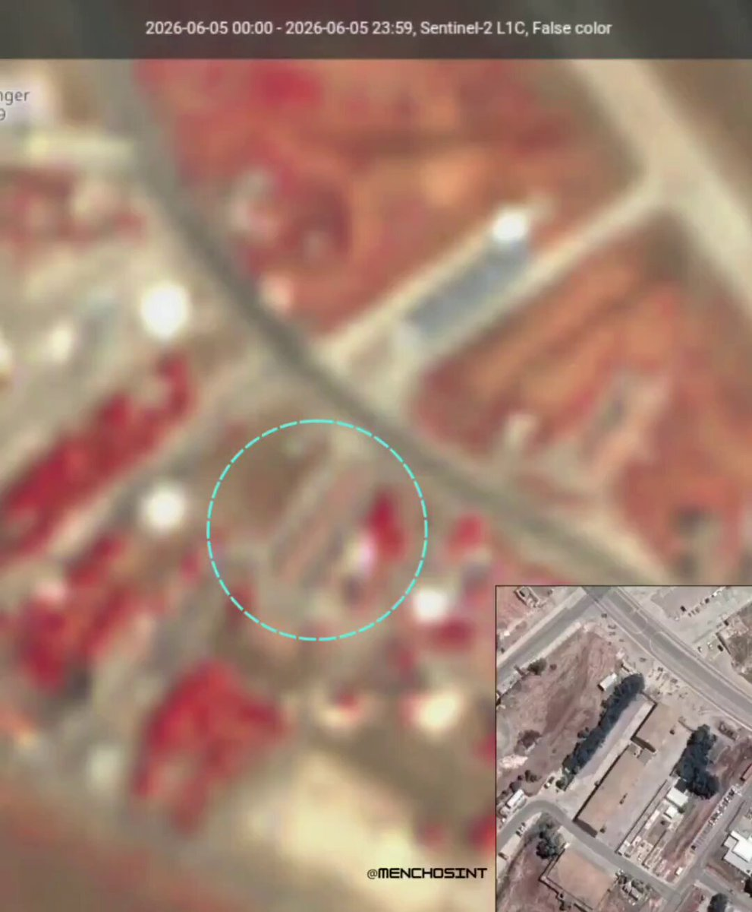
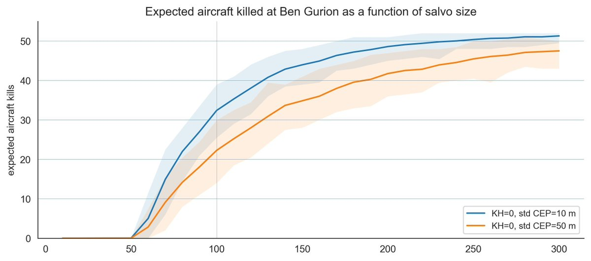
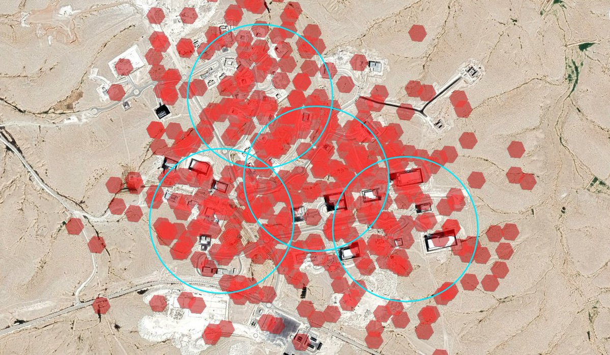
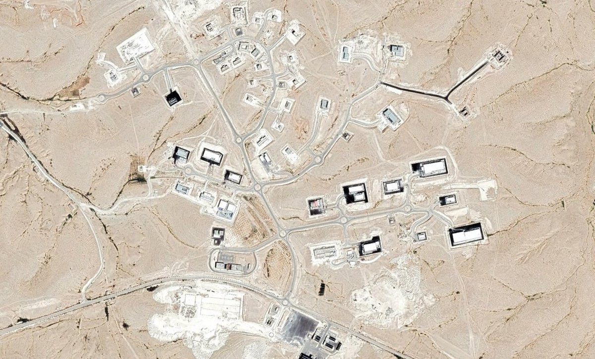
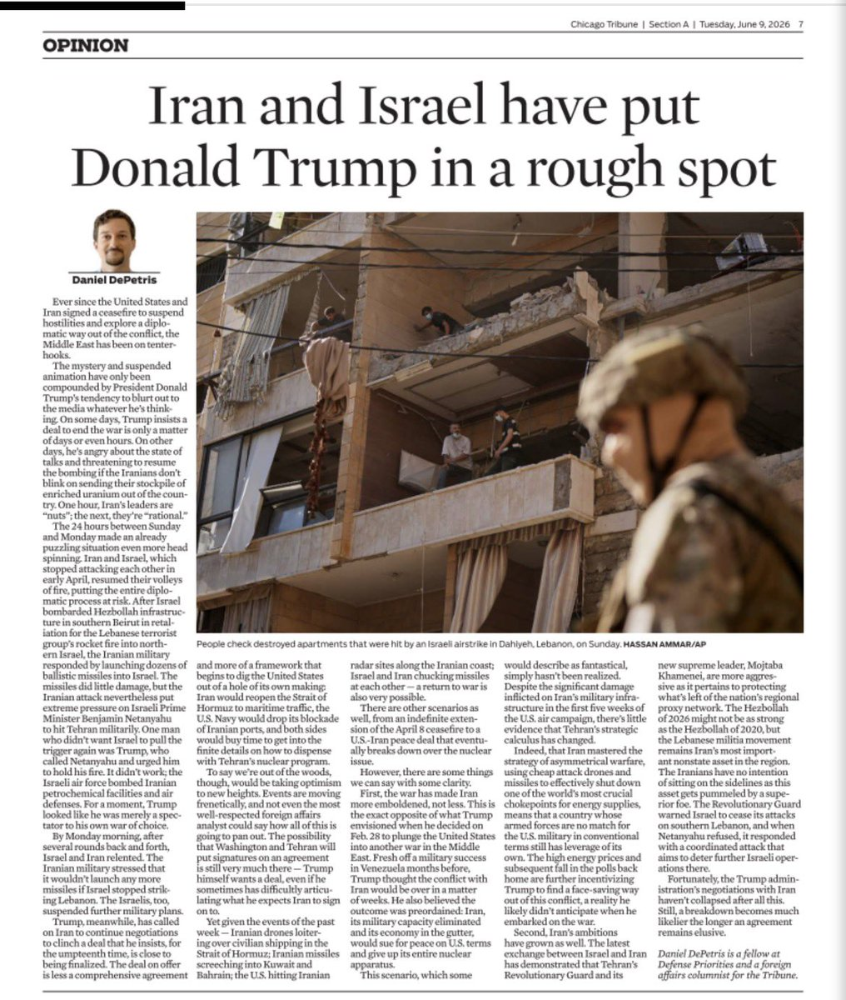
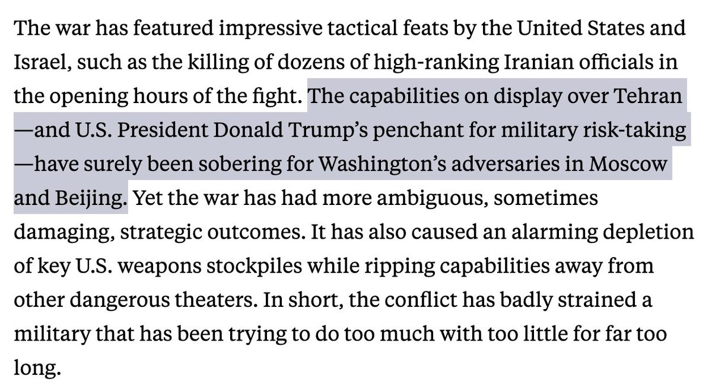
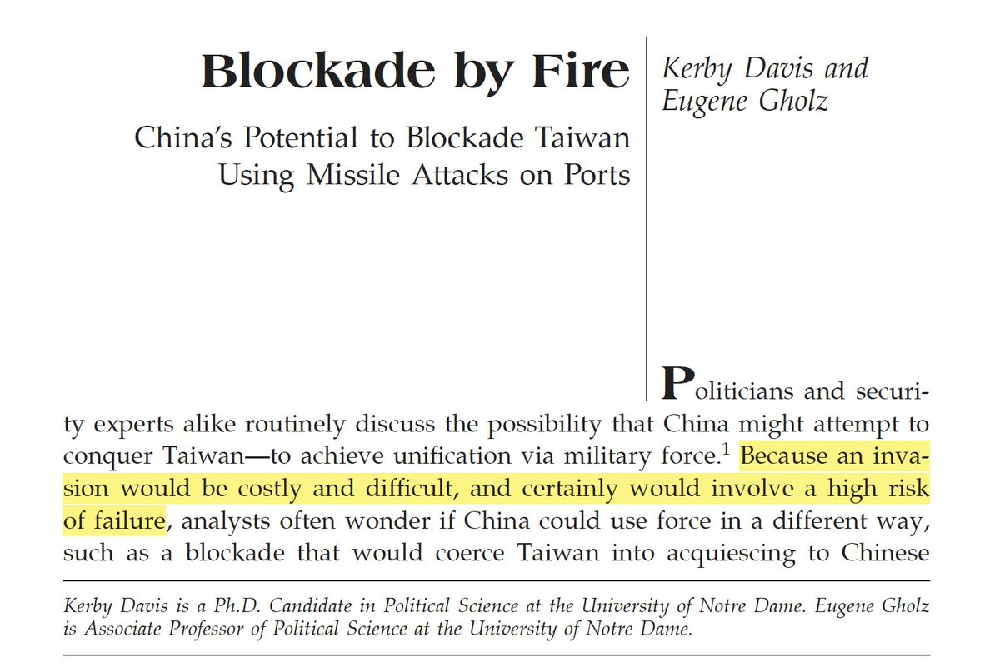
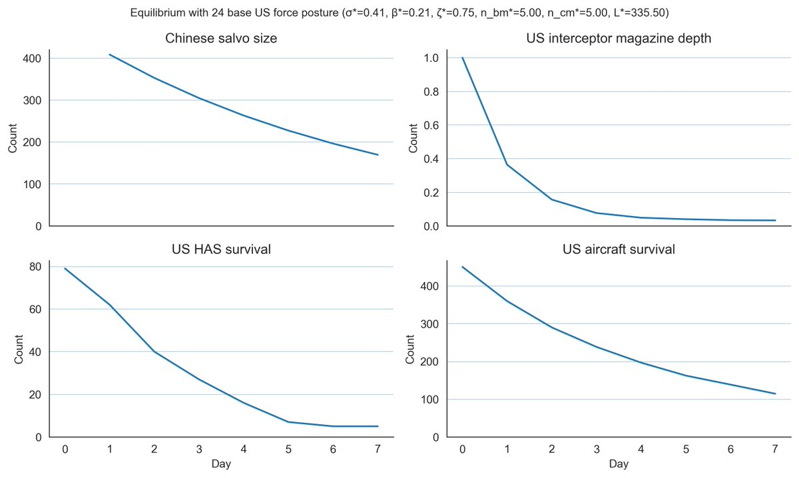

# Twitter Timeline Export

## Entry 1
### Policy Tensor
- Username: @policytensor
- Tweet ID: `2064280559702909010`
- Date: [2026-06-09 09:36 UTC](https://x.com/policytensor/status/2064280559702909010)

An Equilibrium Model of Counter-Base War in the Western Pacific, by @policytensor https://t.co/DOAYbvr7zF https://t.co/MoVdZY0mmL

---

## Entry 2
### Policy Tensor
- Username: @policytensor
- Tweet ID: `2064465233066754231`
- Date: [2026-06-09 21:50 UTC](https://x.com/policytensor/status/2064465233066754231)

Very interesting.

**Quoted Forward:**
> ### Arya Yadeghaar (Backup)
> - Username: @AryJeayBackup
> - Tweet ID: `2064316896577487239`
> - Date: [2026-06-09 12:01 UTC](https://x.com/AryJeayBackup/status/2064316896577487239)
> 
> According to reports, the building that Iranian missiles hit inside of Israeli Ramat David Air Base, was the HQ of the Israeli Air Force’s 157th Squadron, which specializes in electronic warfare (EW). 
> 
> Looks like a very calculated and high value hit. https://t.co/CTMljuTUn4
> 
> 
> 
> 

---

## Entry 3
### Policy Tensor
- Username: @policytensor
- Tweet ID: `2064464874382426352`
- Date: [2026-06-09 21:49 UTC](https://x.com/policytensor/status/2064464874382426352)

It’s a one-off. The chopper episode is not going to derail the deal. Israeli actions in Lebanon may very well. The Iranian response function is such that the Israelis can derail the deal unilaterally.

**Quoted Forward:**
> ### Shaiel Ben-Ephraim
> - Username: @academic_la
> - Tweet ID: `2064450593742311841`
> - Date: [2026-06-09 20:52 UTC](https://x.com/academic_la/status/2064450593742311841)
> 
> According to the New York Times, before he helicopter debacle today, the two sides got closer to a deal on several issues: 
> 
> 1) Uranium enrichment. The U.S. has pushed for a long suspension, framed around the 15-year horizon. This has been the hardest single point throughout the
> 

---

## Entry 4
### Policy Tensor
- Username: @policytensor
- Tweet ID: `2064462631151309206`
- Date: [2026-06-09 21:40 UTC](https://x.com/policytensor/status/2064462631151309206)

Fantastic video. What is really impressive about this weapon is the dual guidance system. The data link can be jammed but the heat seeker cannot. Wonder how many of the fifty Reaper drones were shot down with this cruise missile.

**Quoted Forward:**
> ### Patarames
> - Username: @Pataramesh
> - Tweet ID: `2064396037498843458`
> - Date: [2026-06-09 17:15 UTC](https://x.com/Pataramesh/status/2064396037498843458)
> 
> My video on Missile-358
> https://t.co/JpPQ03amNZ
> 

---

## Entry 5
### Policy Tensor
- Username: @policytensor
- Tweet ID: `2064449502950408558`
- Date: [2026-06-09 20:48 UTC](https://x.com/policytensor/status/2064449502950408558)

Did my first full-length TV interview. Should be out this weekend. Will share.

---

## Entry 6
### Policy Tensor
- Username: @policytensor
- Tweet ID: `2064446316348903848`
- Date: [2026-06-09 20:35 UTC](https://x.com/policytensor/status/2064446316348903848)

Again. Do the interceptor math pls. There is no possibility of bagging any eagles on the aprons at Ben Gurion without firing at least fifty missiles. Anything smaller will be fully intercepted by the four-layered BMD. https://t.co/vJgp00Z55I

**Quoted Forward:**
> ### Patarames
> - Username: @Pataramesh
> - Tweet ID: `2064353068305494413`
> - Date: [2026-06-09 14:24 UTC](https://x.com/Pataramesh/status/2064353068305494413)
> 
> Simulated effects of a salvo of 2⃣0⃣ Khorramshahr-4 missiles equipped with 20 heavy 100kg Submunitions
> (on a key 🇮🇱 facility)
> 
> Details:
> - 300m CEP for a tri-conic-RV, heavy-Submunition released outside the atmosphere
> 
> - 100kg Submunition assumed have heavy destructive effect out https://t.co/rOpz6nGh19
> 
> 
> 
> 
> 

---

## Entry 7
### Policy Tensor
- Username: @policytensor
- Tweet ID: `2064445714189500616`
- Date: [2026-06-09 20:33 UTC](https://x.com/policytensor/status/2064445714189500616)

RT @ggreenwald: The planet's most fanatical Israel loyalists now own and control (or are about to) Paramount, CBS, TikTok, Warner Brothers,…

**Reposted:**
> ### Glenn Greenwald
> - Username: @ggreenwald
> - Tweet ID: `2064424379212054945`
> - Date: [2026-06-09 19:08 UTC](https://x.com/ggreenwald/status/2064424379212054945)
> 
> The planet's most fanatical Israel loyalists now own and control (or are about to) Paramount, CBS, TikTok, Warner Brothers, CNN: all acquired in the last two years by Netanyahu's close friend, Larry Ellison, right as public support for Israel in the US and the west collapses:
> 
> **Quoted Forward:**
> > ### New York Post
> > - Username: @nypost
> > - Tweet ID: `2064388279156294124`
> > - Date: [2026-06-09 16:44 UTC](https://x.com/nypost/status/2064388279156294124)
> > 
> > CBS News boss Bari Weiss poised to oversee CNN editorial operations: report https://t.co/9TOb1jnX68 https://t.co/zodbfpgDKf
> > 
> > 
> > 

---

## Entry 8
### Policy Tensor
- Username: @policytensor
- Tweet ID: `2064443919275086091`
- Date: [2026-06-09 20:26 UTC](https://x.com/policytensor/status/2064443919275086091)

A separate peace would be a rather interesting development. The Americans might very well prefer that to getting dragged back in by the Israelis. But the issue is whether the Iranians would play along. I would think yes. Why would they not want the US to withdraw? 

This is still

**Quoted Forward:**
> ### Policy Tensor
> - Username: @policytensor
> - Tweet ID: `2061590104091533711`
> - Date: [2026-06-01 23:25 UTC](https://x.com/policytensor/status/2061590104091533711)
> 
> One possible way this plays out is a Trump-Bibi breakup and a separate peace. If the Israelis continue their aggression in Lebanon, Iran will likely strike Israel and the Israelis will respond. But the US may stay out of it. That would be an interesting development.
> 

---

## Entry 9
### Policy Tensor
- Username: @policytensor
- Tweet ID: `2064441026513682659`
- Date: [2026-06-09 20:14 UTC](https://x.com/policytensor/status/2064441026513682659)

“Ben Gvir proposed detaining Hezbollah members’ wives and youth in dedicated prisons.”

**Quoted Forward:**
> ### Drop Site
> - Username: @DropSiteNews
> - Tweet ID: `2064430174653849893`
> - Date: [2026-06-09 19:31 UTC](https://x.com/DropSiteNews/status/2064430174653849893)
> 
> 🇮🇱 Israeli ministers clashed in a cabinet meeting Monday over how to escalate against both Iran and Hezbollah, according to i24 News.
> 
> ➤ Foreign Minister Sa’ar warned Hezbollah was trying to draw Israel into a war of attrition. Minister Elkin said Israel had managed to strike
> 

---

## Entry 10
### Policy Tensor
- Username: @policytensor
- Tweet ID: `2064435854689366497`
- Date: [2026-06-09 19:53 UTC](https://x.com/policytensor/status/2064435854689366497)

Not if you use the standard for this sort of thing: 500 euro bills amount to about 7 tons.

**Quoted Forward:**
> ### Gregg Carlstrom
> - Username: @glcarlstrom
> - Tweet ID: `2064429133560508568`
> - Date: [2026-06-09 19:27 UTC](https://x.com/glcarlstrom/status/2064429133560508568)
> 
> First, Kan cites an "IRGC-affiliated outlet" without actually naming the outlet. Which is sketchy!
> 
> Second, $3bn in cash weighs 30,000kg, which is 50% more than the maximum cargo capacity of the bizjet in question. I know it's a bizarre year but the laws of physics do still apply
> 

---

## Entry 11
### Policy Tensor
- Username: @policytensor
- Tweet ID: `2064432904399143045`
- Date: [2026-06-09 19:42 UTC](https://x.com/policytensor/status/2064432904399143045)

I am still holding on to my wager that there will be a deal. But the wager is premised on the assumption that the Trump team is not totally stupid. If that assumption is wrong and the US goes back to full-scale war, it will blow the wad and still fail to subdue Iranian fire.

**Quoted Forward:**
> ### Daniel DePetris
> - Username: @DanDePetris
> - Tweet ID: `2064423800603619795`
> - Date: [2026-06-09 19:06 UTC](https://x.com/DanDePetris/status/2064423800603619795)
> 
> A return to full-scale war? Inking a U.S.-Iran peace deal? A peace deal that collapses into renewed warfare? Sporadic clashes as the new status-quo? Something in between?
> 
> Not even the most seasoned foreign affairs analyst can tell you how it’s all going to pan out. https://t.co/f1O9bWcy4b
> 
> 
> 

---

## Entry 12
### Policy Tensor
- Username: @policytensor
- Tweet ID: `2064430748661125601`
- Date: [2026-06-09 19:33 UTC](https://x.com/policytensor/status/2064430748661125601)

Astonishing that people can say this with a straight face and not be laughed out of the room. And this guy is a full professor at Johns Hopkins. https://t.co/d1RWZS5IvK

**Quoted Forward:**
> ### Hal Brands
> - Username: @HalBrands
> - Tweet ID: `2064386406835777762`
> - Date: [2026-06-09 16:37 UTC](https://x.com/HalBrands/status/2064386406835777762)
> 
> The global shock waves of the Iran war will be felt for years--perhaps chief among them, the effects on a US military that has performed impressively, but will find itself overstretched and under-armed for some time to come.
> 
> @ForeignPolicy @AEI 
> 
> https://t.co/WE6jF0EK0i
> 

---

## Entry 13
### Policy Tensor
- Username: @policytensor
- Tweet ID: `2064429378310697251`
- Date: [2026-06-09 19:28 UTC](https://x.com/policytensor/status/2064429378310697251)

Russian upgrade.

**Quoted Forward:**
> ### Daniel Davis Deep Dive
> - Username: @DanielLDavis1
> - Tweet ID: `2064413089823350954`
> - Date: [2026-06-09 18:23 UTC](https://x.com/DanielLDavis1/status/2064413089823350954)
> 
> I found this incredibly hard to believe. It is war, and I guess anything is possible, but a helicopter is highly maneuverable whereas a Shahid drone has no independent ability to maneuver mid flight. It will fly from point A to point B and hit the target. But it would be an
> 

---

## Entry 14
### Policy Tensor
- Username: @policytensor
- Tweet ID: `2064413667630751983`
- Date: [2026-06-09 18:25 UTC](https://x.com/policytensor/status/2064413667630751983)

RT @JJKALE2: Dr Warwick Powell's critique of AUKUS is the best I've heard thus far. Not only is AUKUS an extremely expensive dud, it could…

**Reposted:**
> ### Solo Monk
> - Username: @JJKALE2
> - Tweet ID: `2064210939642318863`
> - Date: [2026-06-09 05:00 UTC](https://x.com/JJKALE2/status/2064210939642318863)
> 
> Dr Warwick Powell's critique of AUKUS is the best I've heard thus far. Not only is AUKUS an extremely expensive dud, it could be straight up dangerous for Australia.  
> 
> Must watch. 
> 
> https://t.co/SvFI7jyROF
> 

---

## Entry 15
### Policy Tensor
- Username: @policytensor
- Tweet ID: `2064406407231795477`
- Date: [2026-06-09 17:56 UTC](https://x.com/policytensor/status/2064406407231795477)

It's really alarming that people are not thinking straight about this. There would be a risk of failure only if China is stupid enough to attempt to conquer the island without first kicking out the US from Asia. If it does things correctly, it can guarantee success. https://t.co/j7FbsXfLY0

---

## Entry 16
### Policy Tensor
- Username: @policytensor
- Tweet ID: `2064404145608491444`
- Date: [2026-06-09 17:47 UTC](https://x.com/policytensor/status/2064404145608491444)

“Risking little of their own money, the US president and his sons have added at least $2.3 billion to the family fortune from their main crypto ventures, while the investors they've wooed have taken a $2.3 billion hit.” 

https://t.co/eVKSV78J8f

---

## Entry 17
### Policy Tensor
- Username: @policytensor
- Tweet ID: `2064402732828500421`
- Date: [2026-06-09 17:42 UTC](https://x.com/policytensor/status/2064402732828500421)

“She compared Trump’s approach to that of former US President Joe Biden during the first stages of Israel’s war on Gaza.

“The leadership would say, ‘Please stop killing so many Palestinians’,” Bennis said, “while continuing to supply weapons and funding … The words just don’t

---

## Entry 18
### Policy Tensor
- Username: @policytensor
- Tweet ID: `2064397195189575743`
- Date: [2026-06-09 17:20 UTC](https://x.com/policytensor/status/2064397195189575743)

A separate peace serves everyone. The Israelis should fight their own wars of aggression anyway. Let’s sit back and watch them learn some lessons about size.

**Quoted Forward:**
> ### *Walter Bloomberg
> - Username: @DeItaone
> - Tweet ID: `2064394392379511227`
> - Date: [2026-06-09 17:09 UTC](https://x.com/DeItaone/status/2064394392379511227)
> 
> ISRAEL PREPARES FOR POSSIBLE SOLO STANDOFF WITH IRAN
> 
> Israeli media reported that Prime Minister Benjamin Netanyahu warned the country may have to confront Iran without U.S. support, despite the potential costs in military resources and international isolation. Meanwhile, Chief
> 

---

## Entry 19
### Policy Tensor
- Username: @policytensor
- Tweet ID: `2064280232530526624`
- Date: [2026-06-09 09:35 UTC](https://x.com/policytensor/status/2064280232530526624)

There is no recognitiion of the military fact that Taiwan is impossible to defend. How the fuck do think this is going to end? https://t.co/m3bYV3bHEV https://t.co/dsuD30CnM6

---

## Entry 20
### Policy Tensor
- Username: @policytensor
- Tweet ID: `2064291635714719883`
- Date: [2026-06-09 10:20 UTC](https://x.com/policytensor/status/2064291635714719883)

This is the math. Show me yours. https://t.co/vj42IXkU7B

---

## Entry 21
### Policy Tensor
- Username: @policytensor
- Tweet ID: `2064285286117290128`
- Date: [2026-06-09 09:55 UTC](https://x.com/policytensor/status/2064285286117290128)

RT @policytensor: @walter_bascom Belich documents the historical cycles of this centralization process. But my lodestar here is Hubbart, Th…

**Reposted:**
> ### Policy Tensor
> - Username: @policytensor
> - Tweet ID: `2064206809703887077`
> - Date: [2026-06-09 04:43 UTC](https://x.com/policytensor/status/2064206809703887077)
> 
> @walter_bascom Belich documents the historical cycles of this centralization process. But my lodestar here is Hubbart, The Older Middle West, 1840-1880. He notes how 80,000 books were published in Cincinnati in 1831. That was just taken over by New York.
> 

---

## Entry 22
### Policy Tensor
- Username: @policytensor
- Tweet ID: `2064282823410831755`
- Date: [2026-06-09 09:45 UTC](https://x.com/policytensor/status/2064282823410831755)

This is the most sophisticated model of war in Asia.

**Quoted Forward:**
> ### Policy Tensor
> - Username: @policytensor
> - Tweet ID: `2064280559702909010`
> - Date: [2026-06-09 09:36 UTC](https://x.com/policytensor/status/2064280559702909010)
> 
> An Equilibrium Model of Counter-Base War in the Western Pacific, by @policytensor https://t.co/DOAYbvr7zF https://t.co/MoVdZY0mmL
> 
> 
> 

---
