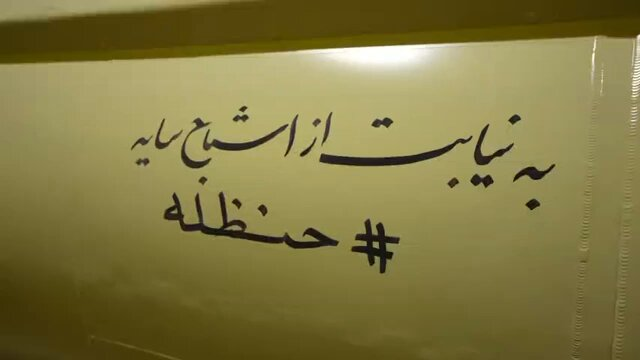
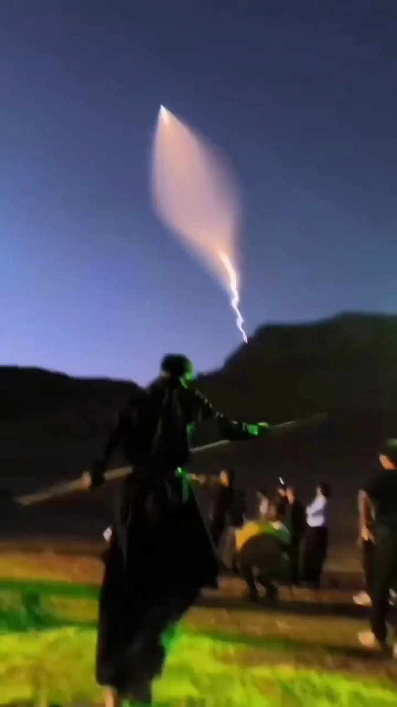
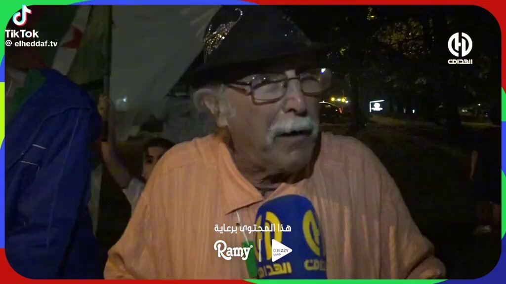
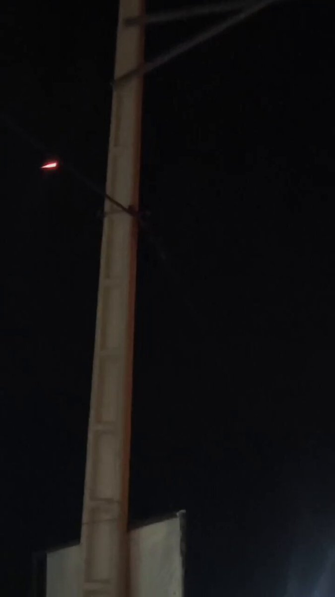
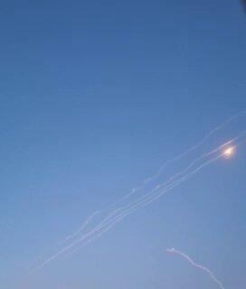
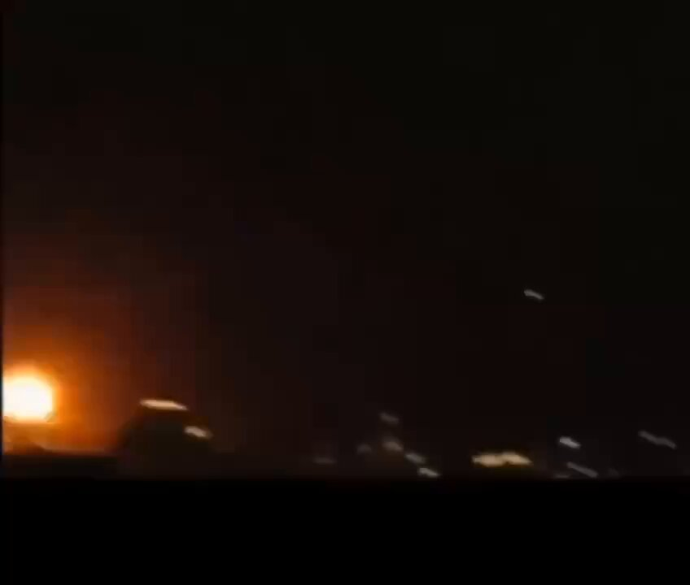
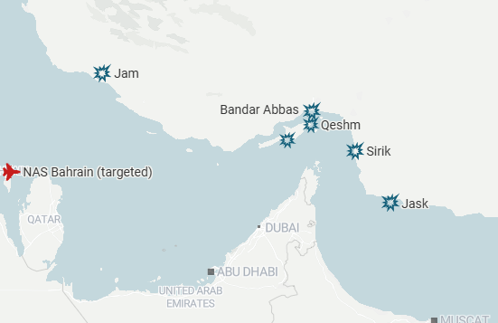
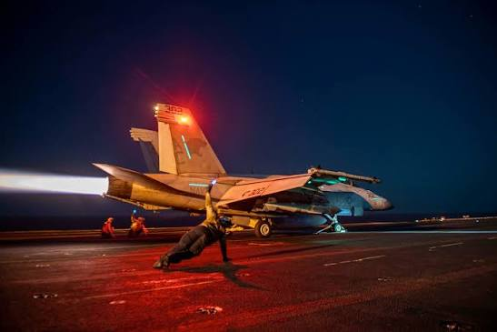

# Twitter Timeline Export

## Entry 1
### Nicole Grajewski
- Username: @NicoleGrajewski
- Tweet ID: `2064650079131111769`
- Date: [2026-06-10 10:05 UTC](https://x.com/NicoleGrajewski/status/2064650079131111769)

RT @AntonJaegermm: Wrote about Kojève's grave in Brussels and the idea of a European geopolitics for @nytopinion 

https://t.co/1Os3DoCAST

**Reposted:**
> ### Anton Jäger
> - Username: @AntonJaegermm
> - Tweet ID: `2064244674500477375`
> - Date: [2026-06-09 07:14 UTC](https://x.com/AntonJaegermm/status/2064244674500477375)
> 
> Wrote about Kojève's grave in Brussels and the idea of a European geopolitics for @nytopinion 
> 
> https://t.co/1Os3DoCAST
> 

---

## Entry 2
### Nicole Grajewski
- Username: @NicoleGrajewski
- Tweet ID: `2064642641166233813`
- Date: [2026-06-10 09:35 UTC](https://x.com/NicoleGrajewski/status/2064642641166233813)

RT @jillrussia: Ukraine builds cheap alternative to Patriot missiles via @FT
 https://t.co/Eq0aIPLP7O

**Reposted:**
> ### Jill Dougherty
> - Username: @jillrussia
> - Tweet ID: `2064596334141735416`
> - Date: [2026-06-10 06:31 UTC](https://x.com/jillrussia/status/2064596334141735416)
> 
> Ukraine builds cheap alternative to Patriot missiles via @FT
>  https://t.co/Eq0aIPLP7O
> 

---

## Entry 3
### Nicole Grajewski
- Username: @NicoleGrajewski
- Tweet ID: `2064635673206731181`
- Date: [2026-06-10 09:07 UTC](https://x.com/NicoleGrajewski/status/2064635673206731181)

RT @Entekhab_News: فرماندار شهرستان قشم: 

انفجاری در قشم رخ نداده است و صدای انفجار شنیده شده مربوط به قشم نیست.

ساعتی پیش صدای انفجار از…

**Reposted:**
> ### انتخاب
> - Username: @Entekhab_News
> - Tweet ID: `2064633191642673504`
> - Date: [2026-06-10 08:58 UTC](https://x.com/Entekhab_News/status/2064633191642673504)
> 
> فرماندار شهرستان قشم: 
> 
> انفجاری در قشم رخ نداده است و صدای انفجار شنیده شده مربوط به قشم نیست.
> 
> ساعتی پیش صدای انفجار از سمت دریا در قشم شنیده شده است اما هنوز هیچ منبع رسمی منشاء و مکان انفجار را تائید نکرده است. / صداوسیما
> 

---

## Entry 4
### Nicole Grajewski
- Username: @NicoleGrajewski
- Tweet ID: `2064635274118721685`
- Date: [2026-06-10 09:06 UTC](https://x.com/NicoleGrajewski/status/2064635274118721685)

Video of Iranian missiles fired towards Azraq Air Base in Jordan https://t.co/uEzMs6Q5Un

---

## Entry 5
### Nicole Grajewski
- Username: @NicoleGrajewski
- Tweet ID: `2064634903128420363`
- Date: [2026-06-10 09:04 UTC](https://x.com/NicoleGrajewski/status/2064634903128420363)

Videos of Iranian ballistic missile launches against U.S. targets this morning, includes a mix of liquid and solid propellants https://t.co/PgtgRCXgy3

---

## Entry 6
### Nicole Grajewski
- Username: @NicoleGrajewski
- Tweet ID: `2064632011566784755`
- Date: [2026-06-10 08:53 UTC](https://x.com/NicoleGrajewski/status/2064632011566784755)

RT @Afshin_Ismaeli: A new video from Iran shows Lurs performing a traditional dance while watching an Iranian Sejjil missile launch toward…

**Reposted:**
> ### Afshin Ismaeli
> - Username: @Afshin_Ismaeli
> - Tweet ID: `2064406284296687778`
> - Date: [2026-06-09 17:56 UTC](https://x.com/Afshin_Ismaeli/status/2064406284296687778)
> 
> A new video from Iran shows Lurs performing a traditional dance while watching an Iranian Sejjil missile launch toward Israel during the March conflict. https://t.co/tvQOctPDfU
> 
> 
> 

---

## Entry 7
### Nicole Grajewski
- Username: @NicoleGrajewski
- Tweet ID: `2064537683846697142`
- Date: [2026-06-10 02:38 UTC](https://x.com/NicoleGrajewski/status/2064537683846697142)

RT @OrlandoNapoli22: This is perfect because I’ve always heard people call Lawrence, Kansas the Algeria of the Midwest

**Reposted:**
> ### OZ
> - Username: @OrlandoNapoli22
> - Tweet ID: `2064363687381528803`
> - Date: [2026-06-09 15:07 UTC](https://x.com/OrlandoNapoli22/status/2064363687381528803)
> 
> This is perfect because I’ve always heard people call Lawrence, Kansas the Algeria of the Midwest
> 
> **Quoted Forward:**
> > ### Dean Ammi
> > - Username: @AlgerianFooty
> > - Tweet ID: `2064096526981292318`
> > - Date: [2026-06-08 21:25 UTC](https://x.com/AlgerianFooty/status/2064096526981292318)
> > 
> > 🗣️ “I want to say thank you to Algeria for choosing Lawrence, Kansas.” 🇺🇸 
> > 
> > The locals in USA are all getting behind Algeria. 🇩🇿 https://t.co/e2kejLtxjb
> > 
> > 
> > 

---

## Entry 8
### Nicole Grajewski
- Username: @NicoleGrajewski
- Tweet ID: `2064526558618919400`
- Date: [2026-06-10 01:54 UTC](https://x.com/NicoleGrajewski/status/2064526558618919400)

RT @gbrew24: US launched three waves of strikes on Iran, in response to Iran downing a helicopter. 

Targets included air defense and radar…

**Reposted:**
> ### Gregory Brew
> - Username: @gbrew24
> - Tweet ID: `2064516433095041240`
> - Date: [2026-06-10 01:14 UTC](https://x.com/gbrew24/status/2064516433095041240)
> 
> US launched three waves of strikes on Iran, in response to Iran downing a helicopter. 
> 
> Targets included air defense and radar installations across several southern provinces.
> 
> Iran has fired drones at US installations in Bahrain but otherwise has taken no action, as yet.
> 

---

## Entry 9
### Nicole Grajewski
- Username: @NicoleGrajewski
- Tweet ID: `2064526104509943889`
- Date: [2026-06-10 01:52 UTC](https://x.com/NicoleGrajewski/status/2064526104509943889)

RT @BabakTaghvaee1: BREAKING: Air-defence activity in Lorestan province of Iran! The IRGC Aerospace Force units in Imam Ali missile base of…

**Reposted:**
> ### Babak Taghvaee - The Crisis Watch
> - Username: @BabakTaghvaee1
> - Tweet ID: `2064504665723564540`
> - Date: [2026-06-10 00:27 UTC](https://x.com/BabakTaghvaee1/status/2064504665723564540)
> 
> BREAKING: Air-defence activity in Lorestan province of Iran! The IRGC Aerospace Force units in Imam Ali missile base of Khorramabad can be seen launching surface-to-air missiles at the USAF or US Navy fighter jets involved in the third wave of airstrikes ta Iran tonight. https://t.co/NHYvnnmSiI
> 
> 
> 

---

## Entry 10
### Nicole Grajewski
- Username: @NicoleGrajewski
- Tweet ID: `2064525703949758671`
- Date: [2026-06-10 01:50 UTC](https://x.com/NicoleGrajewski/status/2064525703949758671)

RT @hey_itsmyturn: Via @Vahid:
0106Z - 3 BMs launched from Khomein, Markaz Province, #Iran https://t.co/zuAwv8q2nI

**Reposted:**
> ### Shin
> - Username: @hey_itsmyturn
> - Tweet ID: `2064515668649640089`
> - Date: [2026-06-10 01:11 UTC](https://x.com/hey_itsmyturn/status/2064515668649640089)
> 
> Via @Vahid:
> 0106Z - 3 BMs launched from Khomein, Markaz Province, #Iran https://t.co/zuAwv8q2nI
> 
> 
> 

---

## Entry 11
### Nicole Grajewski
- Username: @NicoleGrajewski
- Tweet ID: `2064525672110793115`
- Date: [2026-06-10 01:50 UTC](https://x.com/NicoleGrajewski/status/2064525672110793115)

RT @Afshin_Ismaeli: Video reportedly showing the aftermath of tonight’s U.S. strikes on Qeshm Island. https://t.co/O0h0pKxDEc

**Reposted:**
> ### Afshin Ismaeli
> - Username: @Afshin_Ismaeli
> - Tweet ID: `2064496627323195466`
> - Date: [2026-06-09 23:55 UTC](https://x.com/Afshin_Ismaeli/status/2064496627323195466)
> 
> Video reportedly showing the aftermath of tonight’s U.S. strikes on Qeshm Island. https://t.co/O0h0pKxDEc
> 
> 
> 

---

## Entry 12
### Nicole Grajewski
- Username: @NicoleGrajewski
- Tweet ID: `2064525616800514421`
- Date: [2026-06-10 01:50 UTC](https://x.com/NicoleGrajewski/status/2064525616800514421)

RT @FaytuksNetwork: The IRGC and Khatam Al-Anbiya Central Headquarters say that they attacked the US 5th Fleet in Bahrain and US bases in t…

**Reposted:**
> ### Faytuks Network
> - Username: @FaytuksNetwork
> - Tweet ID: `2064511883810386373`
> - Date: [2026-06-10 00:56 UTC](https://x.com/FaytuksNetwork/status/2064511883810386373)
> 
> The IRGC and Khatam Al-Anbiya Central Headquarters say that they attacked the US 5th Fleet in Bahrain and US bases in the region. There is currently no evidence that any attack was launched and there have been no sirens or explosions heard.
> 

---

## Entry 13
### Nicole Grajewski
- Username: @NicoleGrajewski
- Tweet ID: `2064525560651411553`
- Date: [2026-06-10 01:50 UTC](https://x.com/NicoleGrajewski/status/2064525560651411553)

RT @Osinttechnical: Reported US and Iranian attacks so far tonight, as Hormuz once again descends into fighting. https://t.co/2s5Bt92p3p

**Reposted:**
> ### OSINTtechnical
> - Username: @Osinttechnical
> - Tweet ID: `2064512939915108782`
> - Date: [2026-06-10 01:00 UTC](https://x.com/Osinttechnical/status/2064512939915108782)
> 
> Reported US and Iranian attacks so far tonight, as Hormuz once again descends into fighting. https://t.co/2s5Bt92p3p
> 
> 
> 

---

## Entry 14
### Nicole Grajewski
- Username: @NicoleGrajewski
- Tweet ID: `2064525510181310476`
- Date: [2026-06-10 01:50 UTC](https://x.com/NicoleGrajewski/status/2064525510181310476)

RT @BarakRavid: CENTCOM: "U.S. forces completed self-defense strikes against Iran...in response to yesterday’s downing of a U.S. Army Apach…

**Reposted:**
> ### Barak Ravid
> - Username: @BarakRavid
> - Tweet ID: `2064513756676133350`
> - Date: [2026-06-10 01:03 UTC](https://x.com/BarakRavid/status/2064513756676133350)
> 
> CENTCOM: "U.S. forces completed self-defense strikes against Iran...in response to yesterday’s downing of a U.S. Army Apache helicopter. The forces struck Iranian air defense, ground control stations, and surveillance radar sites near the Strait of Hormuz with precision munitions
> 

---

## Entry 15
### Nicole Grajewski
- Username: @NicoleGrajewski
- Tweet ID: `2064525503030001778`
- Date: [2026-06-10 01:50 UTC](https://x.com/NicoleGrajewski/status/2064525503030001778)

RT @Osinttechnical: Explosions reported in Bahrain

**Reposted:**
> ### OSINTtechnical
> - Username: @Osinttechnical
> - Tweet ID: `2064520471865909729`
> - Date: [2026-06-10 01:30 UTC](https://x.com/Osinttechnical/status/2064520471865909729)
> 
> Explosions reported in Bahrain
> 

---

## Entry 16
### Nicole Grajewski
- Username: @NicoleGrajewski
- Tweet ID: `2064473566041583801`
- Date: [2026-06-09 22:23 UTC](https://x.com/NicoleGrajewski/status/2064473566041583801)

RT @websterkaroon: Approximately 15 impacts happened in at least 3 different Iranian southern cities.

My understanding is Iran is shooting…

**Reposted:**
> ### Alireza Talakoubnejad
> - Username: @websterkaroon
> - Tweet ID: `2064468153372213615`
> - Date: [2026-06-09 22:02 UTC](https://x.com/websterkaroon/status/2064468153372213615)
> 
> Approximately 15 impacts happened in at least 3 different Iranian southern cities.
> 
> My understanding is Iran is shooting back at US bases in the region
> 

---

## Entry 17
### Nicole Grajewski
- Username: @NicoleGrajewski
- Tweet ID: `2064459800000311784`
- Date: [2026-06-09 21:29 UTC](https://x.com/NicoleGrajewski/status/2064459800000311784)

U.S. Launches Strikes on Iran in Response to Downed Apache Helicopter https://t.co/hl7zF8oOyF

---

## Entry 18
### Nicole Grajewski
- Username: @NicoleGrajewski
- Tweet ID: `2064459439260754191`
- Date: [2026-06-09 21:27 UTC](https://x.com/NicoleGrajewski/status/2064459439260754191)

RT @Afshin_Ismaeli: Iran is carrying out drone strikes against the headquarters of the Iranian Kurdish opposition party KDPI in Balisan, Er…

**Reposted:**
> ### Afshin Ismaeli
> - Username: @Afshin_Ismaeli
> - Tweet ID: `2064429771442864491`
> - Date: [2026-06-09 19:29 UTC](https://x.com/Afshin_Ismaeli/status/2064429771442864491)
> 
> Iran is carrying out drone strikes against the headquarters of the Iranian Kurdish opposition party KDPI in Balisan, Erbil, Iraqi Kurdistan.
> 

---

## Entry 19
### Nicole Grajewski
- Username: @NicoleGrajewski
- Tweet ID: `2064459057113514386`
- Date: [2026-06-09 21:26 UTC](https://x.com/NicoleGrajewski/status/2064459057113514386)

RT @Conflict_Radar: NOW: Ballistic missile launch detected from Yemen towards Israel

**Reposted:**
> ### Conflict Radar
> - Username: @Conflict_Radar
> - Tweet ID: `2064439545702355251`
> - Date: [2026-06-09 20:08 UTC](https://x.com/Conflict_Radar/status/2064439545702355251)
> 
> NOW: Ballistic missile launch detected from Yemen towards Israel
> 

---

## Entry 20
### Nicole Grajewski
- Username: @NicoleGrajewski
- Tweet ID: `2064458799943983258`
- Date: [2026-06-09 21:25 UTC](https://x.com/NicoleGrajewski/status/2064458799943983258)

RT @vvanwilgenburg: #BREAKING: U.S. Central Command (CENTCOM) forces began launching self-defense strikes against Iran  - @CENTCOM https://…

**Reposted:**
> ### Wladimir van Wilgenburg
> - Username: @vvanwilgenburg
> - Tweet ID: `2064457252128399378`
> - Date: [2026-06-09 21:18 UTC](https://x.com/vvanwilgenburg/status/2064457252128399378)
> 
> #BREAKING: U.S. Central Command (CENTCOM) forces began launching self-defense strikes against Iran  - @CENTCOM https://t.co/LRenH8NJad
> 
> 
> 

---
