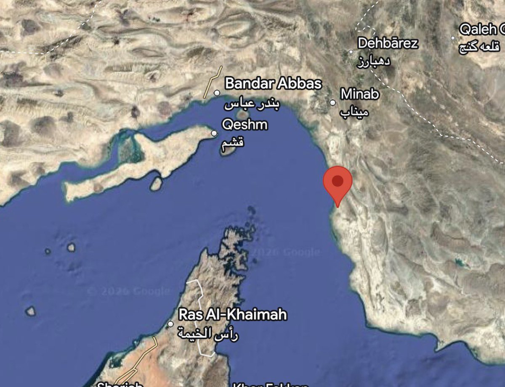
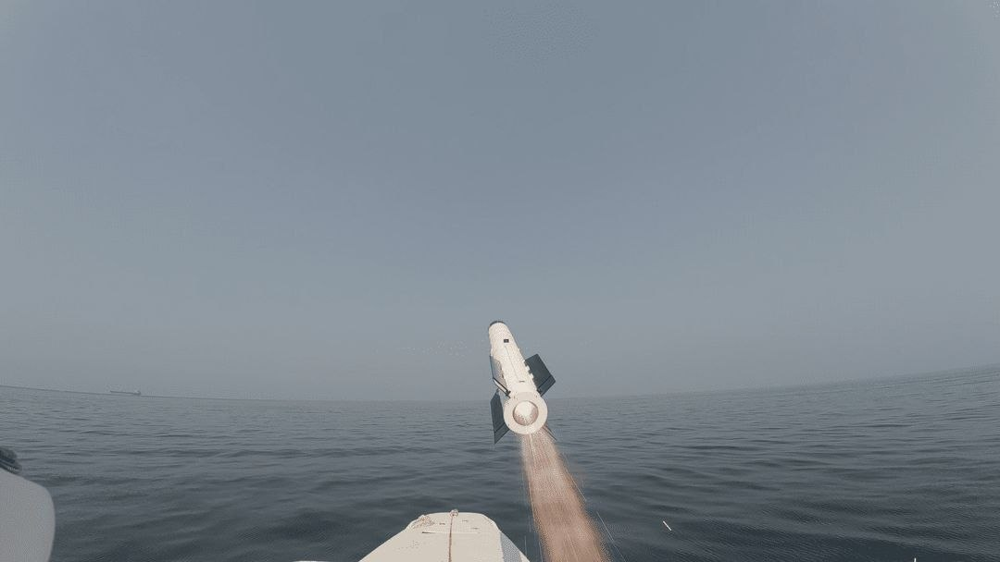
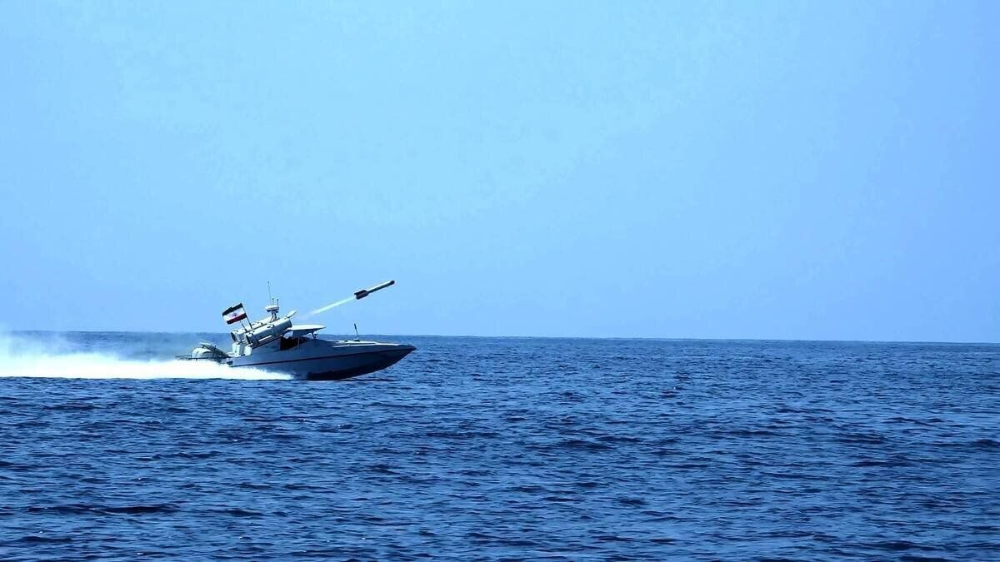
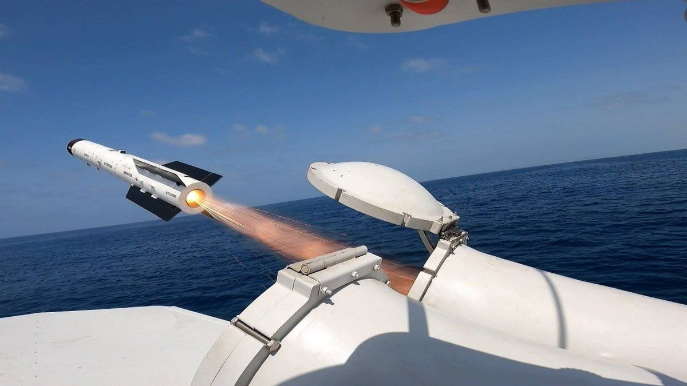
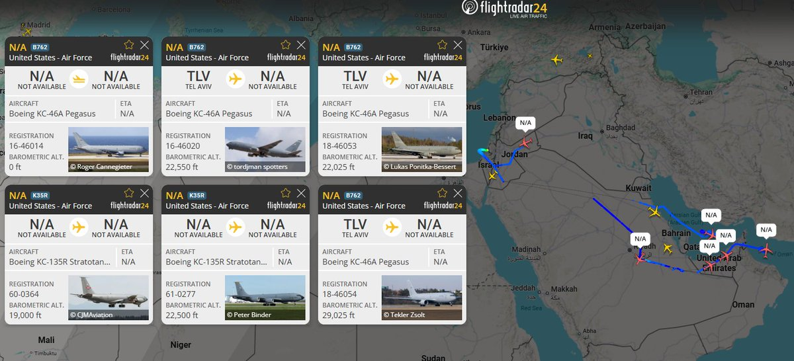
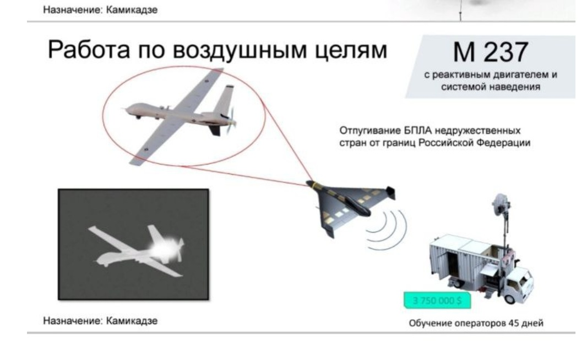
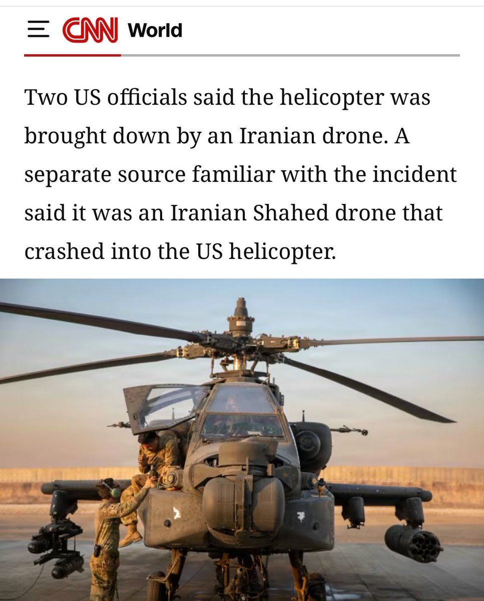
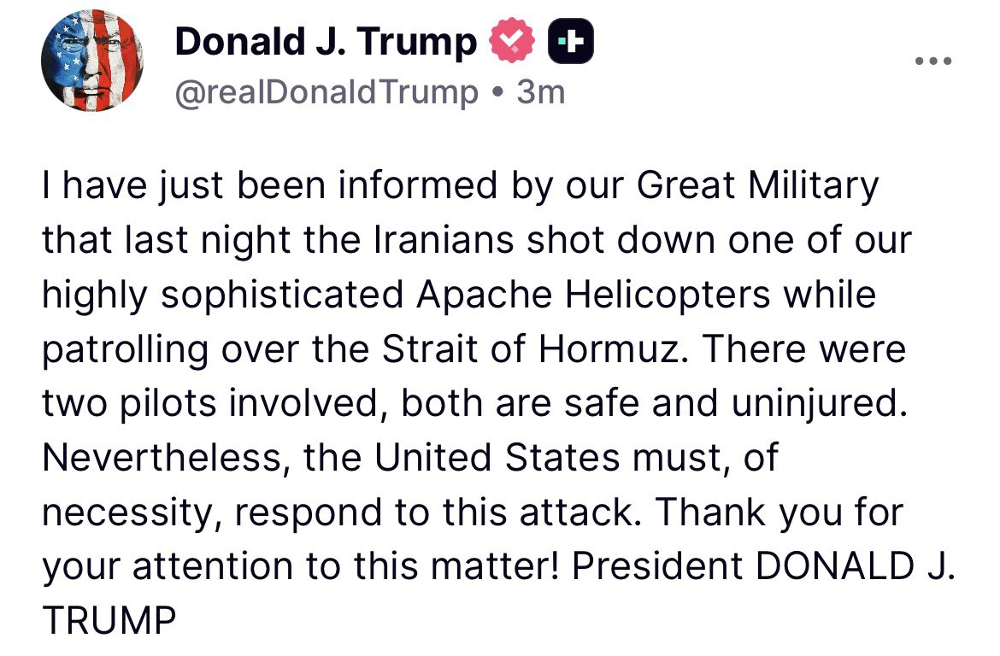
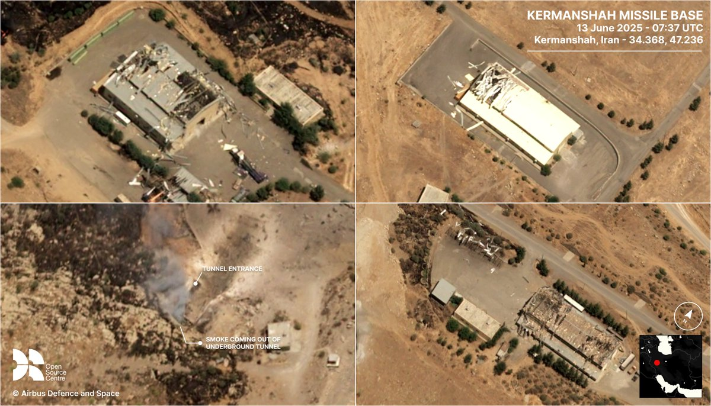

# Twitter Timeline Export

## Entry 1
### Nicole Grajewski
- Username: @NicoleGrajewski
- Tweet ID: `2064458555424403922`
- Date: [2026-06-09 21:24 UTC](https://x.com/NicoleGrajewski/status/2064458555424403922)

RT @Osinttechnical: Explosions reported in Sirik, an Iranian port city on the Strait of Hormuz- Iranian state media https://t.co/HOJ4vAk1cT

**Reposted:**
> ### OSINTtechnical
> - Username: @Osinttechnical
> - Tweet ID: `2064456445937037341`
> - Date: [2026-06-09 21:15 UTC](https://x.com/Osinttechnical/status/2064456445937037341)
> 
> Explosions reported in Sirik, an Iranian port city on the Strait of Hormuz- Iranian state media https://t.co/HOJ4vAk1cT
> 
> 
> 

---

## Entry 2
### Nicole Grajewski
- Username: @NicoleGrajewski
- Tweet ID: `2064458452110311608`
- Date: [2026-06-09 21:23 UTC](https://x.com/NicoleGrajewski/status/2064458452110311608)

RT @mhmiranusa: Some Iranian unofficial sources claim that the American Apache helicopter was shot down by an Iranian Kowsar-222 surface to…

**Reposted:**
> ### Mehdi H.
> - Username: @mhmiranusa
> - Tweet ID: `2064443772012736576`
> - Date: [2026-06-09 20:25 UTC](https://x.com/mhmiranusa/status/2064443772012736576)
> 
> Some Iranian unofficial sources claim that the American Apache helicopter was shot down by an Iranian Kowsar-222 surface to air missile which was launched from an Iranian fast attack boat during skirmishes bwtween the boats and the Apaches. https://t.co/HCcDmClPXt
> 
> 
> 
> 
> 

---

## Entry 3
### Nicole Grajewski
- Username: @NicoleGrajewski
- Tweet ID: `2064441064958919058`
- Date: [2026-06-09 20:14 UTC](https://x.com/NicoleGrajewski/status/2064441064958919058)

RT @mhmiranusa: Seven USAF tankers are currently pinging over the Middle East, six of which are flying near the Persian Gulf. https://t.co/…

**Reposted:**
> ### Mehdi H.
> - Username: @mhmiranusa
> - Tweet ID: `2064422562956820579`
> - Date: [2026-06-09 19:01 UTC](https://x.com/mhmiranusa/status/2064422562956820579)
> 
> Seven USAF tankers are currently pinging over the Middle East, six of which are flying near the Persian Gulf. https://t.co/YhTNGj1HAf
> 
> 
> 

---

## Entry 4
### Nicole Grajewski
- Username: @NicoleGrajewski
- Tweet ID: `2064418773638271324`
- Date: [2026-06-09 18:46 UTC](https://x.com/NicoleGrajewski/status/2064418773638271324)

RT @fab_hinz: Assuming the reporting is correct, this could have been a freak accident, a failed shoot-down attempt, or an intentional atta…

**Reposted:**
> ### Fabian Hinz
> - Username: @fab_hinz
> - Tweet ID: `2064403164112056526`
> - Date: [2026-06-09 17:44 UTC](https://x.com/fab_hinz/status/2064403164112056526)
> 
> Assuming the reporting is correct, this could have been a freak accident, a failed shoot-down attempt, or an intentional attack.
> 
> Worth noting that Iran previously marketed an interceptor variant of the jet-powered Shahed for export. https://t.co/Q1uiyNAyBz
> 
> 
> 
> **Quoted Forward:**
> > ### Special Kherson Cat 🐈🇺🇦
> > - Username: @bayraktar_1love
> > - Tweet ID: `2064400724620914761`
> > - Date: [2026-06-09 17:34 UTC](https://x.com/bayraktar_1love/status/2064400724620914761)
> > 
> > CNN reports that the U.S. Army AH-64 Apache downed near the Strait of Hormuz was brought down by an Iranian Shahed kamikaze drone. https://t.co/6QwIqiFklf
> > 
> > 
> > 

---

## Entry 5
### Nicole Grajewski
- Username: @NicoleGrajewski
- Tweet ID: `2064394985278001307`
- Date: [2026-06-09 17:11 UTC](https://x.com/NicoleGrajewski/status/2064394985278001307)

RT @WarMonitor3: Intelligence reports suggest the Russian official today assassinated in Moscow was the Head of the Department of Supply of…

**Reposted:**
> ### WarMonitor🇺🇦🇬🇧
> - Username: @WarMonitor3
> - Tweet ID: `2064372881925038293`
> - Date: [2026-06-09 15:43 UTC](https://x.com/WarMonitor3/status/2064372881925038293)
> 
> Intelligence reports suggest the Russian official today assassinated in Moscow was the Head of the Department of Supply of Missiles and Ammunition for the Russian ministry of defence.
> 

---

## Entry 6
### Nicole Grajewski
- Username: @NicoleGrajewski
- Tweet ID: `2064394794365796417`
- Date: [2026-06-09 17:10 UTC](https://x.com/NicoleGrajewski/status/2064394794365796417)

RT @BarakRavid: A U.S. official told me the investigation determined that an Iranian drone hit the U.S. helicopter and got it to crash. The…

**Reposted:**
> ### Barak Ravid
> - Username: @BarakRavid
> - Tweet ID: `2064392995118411871`
> - Date: [2026-06-09 17:03 UTC](https://x.com/BarakRavid/status/2064392995118411871)
> 
> A U.S. official told me the investigation determined that an Iranian drone hit the U.S. helicopter and got it to crash. The U.S. official said the investigation still hasn't determined if it was intentional or not
> 
> **Quoted Forward:**
> > ### Barak Ravid
> > - Username: @BarakRavid
> > - Tweet ID: `2064387123570962844`
> > - Date: [2026-06-09 16:40 UTC](https://x.com/BarakRavid/status/2064387123570962844)
> > 
> > 🚨🚨Trump on Truth Social: I have just been informed by our Great Military that last night the Iranians shot down one of our highly sophisticated Apache Helicopters while patrolling over the Strait of Hormuz. There were two pilots involved, both are safe and uninjured.
> > 

---

## Entry 7
### Nicole Grajewski
- Username: @NicoleGrajewski
- Tweet ID: `2064394759989264623`
- Date: [2026-06-09 17:10 UTC](https://x.com/NicoleGrajewski/status/2064394759989264623)

RT @sentdefender: Following the downing of a U.S. Army AH-64 Apache helicopter near the Strait of Hormuz, U.S. President Donald J. Trump ha…

**Reposted:**
> ### OSINTdefender
> - Username: @sentdefender
> - Tweet ID: `2064388408739258534`
> - Date: [2026-06-09 16:45 UTC](https://x.com/sentdefender/status/2064388408739258534)
> 
> Following the downing of a U.S. Army AH-64 Apache helicopter near the Strait of Hormuz, U.S. President Donald J. Trump has said that the Apache was in fact shot down while patrolling over the strait. Additionally, President Trump vowed to retaliate for the attack, saying that a https://t.co/4qKhpPHf1J
> 
> 
> 

---

## Entry 8
### Nicole Grajewski
- Username: @NicoleGrajewski
- Tweet ID: `2064394437661438435`
- Date: [2026-06-09 17:09 UTC](https://x.com/NicoleGrajewski/status/2064394437661438435)

Trump Says U.S. ‘Must’ Respond After Confirming Iran Shot Down Apache Helicopter https://t.co/MGed01nbz8

---

## Entry 9
### Nicole Grajewski
- Username: @NicoleGrajewski
- Tweet ID: `2064374691947512133`
- Date: [2026-06-09 15:50 UTC](https://x.com/NicoleGrajewski/status/2064374691947512133)

RT @glcarlstrom: You know things are deadlocked when even the unnamed Pakistani sources can't keep up an optimistic front anymore

**Reposted:**
> ### Gregg Carlstrom
> - Username: @glcarlstrom
> - Tweet ID: `2064355402548961598`
> - Date: [2026-06-09 14:34 UTC](https://x.com/glcarlstrom/status/2064355402548961598)
> 
> You know things are deadlocked when even the unnamed Pakistani sources can't keep up an optimistic front anymore
> 
> **Quoted Forward:**
> > ### First Squawk
> > - Username: @FirstSquawk
> > - Tweet ID: `2064344282702782675`
> > - Date: [2026-06-09 13:50 UTC](https://x.com/FirstSquawk/status/2064344282702782675)
> > 
> > PAKISTANI SOURCES SAY U.S.-IRAN TALKS FACE MAJOR HURDLES
> > 
> > Reaching agreement to end war between US and Iran within next few days is 'unlikely' due to ongoing 'complex situation,' Pakistani government sources tell Anadolu  Sources cite Israel’s 'non-stop' ceasefire violations in
> > 

---

## Entry 10
### Nicole Grajewski
- Username: @NicoleGrajewski
- Tweet ID: `2064304992735883626`
- Date: [2026-06-09 11:13 UTC](https://x.com/NicoleGrajewski/status/2064304992735883626)

RT @AliVaez: Israel and Iran nearly pull Trump back into a war he's anxious to end https://t.co/kbdAzYbquQ

**Reposted:**
> ### Ali Vaez
> - Username: @AliVaez
> - Tweet ID: `2064070376322191589`
> - Date: [2026-06-08 19:41 UTC](https://x.com/AliVaez/status/2064070376322191589)
> 
> Israel and Iran nearly pull Trump back into a war he's anxious to end https://t.co/kbdAzYbquQ
> 

---

## Entry 11
### Nicole Grajewski
- Username: @NicoleGrajewski
- Tweet ID: `2064304458075426843`
- Date: [2026-06-09 11:11 UTC](https://x.com/NicoleGrajewski/status/2064304458075426843)

RT @business: German Defense Minister Boris Pistorius said his government is seeking new partners after the collapse of a Franco-German joi…

**Reposted:**
> ### Bloomberg
> - Username: @business
> - Tweet ID: `2064269866480046515`
> - Date: [2026-06-09 08:54 UTC](https://x.com/business/status/2064269866480046515)
> 
> German Defense Minister Boris Pistorius said his government is seeking new partners after the collapse of a Franco-German joint fighter jet project https://t.co/tbYHmzBu9m
> 

---

## Entry 12
### Nicole Grajewski
- Username: @NicoleGrajewski
- Tweet ID: `2064303129751957567`
- Date: [2026-06-09 11:06 UTC](https://x.com/NicoleGrajewski/status/2064303129751957567)

RT @ZiadMDaoud: "Even as the clashes seemed to subside, a US Army Apache helicopter went down near the Strait of Hormuz and it wasn’t clear…

**Reposted:**
> ### Ziad Daoud
> - Username: @ZiadMDaoud
> - Tweet ID: `2064285624803471371`
> - Date: [2026-06-09 09:57 UTC](https://x.com/ZiadMDaoud/status/2064285624803471371)
> 
> "Even as the clashes seemed to subside, a US Army Apache helicopter went down near the Strait of Hormuz and it wasn’t clear if the aircraft suffered mechanical troubles or had been shot down by Iran"
> 
> https://t.co/51Jx056dhR
> 

---

## Entry 13
### Nicole Grajewski
- Username: @NicoleGrajewski
- Tweet ID: `2064245687252840481`
- Date: [2026-06-09 07:18 UTC](https://x.com/NicoleGrajewski/status/2064245687252840481)

RT @AliVaez: Told @WSJ: Iran has left Washington trying to separate two fronts whose key triggers remain outside the U.S.-Iran channel: Isr…

**Reposted:**
> ### Ali Vaez
> - Username: @AliVaez
> - Tweet ID: `2064245316145033572`
> - Date: [2026-06-09 07:16 UTC](https://x.com/AliVaez/status/2064245316145033572)
> 
> Told @WSJ: Iran has left Washington trying to separate two fronts whose key triggers remain outside the U.S.-Iran channel: Israel’s asserted freedom of action in Lebanon and Hezbollah’s refusal to stand down. The war has certainly made Iran less, not more, risk averse.
> 

---

## Entry 14
### Nicole Grajewski
- Username: @NicoleGrajewski
- Tweet ID: `2064235590451699927`
- Date: [2026-06-09 06:38 UTC](https://x.com/NicoleGrajewski/status/2064235590451699927)

RT @JM_Szuba: ICYMI — The US military fired land- and sea-based anti-missile interceptors in defense of Israeli territory during Iran’s lat…

**Reposted:**
> ### Jared Szuba
> - Username: @JM_Szuba
> - Tweet ID: `2064050676489982166`
> - Date: [2026-06-08 18:23 UTC](https://x.com/JM_Szuba/status/2064050676489982166)
> 
> ICYMI — The US military fired land- and sea-based anti-missile interceptors in defense of Israeli territory during Iran’s latest barrage of ballistic missiles.
> 
> More @AlMonitor 
> 
> https://t.co/FOjiK4IEdv
> 

---

## Entry 15
### Nicole Grajewski
- Username: @NicoleGrajewski
- Tweet ID: `2064225668515197322`
- Date: [2026-06-09 05:58 UTC](https://x.com/NicoleGrajewski/status/2064225668515197322)

RT @fab_hinz: Houthis showing the launch of an Iranian-made two-stage Fattah-1 MRBM under the local designation Palestine-2.

**Reposted:**
> ### Fabian Hinz
> - Username: @fab_hinz
> - Tweet ID: `2064019080265318894`
> - Date: [2026-06-08 16:17 UTC](https://x.com/fab_hinz/status/2064019080265318894)
> 
> Houthis showing the launch of an Iranian-made two-stage Fattah-1 MRBM under the local designation Palestine-2.
> 
> **Quoted Forward:**
> > ### Clash Report
> > - Username: @clashreport
> > - Tweet ID: `2064009450826891310`
> > - Date: [2026-06-08 15:39 UTC](https://x.com/clashreport/status/2064009450826891310)
> > 
> > WATCH: Footage of this morning’s launch by the Houthis of a Palestine-2 missile from Yemen toward central Israel. https://t.co/fEqTkPXwPN
> > 
> > 
> > 

---

## Entry 16
### Nicole Grajewski
- Username: @NicoleGrajewski
- Tweet ID: `2063911247393743200`
- Date: [2026-06-08 09:09 UTC](https://x.com/NicoleGrajewski/status/2063911247393743200)

RT @ZiadMDaoud: Last few hours in the Mideast:
• Iran threatened to strike Israel if Beirut was hit
• Israel struck Beirut
• Iran carried o…

**Reposted:**
> ### Ziad Daoud
> - Username: @ZiadMDaoud
> - Tweet ID: `2063908914664444335`
> - Date: [2026-06-08 09:00 UTC](https://x.com/ZiadMDaoud/status/2063908914664444335)
> 
> Last few hours in the Mideast:
> • Iran threatened to strike Israel if Beirut was hit
> • Israel struck Beirut
> • Iran carried out its threat, launching missiles at Israel
> • Trump told Netanyahu not to retaliate
> • Israel retaliated
> • Houthis are joining
> 
> https://t.co/51Jx055Fsj
> 

---

## Entry 17
### Nicole Grajewski
- Username: @NicoleGrajewski
- Tweet ID: `2063911198727299178`
- Date: [2026-06-08 09:09 UTC](https://x.com/NicoleGrajewski/status/2063911198727299178)

RT @jongambrellAP: APNewsAlert: DUBAI, United Arab Emirates (AP) — Saudi Arabia sounds missile alert in area home to the Prince Sultan Air…

**Reposted:**
> ### Jon Gambrell | جون
> - Username: @jongambrellAP
> - Tweet ID: `2063811750513029216`
> - Date: [2026-06-08 02:33 UTC](https://x.com/jongambrellAP/status/2063811750513029216)
> 
> APNewsAlert: DUBAI, United Arab Emirates (AP) — Saudi Arabia sounds missile alert in area home to the Prince Sultan Air Base, which hosts US forces.
> 

---

## Entry 18
### Nicole Grajewski
- Username: @NicoleGrajewski
- Tweet ID: `2063911185334804657`
- Date: [2026-06-08 09:09 UTC](https://x.com/NicoleGrajewski/status/2063911185334804657)

RT @Zakhe93: بالستیک های شلیک شده از کرمانشاه و اطراف تبریز نشانه باز شدن این دو پایگاه کلیدی که در جنگ 12 روزه سنگین بمباران و بسته شده بو…

**Reposted:**
> ### Lost weapons of Persia
> - Username: @Zakhe93
> - Tweet ID: `2063704799862759566`
> - Date: [2026-06-07 19:29 UTC](https://x.com/Zakhe93/status/2063704799862759566)
> 
> بالستیک های شلیک شده از کرمانشاه و اطراف تبریز نشانه باز شدن این دو پایگاه کلیدی که در جنگ 12 روزه سنگین بمباران و بسته شده بود را تایید می کند.
> حین آتش بس اخباری از فعالیت شدید جهت باز شدن این دو پایگاه بود!
> در این پایگاه ها تعداد قابل توجهی موشک بالستیک دوربرد و لانچر دپو ست! https://t.co/uWv53iKNun
> 
> 
> 

---

## Entry 19
### Nicole Grajewski
- Username: @NicoleGrajewski
- Tweet ID: `2063911139113603468`
- Date: [2026-06-08 09:08 UTC](https://x.com/NicoleGrajewski/status/2063911139113603468)

RT @FaytuksNetwork: Locals tell us they hear multiple explosions in the Tehran and Karaj areas.

**Reposted:**
> ### Faytuks Network
> - Username: @FaytuksNetwork
> - Tweet ID: `2063896578016919676`
> - Date: [2026-06-08 08:11 UTC](https://x.com/FaytuksNetwork/status/2063896578016919676)
> 
> Locals tell us they hear multiple explosions in the Tehran and Karaj areas.
> 

---
