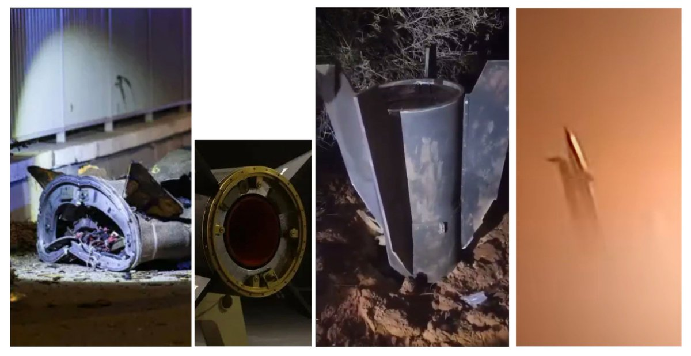
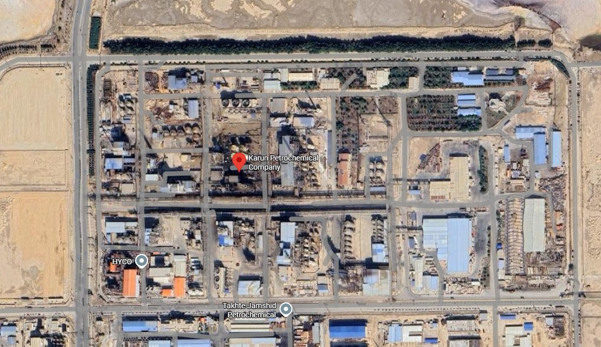
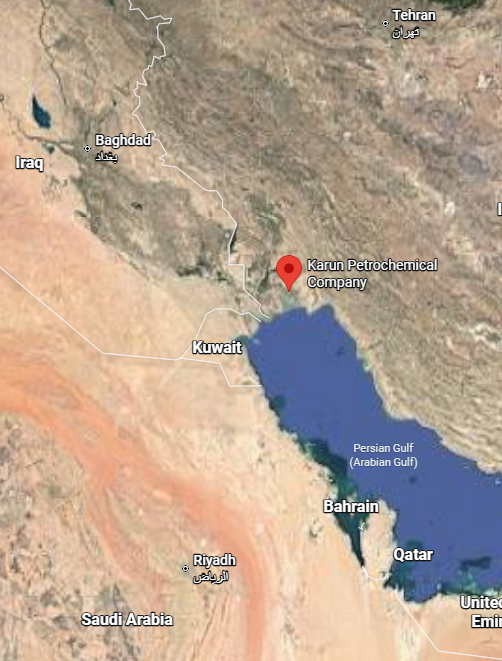
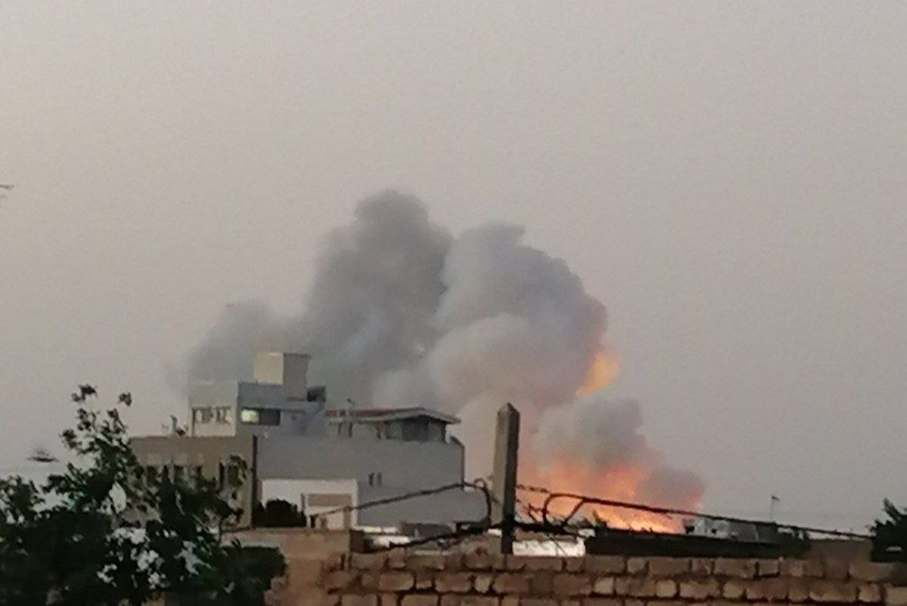
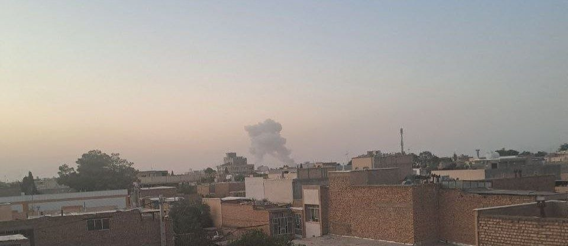
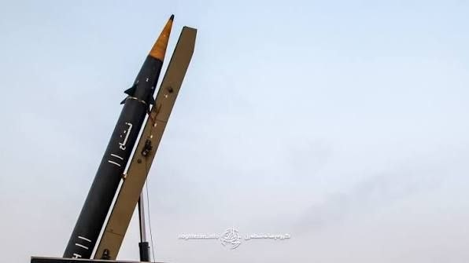
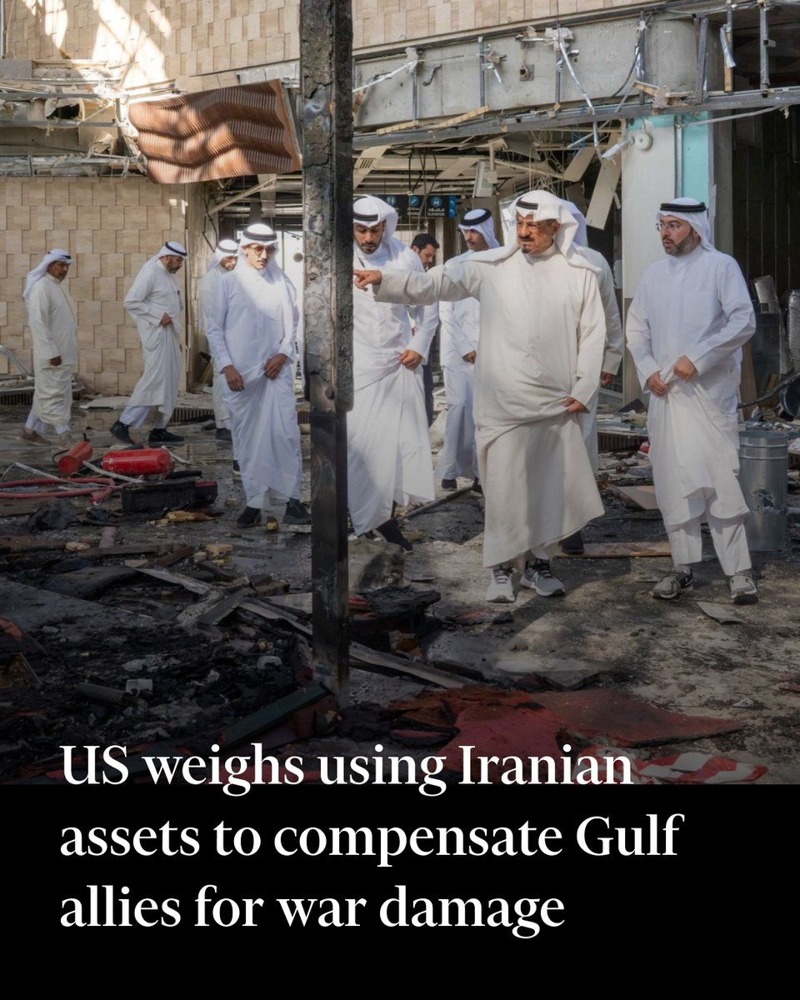
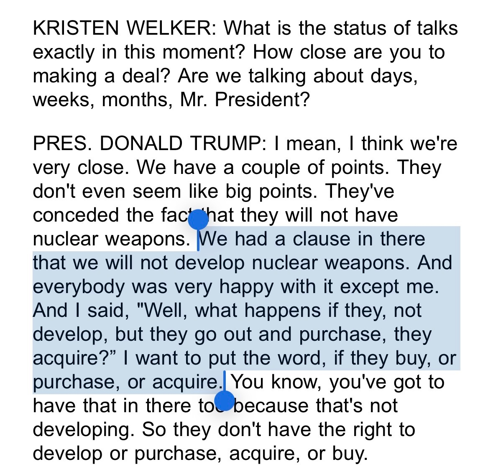

# Twitter Timeline Export

## Entry 1
### Nicole Grajewski
- Username: @NicoleGrajewski
- Tweet ID: `2063898346410950780`
- Date: [2026-06-08 08:18 UTC](https://x.com/NicoleGrajewski/status/2063898346410950780)

RT @FarzinNadimi: Evidence that the IRGC used some of its most advanced Fattah-1 hypersonic ballistic missiles, with rocket-powered exo-/en…

**Reposted:**
> ### Farzin Nadimi, PhD فرزین ندیمی
> - Username: @FarzinNadimi
> - Tweet ID: `2063880271657582668`
> - Date: [2026-06-08 07:06 UTC](https://x.com/FarzinNadimi/status/2063880271657582668)
> 
> Evidence that the IRGC used some of its most advanced Fattah-1 hypersonic ballistic missiles, with rocket-powered exo-/endo-atmospheric maneuvering warhead, for its latest attacks against northern Israel. The reentry vehicle separated from missile body over southern Syria. At https://t.co/UfhrpVHSM4
> 
> 
> 

---

## Entry 2
### Nicole Grajewski
- Username: @NicoleGrajewski
- Tweet ID: `2063898311912816970`
- Date: [2026-06-08 08:17 UTC](https://x.com/NicoleGrajewski/status/2063898311912816970)

RT @Osinttechnical: Iranian state media says that Israeli forces bombed the Karun Petrochemical Company in the city of Bandar-e Mahshahr th…

**Reposted:**
> ### OSINTtechnical
> - Username: @Osinttechnical
> - Tweet ID: `2063843004754821569`
> - Date: [2026-06-08 04:38 UTC](https://x.com/Osinttechnical/status/2063843004754821569)
> 
> Iranian state media says that Israeli forces bombed the Karun Petrochemical Company in the city of Bandar-e Mahshahr this morning. https://t.co/8s2Pjk3OlK
> 
> 
> 
> 

---

## Entry 3
### Nicole Grajewski
- Username: @NicoleGrajewski
- Tweet ID: `2063898288403718158`
- Date: [2026-06-08 08:17 UTC](https://x.com/NicoleGrajewski/status/2063898288403718158)

RT @vali_nasr: I would add to that this all came when US and Iran are deadlocked on MoU. This along with exchange in Persian Gulf is Iran p…

**Reposted:**
> ### Vali Nasr
> - Username: @vali_nasr
> - Tweet ID: `2063867007720698024`
> - Date: [2026-06-08 06:13 UTC](https://x.com/vali_nasr/status/2063867007720698024)
> 
> I would add to that this all came when US and Iran are deadlocked on MoU. This along with exchange in Persian Gulf is Iran putting pressure on US by signaling willingness to escalate and return to war when U.S. said war is over. The pressure is for Trump to move on the MoU.
> 
> **Quoted Forward:**
> > ### Alex Ward
> > - Username: @alexbward
> > - Tweet ID: `2063789212063641931`
> > - Date: [2026-06-08 01:04 UTC](https://x.com/alexbward/status/2063789212063641931)
> > 
> > What happened tonight:
> > 
> > - Trump told Netanyahu to back off retaliating against Iran.
> > 
> > - Iran came to its proxy’s defense, not the usual other way around.
> > 
> > - Israel and U.S. tried to separate US v Iran from Israel v Hezbollah. Now they are linked.
> > 

---

## Entry 4
### Nicole Grajewski
- Username: @NicoleGrajewski
- Tweet ID: `2063898180001935429`
- Date: [2026-06-08 08:17 UTC](https://x.com/NicoleGrajewski/status/2063898180001935429)

RT @glcarlstrom: Seeing some tweets about how Iran has imposed a new deterrence equation on Israel and the region. That seems like a whole…

**Reposted:**
> ### Gregg Carlstrom
> - Username: @glcarlstrom
> - Tweet ID: `2063898067770703882`
> - Date: [2026-06-08 08:16 UTC](https://x.com/glcarlstrom/status/2063898067770703882)
> 
> Seeing some tweets about how Iran has imposed a new deterrence equation on Israel and the region. That seems like a whole lot of motivated reasoning.
> 
> First, let's be clear about how much of a reversal this represents for Iran's strategic doctrine: instead of its Arab proxies
> 

---

## Entry 5
### Nicole Grajewski
- Username: @NicoleGrajewski
- Tweet ID: `2063866223775867278`
- Date: [2026-06-08 06:10 UTC](https://x.com/NicoleGrajewski/status/2063866223775867278)

RT @mhmiranusa: First official video from Iran on the launch of ballistic missiles towards Israel tonight. https://t.co/kdyOxW5GtA

**Reposted:**
> ### Mehdi H.
> - Username: @mhmiranusa
> - Tweet ID: `2063719211189563804`
> - Date: [2026-06-07 20:26 UTC](https://x.com/mhmiranusa/status/2063719211189563804)
> 
> First official video from Iran on the launch of ballistic missiles towards Israel tonight. https://t.co/kdyOxW5GtA
> 
> 
> 

---

## Entry 6
### Nicole Grajewski
- Username: @NicoleGrajewski
- Tweet ID: `2063866158118228250`
- Date: [2026-06-08 06:10 UTC](https://x.com/NicoleGrajewski/status/2063866158118228250)

RT @mhmiranusa: Local photos of explosions due to Israeli attacks inside Iran this early morning.
Based on the shape and color of explosion…

**Reposted:**
> ### Mehdi H.
> - Username: @mhmiranusa
> - Tweet ID: `2063802983389774181`
> - Date: [2026-06-08 01:59 UTC](https://x.com/mhmiranusa/status/2063802983389774181)
> 
> Local photos of explosions due to Israeli attacks inside Iran this early morning.
> Based on the shape and color of explosion, it looks like missile launchers were hit. https://t.co/xEIvaEpZYv
> 
> 
> 
> 

---

## Entry 7
### Nicole Grajewski
- Username: @NicoleGrajewski
- Tweet ID: `2063865999657464303`
- Date: [2026-06-08 06:09 UTC](https://x.com/NicoleGrajewski/status/2063865999657464303)

RT @websterkaroon: Both side's attacks have been somewhat limited compared to what they are capable of ... but it's escalating pretty fast.…

**Reposted:**
> ### Alireza Talakoubnejad
> - Username: @websterkaroon
> - Tweet ID: `2063852584247636136`
> - Date: [2026-06-08 05:16 UTC](https://x.com/websterkaroon/status/2063852584247636136)
> 
> Both side's attacks have been somewhat limited compared to what they are capable of ... but it's escalating pretty fast.
> 
> It's tough to avoid the conclusion we're back to all out conflict unless Trump forcefully pulls the brakes in the next few hours
> 

---

## Entry 8
### Nicole Grajewski
- Username: @NicoleGrajewski
- Tweet ID: `2063761022628815059`
- Date: [2026-06-07 23:12 UTC](https://x.com/NicoleGrajewski/status/2063761022628815059)

RT @hdagres: Sounds like Israel is getting ready to retaliate...

**Reposted:**
> ### Holly Dagres
> - Username: @hdagres
> - Tweet ID: `2063747740270493886`
> - Date: [2026-06-07 22:19 UTC](https://x.com/hdagres/status/2063747740270493886)
> 
> Sounds like Israel is getting ready to retaliate...
> 
> **Quoted Forward:**
> > ### Trey Yingst
> > - Username: @TreyYingst
> > - Tweet ID: `2063737716617953475`
> > - Date: [2026-06-07 21:39 UTC](https://x.com/TreyYingst/status/2063737716617953475)
> > 
> > NEW: The U. S. Embassy in Jerusalem has directed all U.S. government employees and their families to shelter in place. 
> > 
> > The order also calls on these individuals to be prepared to move to a protected space in the event of a red alert siren due to missile fire.
> > 

---

## Entry 9
### Nicole Grajewski
- Username: @NicoleGrajewski
- Tweet ID: `2063760979435942137`
- Date: [2026-06-07 23:12 UTC](https://x.com/NicoleGrajewski/status/2063760979435942137)

Listen to Decker here

**Quoted Forward:**
> ### Decker Eveleth
> - Username: @dex_eve
> - Tweet ID: `2063714225646616916`
> - Date: [2026-06-07 20:06 UTC](https://x.com/dex_eve/status/2063714225646616916)
> 
> 10 missiles against an air base target - a target type that Iran has in the past only been able to do limited damage do in terms of operations - is a warning shot. Iran could do much more at this point if they wanted to.
> 

---

## Entry 10
### Nicole Grajewski
- Username: @NicoleGrajewski
- Tweet ID: `2063760776192512342`
- Date: [2026-06-07 23:11 UTC](https://x.com/NicoleGrajewski/status/2063760776192512342)

RT @dex_eve: 10 missiles against an air base target - a target type that Iran has in the past only been able to do limited damage do in ter…

**Reposted:**
> ### Decker Eveleth
> - Username: @dex_eve
> - Tweet ID: `2063714225646616916`
> - Date: [2026-06-07 20:06 UTC](https://x.com/dex_eve/status/2063714225646616916)
> 
> 10 missiles against an air base target - a target type that Iran has in the past only been able to do limited damage do in terms of operations - is a warning shot. Iran could do much more at this point if they wanted to.
> 
> **Quoted Forward:**
> > ### Evergreen Intel
> > - Username: @vcdgf555
> > - Tweet ID: `2063709061791854983`
> > - Date: [2026-06-07 19:45 UTC](https://x.com/vcdgf555/status/2063709061791854983)
> > 
> > IRGC reporting they targeted Ramat David with TBMs.
> > 

---

## Entry 11
### Nicole Grajewski
- Username: @NicoleGrajewski
- Tweet ID: `2063760724749439355`
- Date: [2026-06-07 23:11 UTC](https://x.com/NicoleGrajewski/status/2063760724749439355)

RT @mhmiranusa: Reports of the 6th wave of Iranian ballistic missiles launch towards Israel tonight.
The 6th wave was reportedly launched f…

**Reposted:**
> ### Mehdi H.
> - Username: @mhmiranusa
> - Tweet ID: `2063707139558789314`
> - Date: [2026-06-07 19:38 UTC](https://x.com/mhmiranusa/status/2063707139558789314)
> 
> Reports of the 6th wave of Iranian ballistic missiles launch towards Israel tonight.
> The 6th wave was reportedly launched from near the city of Kashan. https://t.co/VeSRdOH0LD
> 
> 
> 

---

## Entry 12
### Nicole Grajewski
- Username: @NicoleGrajewski
- Tweet ID: `2063760263975727114`
- Date: [2026-06-07 23:09 UTC](https://x.com/NicoleGrajewski/status/2063760263975727114)

RT @michaeldweiss: Timing of this coincides with NYT reporting that the Pentagon is worried about Israel’s spying on US officials, many of…

**Reposted:**
> ### Michael Weiss
> - Username: @michaeldweiss
> - Tweet ID: `2063731053085237553`
> - Date: [2026-06-07 21:13 UTC](https://x.com/michaeldweiss/status/2063731053085237553)
> 
> Timing of this coincides with NYT reporting that the Pentagon is worried about Israel’s spying on US officials, many of them Vance-aligned such as Bridge Colby.
> 
> **Quoted Forward:**
> > ### Afshin Ismaeli
> > - Username: @Afshin_Ismaeli
> > - Tweet ID: `2063018028833616156`
> > - Date: [2026-06-05 22:00 UTC](https://x.com/Afshin_Ismaeli/status/2063018028833616156)
> > 
> > Israeli intelligence sources have accused Vice President JD Vance of leaking a Mossad plan to use Kurdish forces against Iran to Turkish President Erdogan.
> > The leak was intended to help Erdogan reach US President Trump in time to stop the operation before it could be carried out.
> > 

---

## Entry 13
### Nicole Grajewski
- Username: @NicoleGrajewski
- Tweet ID: `2063760140826710390`
- Date: [2026-06-07 23:08 UTC](https://x.com/NicoleGrajewski/status/2063760140826710390)

RT @Conflict_Radar: Iranian state TV footage of the launch of the attack on Israel

Estimated to have involved 10 ballistic missiles https:…

**Reposted:**
> ### Conflict Radar
> - Username: @Conflict_Radar
> - Tweet ID: `2063725400203657587`
> - Date: [2026-06-07 20:50 UTC](https://x.com/Conflict_Radar/status/2063725400203657587)
> 
> Iranian state TV footage of the launch of the attack on Israel
> 
> Estimated to have involved 10 ballistic missiles https://t.co/Ox8BGktrK1
> 
> 
> 

---

## Entry 14
### Nicole Grajewski
- Username: @NicoleGrajewski
- Tweet ID: `2063709009186578736`
- Date: [2026-06-07 19:45 UTC](https://x.com/NicoleGrajewski/status/2063709009186578736)

Iranian strikes against Israel are in response to the attacks on Lebanon today. As many of us have argued, it was never a question of if hostilities would resume, but when. Too many red lines had been crossed. The key question now is if this remains limited.

---

## Entry 15
### Nicole Grajewski
- Username: @NicoleGrajewski
- Tweet ID: `2063632999518798332`
- Date: [2026-06-07 14:43 UTC](https://x.com/NicoleGrajewski/status/2063632999518798332)

RT @glubold: NEW: The Pentagon has raised the level of concern about Israeli spying on the U.S. military to critical, its highest level ami…

**Reposted:**
> ### Gordon Lubold
> - Username: @glubold
> - Tweet ID: `2063264958738010611`
> - Date: [2026-06-06 14:21 UTC](https://x.com/glubold/status/2063264958738010611)
> 
> NEW: The Pentagon has raised the level of concern about Israeli spying on the U.S. military to critical, its highest level amid worries between the two countries of divergence over the war in Iran. Me with @ckubeNBC and @dandeluce https://t.co/pDPyTan2ai
> 

---

## Entry 16
### Nicole Grajewski
- Username: @NicoleGrajewski
- Tweet ID: `2063632962646663336`
- Date: [2026-06-07 14:43 UTC](https://x.com/NicoleGrajewski/status/2063632962646663336)

RT @FT: The US Treasury secretary is weighing plans to use Iranian assets to pay for the rebuilding of Gulf countries hit by retaliation fr…

**Reposted:**
> ### Financial Times
> - Username: @FT
> - Tweet ID: `2063598638538825958`
> - Date: [2026-06-07 12:27 UTC](https://x.com/FT/status/2063598638538825958)
> 
> The US Treasury secretary is weighing plans to use Iranian assets to pay for the rebuilding of Gulf countries hit by retaliation from Tehran, in a bid to limit the war’s fallout on American allies in the Middle East: https://t.co/1VX4iCDWx6 https://t.co/ggL357QNTP
> 
> 
> 

---

## Entry 17
### Nicole Grajewski
- Username: @NicoleGrajewski
- Tweet ID: `2063626282777162008`
- Date: [2026-06-07 14:17 UTC](https://x.com/NicoleGrajewski/status/2063626282777162008)

RT @FT: Russian drone hits nuclear fuel site near Chernobyl https://t.co/kz9Ba89e87

**Reposted:**
> ### Financial Times
> - Username: @FT
> - Tweet ID: `2063596200897462294`
> - Date: [2026-06-07 12:17 UTC](https://x.com/FT/status/2063596200897462294)
> 
> Russian drone hits nuclear fuel site near Chernobyl https://t.co/kz9Ba89e87
> 

---

## Entry 18
### Nicole Grajewski
- Username: @NicoleGrajewski
- Tweet ID: `2063621983988858978`
- Date: [2026-06-07 13:59 UTC](https://x.com/NicoleGrajewski/status/2063621983988858978)

RT @ForeignAffairs: The United States and Iran are unlikely to make real peace because Tehran “has concluded that conflict is preferable to…

**Reposted:**
> ### Foreign Affairs
> - Username: @ForeignAffairs
> - Tweet ID: `2063616719768244274`
> - Date: [2026-06-07 13:39 UTC](https://x.com/ForeignAffairs/status/2063616719768244274)
> 
> The United States and Iran are unlikely to make real peace because Tehran “has concluded that conflict is preferable to diplomacy,” writes Mohammad Ayatollahi Tabaar. “The war, after all, seems to be helping Iran increase its international power.”
> https://t.co/wDLXz9oSOQ
> 

---

## Entry 19
### Nicole Grajewski
- Username: @NicoleGrajewski
- Tweet ID: `2063620888373698963`
- Date: [2026-06-07 13:55 UTC](https://x.com/NicoleGrajewski/status/2063620888373698963)

RT @gbrew24: Good perspective from @LizHurra.

Today's strike on Beirut was in response to Hezbollah attacks on N Israel, per the new rules…

**Reposted:**
> ### Gregory Brew
> - Username: @gbrew24
> - Tweet ID: `2063615529739243823`
> - Date: [2026-06-07 13:34 UTC](https://x.com/gbrew24/status/2063615529739243823)
> 
> Good perspective from @LizHurra.
> 
> Today's strike on Beirut was in response to Hezbollah attacks on N Israel, per the new rules of engagement. 
> 
> Netanyahu wants to go further, no doubt--but unless Hezbollah continues its attack, US pressure is likely to restrain him.
> 
> **Quoted Forward:**
> > ### Elizabeth Tsurkov
> > - Username: @LizHurra
> > - Tweet ID: `2063609630874316944`
> > - Date: [2026-06-07 13:10 UTC](https://x.com/LizHurra/status/2063609630874316944)
> > 
> > Hezbollah formally rejected the proposal made by Secretary Rubio for a de-escalation of violence - Israel doesn't hit Beirut in exchange for Hezbollah not targeting Israeli border towns (only targeting occupying forces).
> > https://t.co/dsee8IZBWO
> > In reality, for 4 days running,
> > 

---

## Entry 20
### Nicole Grajewski
- Username: @NicoleGrajewski
- Tweet ID: `2063620848758505487`
- Date: [2026-06-07 13:55 UTC](https://x.com/NicoleGrajewski/status/2063620848758505487)

RT @alexbward: Trump confirms that they way he’s trying to strengthen the “no nukes” vow by Iran is having Tehran say they won’t buy nuclea…

**Reposted:**
> ### Alex Ward
> - Username: @alexbward
> - Tweet ID: `2063620152512405606`
> - Date: [2026-06-07 13:52 UTC](https://x.com/alexbward/status/2063620152512405606)
> 
> Trump confirms that they way he’s trying to strengthen the “no nukes” vow by Iran is having Tehran say they won’t buy nuclear material https://t.co/1qJooEyJjM
> 
> 
> 

---
