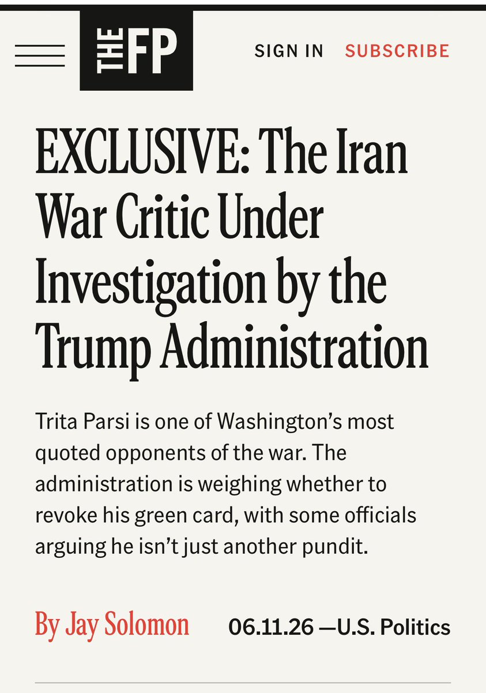
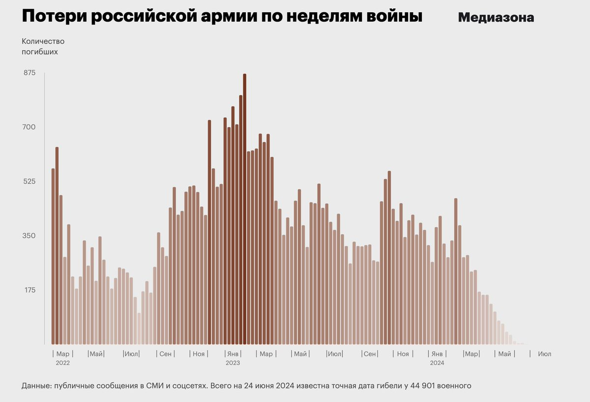

# Twitter Timeline Export

## Entry 1
### Policy Tensor
- Username: @policytensor
- Tweet ID: `2064280559702909010`
- Date: [2026-06-09 09:36 UTC](https://x.com/policytensor/status/2064280559702909010)

An Equilibrium Model of Counter-Base War in the Western Pacific, by @policytensor https://t.co/DOAYbvr7zF https://t.co/MoVdZY0mmL

---

## Entry 2
### Policy Tensor
- Username: @policytensor
- Tweet ID: `2065009291551969510`
- Date: [2026-06-11 09:52 UTC](https://x.com/policytensor/status/2065009291551969510)

RT @AJEnglish: BREAKING: Three liquefied natural gas (LNG) tankers have exited the Strait of Hormuz with their transponders off and bound f…

**Reposted:**
> ### Al Jazeera English
> - Username: @AJEnglish
> - Tweet ID: `2065007845423079774`
> - Date: [2026-06-11 09:46 UTC](https://x.com/AJEnglish/status/2065007845423079774)
> 
> BREAKING: Three liquefied natural gas (LNG) tankers have exited the Strait of Hormuz with their transponders off and bound for destinations in Asia, according to ship-tracking data from LSEG and Kpler.
> 
> 🔴 LIVE updates: https://t.co/dwW5W5LVpL https://t.co/5f3HFJYrmj
> 
> 
> 

---

## Entry 3
### Policy Tensor
- Username: @policytensor
- Tweet ID: `2065003238651281495`
- Date: [2026-06-11 09:28 UTC](https://x.com/policytensor/status/2065003238651281495)

It looks very much like Iran fucked up. I may be wrong. We'll see.

---

## Entry 4
### Policy Tensor
- Username: @policytensor
- Tweet ID: `2065004612902412544`
- Date: [2026-06-11 09:34 UTC](https://x.com/policytensor/status/2065004612902412544)

I mean that that under-responded.

---

## Entry 5
### Policy Tensor
- Username: @policytensor
- Tweet ID: `2064988790918193435`
- Date: [2026-06-11 08:31 UTC](https://x.com/policytensor/status/2064988790918193435)

This is a mistake.

**Quoted Forward:**
> ### Drop Site
> - Username: @DropSiteNews
> - Tweet ID: `2064985926988616084`
> - Date: [2026-06-11 08:19 UTC](https://x.com/DropSiteNews/status/2064985926988616084)
> 
> 🔺 Iran Claims Detailed Intelligence Operation Behind Strikes on U.S. Bases
> 
> Fars News cited a source saying Iran carried out a “complex intelligence and operational plan” in its early Thursday strikes on U.S. military bases across the region, claiming significant damage to
> 

---

## Entry 6
### Policy Tensor
- Username: @policytensor
- Tweet ID: `2064987967228101045`
- Date: [2026-06-11 08:27 UTC](https://x.com/policytensor/status/2064987967228101045)

Iranian response on US assets might.

**Quoted Forward:**
> ### Daniel DePetris
> - Username: @DanDePetris
> - Tweet ID: `2064895407444873352`
> - Date: [2026-06-11 02:20 UTC](https://x.com/DanDePetris/status/2064895407444873352)
> 
> Six weeks of continuous U.S. bombing didn’t force Iran to capitulate. 
> 
> So it’s hard to see how another two days of U.S. bombing is going to force Iran to capitulate.
> 

---

## Entry 7
### Policy Tensor
- Username: @policytensor
- Tweet ID: `2064984223920935248`
- Date: [2026-06-11 08:12 UTC](https://x.com/policytensor/status/2064984223920935248)

RT @policytensor: @ancientjake1 They can’t possibly do this.

**Reposted:**
> ### Policy Tensor
> - Username: @policytensor
> - Tweet ID: `2064976691311636709`
> - Date: [2026-06-11 07:43 UTC](https://x.com/policytensor/status/2064976691311636709)
> 
> @ancientjake1 They can’t possibly do this.
> 

---

## Entry 8
### Policy Tensor
- Username: @policytensor
- Tweet ID: `2064983801244090868`
- Date: [2026-06-11 08:11 UTC](https://x.com/policytensor/status/2064983801244090868)

If @tparsi is not safe. Who is?

---

## Entry 9
### Policy Tensor
- Username: @policytensor
- Tweet ID: `2064980004006461505`
- Date: [2026-06-11 07:56 UTC](https://x.com/policytensor/status/2064980004006461505)

The lobby’s attack on @tparsi is an import test of the survival of our civilization.

**Quoted Forward:**
> ### Policy Tensor
> - Username: @policytensor
> - Tweet ID: `2064973762131288238`
> - Date: [2026-06-11 07:31 UTC](https://x.com/policytensor/status/2064973762131288238)
> 
> Get the fuck out of here. Are you for real? This cannot be tolerated.
> 

---

## Entry 10
### Policy Tensor
- Username: @policytensor
- Tweet ID: `2064975388929855928`
- Date: [2026-06-11 07:37 UTC](https://x.com/policytensor/status/2064975388929855928)

Why the fuck do you think they said that. But it is worse. We will lose to China.

**Quoted Forward:**
> ### Foreign Policy
> - Username: @ForeignPolicy
> - Tweet ID: `2064694244380438908`
> - Date: [2026-06-10 13:00 UTC](https://x.com/ForeignPolicy/status/2064694244380438908)
> 
> The war in Iran has depleted the Pentagon as China’s military buildup matures.
> https://t.co/x9Y6nfHTBs
> 

---

## Entry 11
### Policy Tensor
- Username: @policytensor
- Tweet ID: `2064973762131288238`
- Date: [2026-06-11 07:31 UTC](https://x.com/policytensor/status/2064973762131288238)

Get the fuck out of here. Are you for real? This cannot be tolerated.

**Quoted Forward:**
> ### Ragıp Soylu
> - Username: @ragipsoylu
> - Tweet ID: `2064939124264505418`
> - Date: [2026-06-11 05:13 UTC](https://x.com/ragipsoylu/status/2064939124264505418)
> 
> WOW, Trump administration has launched a probe into Iran war critic Trita Parsi and is considering to cancel his Green Card and deport him out of the country, The Free Press reports https://t.co/L9FmxzF0kD
> 
> 
> 

---

## Entry 12
### Policy Tensor
- Username: @policytensor
- Tweet ID: `2064971761662243106`
- Date: [2026-06-11 07:23 UTC](https://x.com/policytensor/status/2064971761662243106)

RT @policytensor: Did they get him?, by @policytensor. https://t.co/enFG6a4GiC

**Reposted:**
> ### Policy Tensor
> - Username: @policytensor
> - Tweet ID: `2064769783074037768`
> - Date: [2026-06-10 18:00 UTC](https://x.com/policytensor/status/2064769783074037768)
> 
> Did they get him?, by @policytensor. https://t.co/enFG6a4GiC
> 

---

## Entry 13
### Policy Tensor
- Username: @policytensor
- Tweet ID: `2064967558059417894`
- Date: [2026-06-11 07:06 UTC](https://x.com/policytensor/status/2064967558059417894)

👀

**Quoted Forward:**
> ### Ehsan Safarnejad
> - Username: @Safarnejad_IR
> - Tweet ID: `2064955125253202085`
> - Date: [2026-06-11 06:17 UTC](https://x.com/Safarnejad_IR/status/2064955125253202085)
> 
> ⚠️ Iran successful hit on the long-range radar station at the Jabal al-Dukhan site in Bahrain https://t.co/B4jEYG0aAR
> 
> 
> 

---

## Entry 14
### Policy Tensor
- Username: @policytensor
- Tweet ID: `2064963544165073041`
- Date: [2026-06-11 06:50 UTC](https://x.com/policytensor/status/2064963544165073041)

I have seen a lot of shares about Sy Hersh reporting on Trump considering nuclear weapons use. What it shows is potty training. The implied nuclear threat is going to be ignored as it always has since the nuclear revolution. There is no possibility of nuclear use yet.

---

## Entry 15
### Policy Tensor
- Username: @policytensor
- Tweet ID: `2064960037320052841`
- Date: [2026-06-11 06:36 UTC](https://x.com/policytensor/status/2064960037320052841)

Nightcrawler is one of the best media film ever made.

**Quoted Forward:**
> ### Sean Callaghan
> - Username: @keanespirit
> - Tweet ID: `2064679275677057074`
> - Date: [2026-06-10 12:01 UTC](https://x.com/keanespirit/status/2064679275677057074)
> 
> @policytensor 👏👏 https://t.co/OnZTxCg3dp
> 
> 
> 

---

## Entry 16
### Policy Tensor
- Username: @policytensor
- Tweet ID: `2064918457355817059`
- Date: [2026-06-11 03:51 UTC](https://x.com/policytensor/status/2064918457355817059)

Thank you for the correction!

**Quoted Forward:**
> ### Dave Frenkel
> - Username: @merr1k
> - Tweet ID: `2064868517975912885`
> - Date: [2026-06-11 00:33 UTC](https://x.com/merr1k/status/2064868517975912885)
> 
> @policytensor hey, Mediazona author here. it has nothing to do with "losses fallen dramatically", just the obvious fact that it takes time for deaths to become public, so the less time passed since death, the less deaths we know of. same chart from 2024: same "dramatic fall". it peak now there https://t.co/cw5jNBOdfp
> 
> 
> 

---

## Entry 17
### Policy Tensor
- Username: @policytensor
- Tweet ID: `2064902615922553244`
- Date: [2026-06-11 02:48 UTC](https://x.com/policytensor/status/2064902615922553244)

Why Jordan and not Ben Gurion? Are they signaling a controlled counter-escalation?

**Quoted Forward:**
> ### The Hormuz Letter
> - Username: @HormuzLetter
> - Tweet ID: `2064890914732929340`
> - Date: [2026-06-11 02:02 UTC](https://x.com/HormuzLetter/status/2064890914732929340)
> 
> BREAKING: Iran launches multiple ballistic missiles at US bases in Kuwait and Jordan. Multiple explosions now reported.
> 

---

## Entry 18
### Policy Tensor
- Username: @policytensor
- Tweet ID: `2064896343458394570`
- Date: [2026-06-11 02:23 UTC](https://x.com/policytensor/status/2064896343458394570)

Join me. Everyone I follow can speak. Please use this power with responsibility. Or I will kick you out immediately. https://t.co/Z3tVEwBM01

---

## Entry 19
### Policy Tensor
- Username: @policytensor
- Tweet ID: `2064896114717868246`
- Date: [2026-06-11 02:22 UTC](https://x.com/policytensor/status/2064896114717868246)

Monitoring the situation https://t.co/Z3tVEwBM01

---

## Entry 20
### Policy Tensor
- Username: @policytensor
- Tweet ID: `2064887325381804423`
- Date: [2026-06-11 01:47 UTC](https://x.com/policytensor/status/2064887325381804423)

RT @SprinterPress: Pakistan: we have informed the US that we will no longer attempt to mediate. https://t.co/6HYtgmCMKW

**Reposted:**
> ### S p r i n t e r
> - Username: @SprinterPress
> - Tweet ID: `2064851807226982751`
> - Date: [2026-06-10 23:26 UTC](https://x.com/SprinterPress/status/2064851807226982751)
> 
> Pakistan: we have informed the US that we will no longer attempt to mediate. https://t.co/6HYtgmCMKW
> 
> 
> 

---
