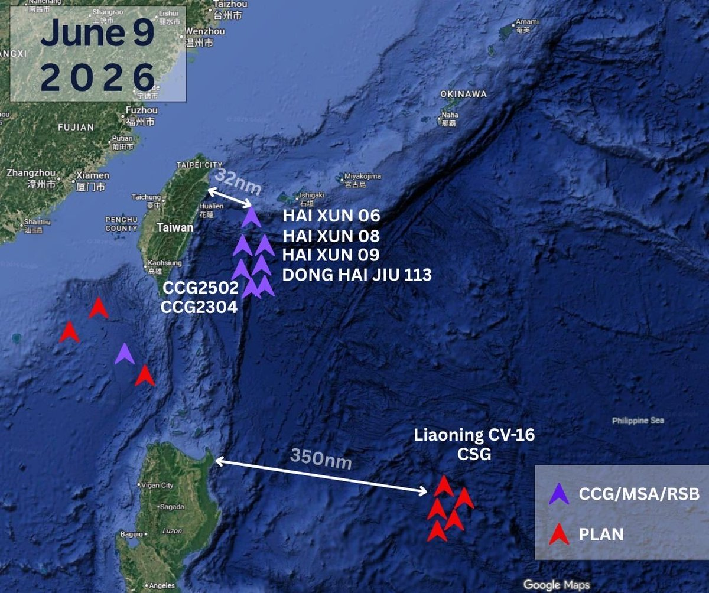
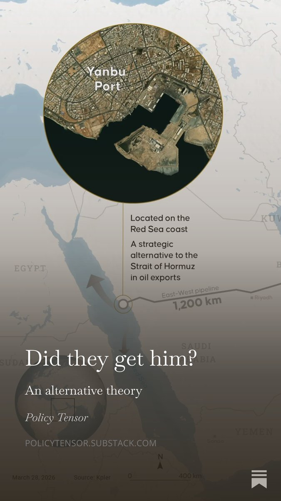
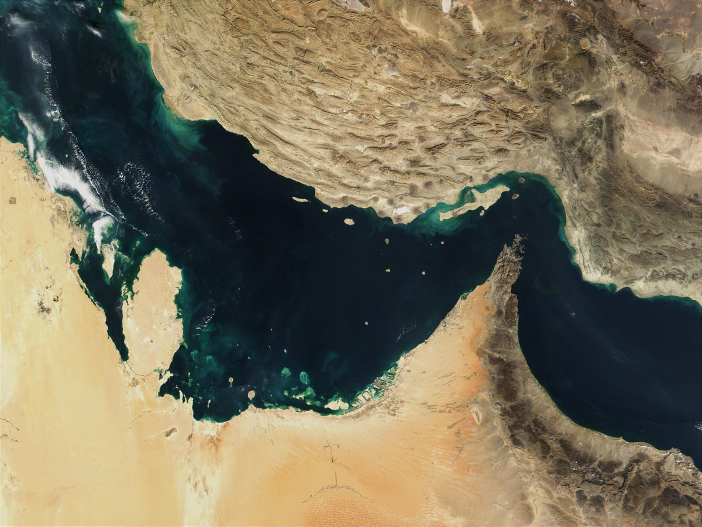
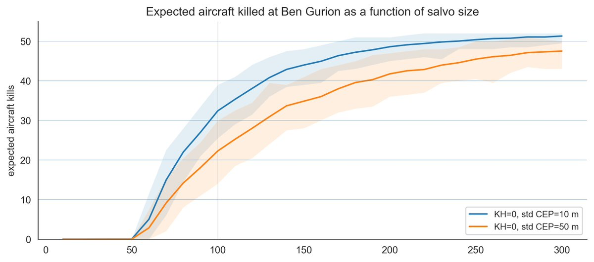
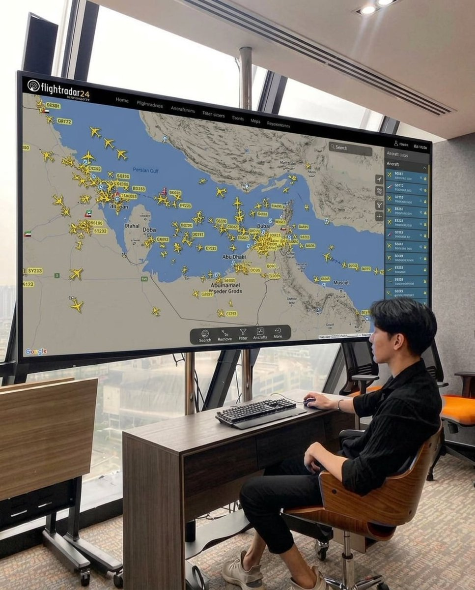

# Twitter Timeline Export

## Entry 1
### Policy Tensor
- Username: @policytensor
- Tweet ID: `2064280559702909010`
- Date: [2026-06-09 09:36 UTC](https://x.com/policytensor/status/2064280559702909010)

An Equilibrium Model of Counter-Base War in the Western Pacific, by @policytensor https://t.co/DOAYbvr7zF https://t.co/MoVdZY0mmL

---

## Entry 2
### Policy Tensor
- Username: @policytensor
- Tweet ID: `2064886648362484167`
- Date: [2026-06-11 01:45 UTC](https://x.com/policytensor/status/2064886648362484167)

RT @tshugart3: Pay attention to this, folks. Isolation of Taiwan from the east using the China Coast Guard—if this turns into that—could be…

**Reposted:**
> ### Tom Shugart
> - Username: @tshugart3
> - Tweet ID: `2064670949564096596`
> - Date: [2026-06-10 11:28 UTC](https://x.com/tshugart3/status/2064670949564096596)
> 
> Pay attention to this, folks. Isolation of Taiwan from the east using the China Coast Guard—if this turns into that—could be the first step of...all sorts of things. 👀
> 
> **Quoted Forward:**
> > ### Joseph Wu
> > - Username: @josephwutw
> > - Tweet ID: `2064232672285938010`
> > - Date: [2026-06-09 06:26 UTC](https://x.com/josephwutw/status/2064232672285938010)
> > 
> > #China’s Hai Xun &amp; CG vessels are harassing commercial ships in #Taiwan’s EEZ to fabricate a facade of #PRC jurisdiction. This expansionism is a major escalation of regional tension. We call on all commercial vessels in the area to ignore #CCG radio calls. https://t.co/5ql0ClxJNb
> > 
> > 
> > 
> > 
> > 

---

## Entry 3
### Policy Tensor
- Username: @policytensor
- Tweet ID: `2064882667418444008`
- Date: [2026-06-11 01:29 UTC](https://x.com/policytensor/status/2064882667418444008)

Why did I lose my wager to Pape?

**Quoted Forward:**
> ### Policy Tensor
> - Username: @policytensor
> - Tweet ID: `2064769695811518725`
> - Date: [2026-06-10 18:00 UTC](https://x.com/policytensor/status/2064769695811518725)
> 
> Patty thinks the lobby got him. I disagree. In my latest dispatch, I lay out a different way to think about the process that is generating escalation in the Gulf. 
> 
> Read the latest. Stay ahead of the curve. https://t.co/692eWnGH7l
> 
> 
> 

---

## Entry 4
### Policy Tensor
- Username: @policytensor
- Tweet ID: `2064882438313013359`
- Date: [2026-06-11 01:28 UTC](https://x.com/policytensor/status/2064882438313013359)

RT @ka_grieco: Washington can announce “not a resumption of all-out war,” but Iran now effectively decides whether the ceasefire still hold…

**Reposted:**
> ### Kelly Grieco
> - Username: @ka_grieco
> - Tweet ID: `2064875754748289319`
> - Date: [2026-06-11 01:01 UTC](https://x.com/ka_grieco/status/2064875754748289319)
> 
> Washington can announce “not a resumption of all-out war,” but Iran now effectively decides whether the ceasefire still holds or whether the United States has returned to war.
> 
> **Quoted Forward:**
> > ### Alex Ward
> > - Username: @alexbward
> > - Tweet ID: `2064851328258429022`
> > - Date: [2026-06-10 23:24 UTC](https://x.com/alexbward/status/2064851328258429022)
> > 
> > Even after ordering new strikes, Trump told senior aides  to deliver a message to Tehran via Qatar: The attacks were in response to the downed Apache, not a resumption of all-out war. The military pressure would only increase until Iran ceded to the president’s terms.
> > 

---

## Entry 5
### Policy Tensor
- Username: @policytensor
- Tweet ID: `2064881373299495163`
- Date: [2026-06-11 01:24 UTC](https://x.com/policytensor/status/2064881373299495163)

No. Calculated not inadvertent.

**Quoted Forward:**
> ### Brett Erickson
> - Username: @BrettErickson28
> - Tweet ID: `2064868561554907453`
> - Date: [2026-06-11 00:33 UTC](https://x.com/BrettErickson28/status/2064868561554907453)
> 
> Trump has completely lost control of the Iran War.
> 

---

## Entry 6
### Policy Tensor
- Username: @policytensor
- Tweet ID: `2064880370328219929`
- Date: [2026-06-11 01:20 UTC](https://x.com/policytensor/status/2064880370328219929)

RT @ka_grieco: We’re back to "shock and awe” as strategy, I see. Iran just absorbed thousands of strikes over two months. What exactly chan…

**Reposted:**
> ### Kelly Grieco
> - Username: @ka_grieco
> - Tweet ID: `2064872511737663877`
> - Date: [2026-06-11 00:49 UTC](https://x.com/ka_grieco/status/2064872511737663877)
> 
> We’re back to "shock and awe” as strategy, I see. Iran just absorbed thousands of strikes over two months. What exactly changes with scale and speed alone? Nothing.
> 
> **Quoted Forward:**
> > ### Axios
> > - Username: @axios
> > - Tweet ID: `2064803031460249632`
> > - Date: [2026-06-10 20:12 UTC](https://x.com/axios/status/2064803031460249632)
> > 
> > Sources said one option Trump is considering is launching an operation that is big in scale but short in duration, with the aim of pressing Iran to change its position in the negotiations.
> > 

---

## Entry 7
### Policy Tensor
- Username: @policytensor
- Tweet ID: `2064867821968904273`
- Date: [2026-06-11 00:30 UTC](https://x.com/policytensor/status/2064867821968904273)

The other possibility is the gulf burning down to the ground.

**Quoted Forward:**
> ### Rosemary Kelanic
> - Username: @RKelanic
> - Tweet ID: `2064865761777046015`
> - Date: [2026-06-11 00:22 UTC](https://x.com/RKelanic/status/2064865761777046015)
> 
> Trump restarting airstrikes on Iran is a huge mistake. 
> 
> It will not bring Iran closer to a deal. 
> 
> Attacks alone can’t coerce concessions. Trump must also convince Iran it can *avoid* attack by meeting US demands.
> 
> It’s called the assurance problem — and it’s been a major
> 

---

## Entry 8
### Policy Tensor
- Username: @policytensor
- Tweet ID: `2064866638902575140`
- Date: [2026-06-11 00:25 UTC](https://x.com/policytensor/status/2064866638902575140)

Just got back from a dinner engagement. Bring me up to speed!

---

## Entry 9
### Policy Tensor
- Username: @policytensor
- Tweet ID: `2064865263455994252`
- Date: [2026-06-11 00:20 UTC](https://x.com/policytensor/status/2064865263455994252)

CENTCOM is not going to confirm unless ordered to do so.

**Quoted Forward:**
> ### Mario Nawfal
> - Username: @MarioNawfal
> - Tweet ID: `2064837810008342838`
> - Date: [2026-06-10 22:31 UTC](https://x.com/MarioNawfal/status/2064837810008342838)
> 
> 🚨🇮🇷🇺🇸 BREAKING: Yedioth is expanding its unconfirmed report that a U.S. warship was hit in the Strait of Hormuz tonight, now claiming the missile involved was hypersonic.
> 
> The original claim arrived with no named vessel, no damage description, and no CENTCOM confirmation, and https://t.co/dqsFgJY5Rm
> 
> 
> 

---

## Entry 10
### Policy Tensor
- Username: @policytensor
- Tweet ID: `2064859867433615823`
- Date: [2026-06-10 23:58 UTC](https://x.com/policytensor/status/2064859867433615823)

They’re going to hit warships and warplanes on the apron. And they will also draw blood. All gloves are off.

**Quoted Forward:**
> ### Nostra, House of Gold
> - Username: @Nostre_damus
> - Tweet ID: `2064836588253946138`
> - Date: [2026-06-10 22:26 UTC](https://x.com/Nostre_damus/status/2064836588253946138)
> 
> Iran hit a US warship with a hypersonic missile
> 

---

## Entry 11
### Policy Tensor
- Username: @policytensor
- Tweet ID: `2064855176314257470`
- Date: [2026-06-10 23:40 UTC](https://x.com/policytensor/status/2064855176314257470)

This is it. All the gloves are coming off. Prepare for a massive salvo like the very first day of the war. Except with more careful targeting of US assets and key allied infrastructure.

**Quoted Forward:**
> ### The Hormuz Letter
> - Username: @HormuzLetter
> - Tweet ID: `2064837826827399488`
> - Date: [2026-06-10 22:31 UTC](https://x.com/HormuzLetter/status/2064837826827399488)
> 
> BREAKING: Iran says strikes on US ships "trapped in the Strait of Hormuz" have now begun, with the IRGC preparing for a "historic operation," per a source close to Iran's Ghalibaf.
> 

---

## Entry 12
### Policy Tensor
- Username: @policytensor
- Tweet ID: `2064850858475434047`
- Date: [2026-06-10 23:23 UTC](https://x.com/policytensor/status/2064850858475434047)

If they hit South Pars, all bets are off. Get those birds airborne now!

---

## Entry 13
### Policy Tensor
- Username: @policytensor
- Tweet ID: `2064829860145447254`
- Date: [2026-06-10 21:59 UTC](https://x.com/policytensor/status/2064829860145447254)

Are there still fifty birds at Ben Gurion? A massive salvo there could bag them the equivalent of a carrier.

**Quoted Forward:**
> ### Policy Tensor
> - Username: @policytensor
> - Tweet ID: `2063837723866120434`
> - Date: [2026-06-08 04:17 UTC](https://x.com/policytensor/status/2063837723866120434)
> 
> Updated the model. If the CEP of Iranian MRBMs is 10m instead of 50m, and Iran launches a salvo of 100 of them, then it will bag 32 birds instead of 22. If Iran uses a lot of the heavier Khorramshahr, the losses mount faster. I assume four-layered ballistic missile defense and https://t.co/DYbE6XjNE2
> 
> 
> 

---

## Entry 14
### Policy Tensor
- Username: @policytensor
- Tweet ID: `2064829316567908488`
- Date: [2026-06-10 21:57 UTC](https://x.com/policytensor/status/2064829316567908488)

“Iran’s state television said three explosions were heard in Sirik and in Kish island and in Minab, which were struck in the last wave of U.S. strikes. These locations are along Iran’s southern Persian Gulf coast, where military and naval outposts are located.” — NYT

**Quoted Forward:**
> ### Policy Tensor
> - Username: @policytensor
> - Tweet ID: `2064819823222161511`
> - Date: [2026-06-10 21:19 UTC](https://x.com/policytensor/status/2064819823222161511)
> 
> To the contrary, the further south the greater the intended erosion of the Iranian blockade at Hormuz, and therefore the most concerning for Iran. This is the forcing variable. Why they have to escalate. Again, as I said, maybe a warship this time.
> 

---

## Entry 15
### Policy Tensor
- Username: @policytensor
- Tweet ID: `2064828809338081645`
- Date: [2026-06-10 21:55 UTC](https://x.com/policytensor/status/2064828809338081645)

There is no miscalculation. Everything is calculated here. Both sides are doing what they are doing bc they think this will help them closer to getting their way.

---

## Entry 16
### Policy Tensor
- Username: @policytensor
- Tweet ID: `2064828288002834714`
- Date: [2026-06-10 21:53 UTC](https://x.com/policytensor/status/2064828288002834714)

Now THAT is monitoring the situation! 🤣

**Quoted Forward:**
> ### KUTUB
> - Username: @KUTUBProduction
> - Tweet ID: `2064811660125057290`
> - Date: [2026-06-10 20:47 UTC](https://x.com/KUTUBProduction/status/2064811660125057290)
> 
> Here we go again,
> 
> Where my coffee ☕️….. https://t.co/nQwFqG1CHO
> 
> 
> 

---

## Entry 17
### Policy Tensor
- Username: @policytensor
- Tweet ID: `2064828099745771582`
- Date: [2026-06-10 21:52 UTC](https://x.com/policytensor/status/2064828099745771582)

Escalation dominance is not an end in itself. It is bc Iran wants to consolidate its new power position that it wants to establish escalation dominance. The counter-escalation yesterday failed to convince the US. If this is still the proximate goal for Tehran, they have to

---

## Entry 18
### Policy Tensor
- Username: @policytensor
- Tweet ID: `2064822842949062811`
- Date: [2026-06-10 21:31 UTC](https://x.com/policytensor/status/2064822842949062811)

RT @policytensor: Patty thinks the lobby got him. I disagree. In my latest dispatch, I lay out a different way to think about the process t…

**Reposted:**
> ### Policy Tensor
> - Username: @policytensor
> - Tweet ID: `2064769695811518725`
> - Date: [2026-06-10 18:00 UTC](https://x.com/policytensor/status/2064769695811518725)
> 
> Patty thinks the lobby got him. I disagree. In my latest dispatch, I lay out a different way to think about the process that is generating escalation in the Gulf. 
> 
> Read the latest. Stay ahead of the curve. https://t.co/692eWnGH7l
> 
> 
> 

---

## Entry 19
### Policy Tensor
- Username: @policytensor
- Tweet ID: `2064820280053088371`
- Date: [2026-06-10 21:21 UTC](https://x.com/policytensor/status/2064820280053088371)

Is a resumption of high-intensity war now inevitable?

---

## Entry 20
### Policy Tensor
- Username: @policytensor
- Tweet ID: `2064819823222161511`
- Date: [2026-06-10 21:19 UTC](https://x.com/policytensor/status/2064819823222161511)

To the contrary, the further south the greater the intended erosion of the Iranian blockade at Hormuz, and therefore the most concerning for Iran. This is the forcing variable. Why they have to escalate. Again, as I said, maybe a warship this time.

**Quoted Forward:**
> ### KUTUB
> - Username: @KUTUBProduction
> - Tweet ID: `2064817980093972589`
> - Date: [2026-06-10 21:12 UTC](https://x.com/KUTUBProduction/status/2064817980093972589)
> 
> Watch which Iran’s cities report explosions, because each one is a different target list:
> 
> - Bandar Abbas / Jask = navy bases &amp; the drone network on the coast same as Tuesday, another warning round.
> 
> - Shiraz = fighter airbase + the air defense headquarters covering all of
> 

---

## Entry 21
### Policy Tensor
- Username: @policytensor
- Tweet ID: `2064818358919569482`
- Date: [2026-06-10 21:13 UTC](https://x.com/policytensor/status/2064818358919569482)

The project to make Europe Judenfrei was clearly genocidal. And they had further genocidal plans. They planned to exterminate and enslave a hundred million Slavs to make way for German homesteaders, the goal being to replicate the American achievement in a single generation.

**Quoted Forward:**
> ### Sami Gold
> - Username: @souljagoyteller
> - Tweet ID: `2064776826489065938`
> - Date: [2026-06-10 18:28 UTC](https://x.com/souljagoyteller/status/2064776826489065938)
> 
> The Nazis fundamentally wanted a Europe free of Jewry, this is nonarguable. And to propagate the idea that the Holocaust was merely a matter of logistical issues is to deny the severity of the Shoah, which killed most of my family’s members. However, the Nazis did not have a plan
> 

---
