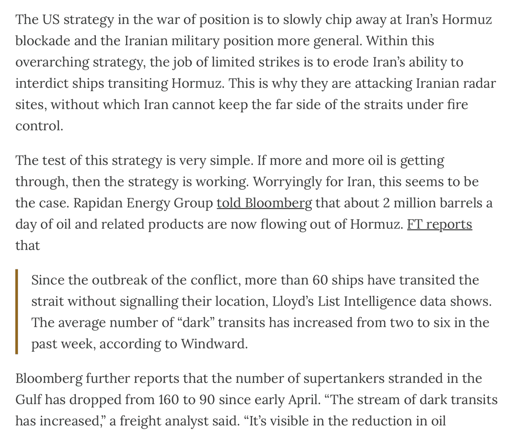
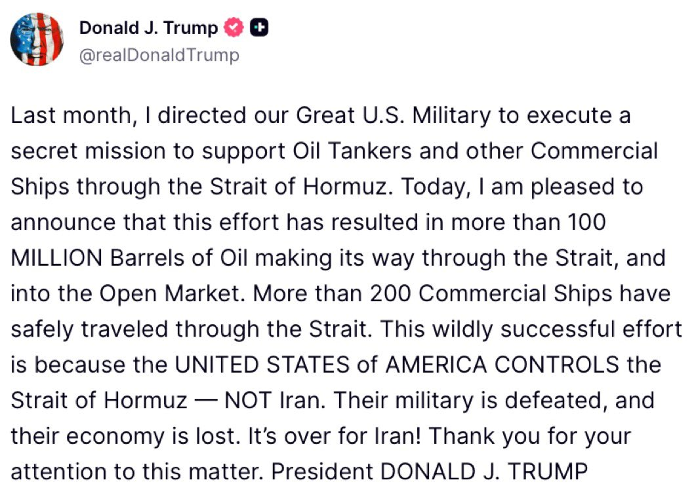
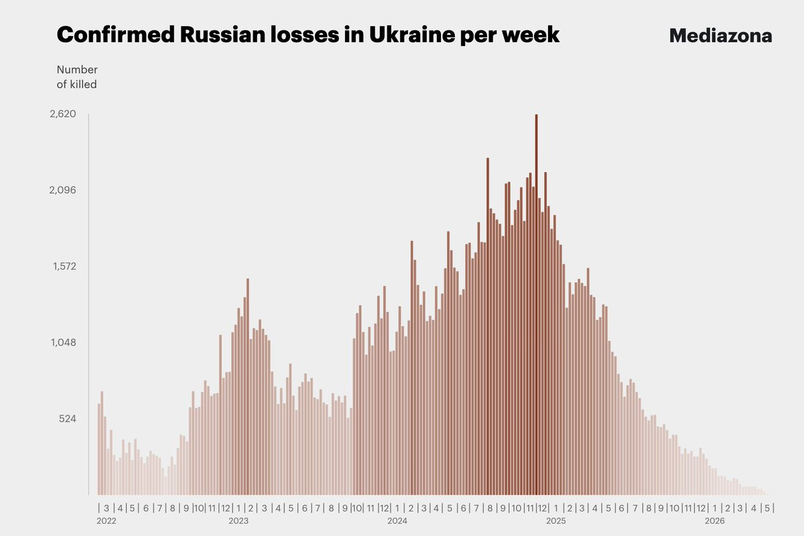
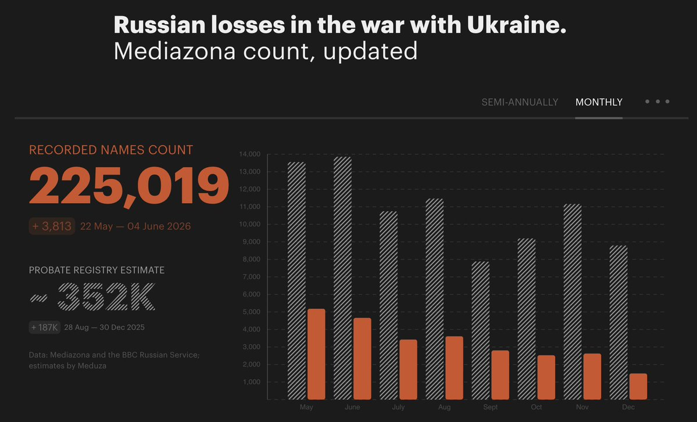
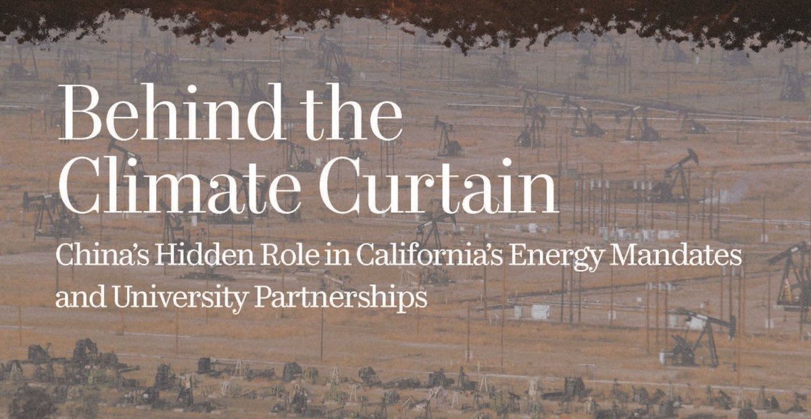
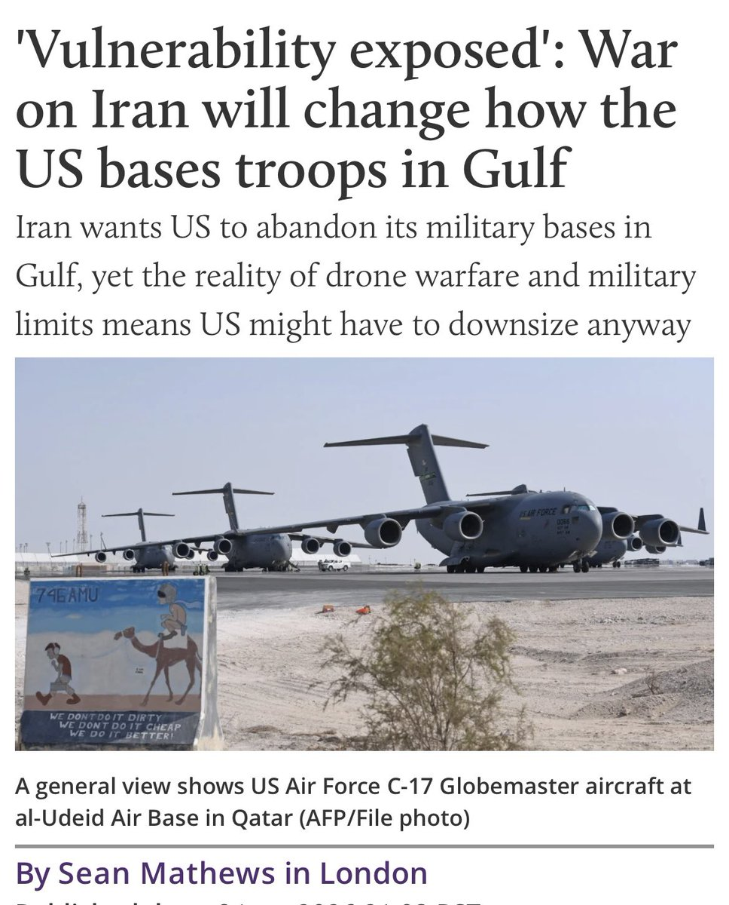

# Twitter Timeline Export

## Entry 1
### Policy Tensor
- Username: @policytensor
- Tweet ID: `2064280559702909010`
- Date: [2026-06-09 09:36 UTC](https://x.com/policytensor/status/2064280559702909010)

An Equilibrium Model of Counter-Base War in the Western Pacific, by @policytensor https://t.co/DOAYbvr7zF https://t.co/MoVdZY0mmL

---

## Entry 2
### Policy Tensor
- Username: @policytensor
- Tweet ID: `2064815531895484873`
- Date: [2026-06-10 21:02 UTC](https://x.com/policytensor/status/2064815531895484873)

This is indeed the logic of escalation in the Gulf rn. See the rest on Substack. https://t.co/h7ZIP6qiim

**Quoted Forward:**
> ### Drop Site
> - Username: @DropSiteNews
> - Tweet ID: `2064814658683384104`
> - Date: [2026-06-10 20:59 UTC](https://x.com/DropSiteNews/status/2064814658683384104)
> 
> 🛢️ Maritime historian and shipping analyst Sal Mercogliano breaks down President Trump’s claim that a covert U.S. mission has moved more than 100 million barrels of oil through the Strait of Hormuz since May.
> 
> He suggests the operation likely relies on a small fleet of
> 

---

## Entry 3
### Policy Tensor
- Username: @policytensor
- Tweet ID: `2064815773244092630`
- Date: [2026-06-10 21:03 UTC](https://x.com/policytensor/status/2064815773244092630)

Did they get him?, by @policytensor. https://t.co/bcNWowFZrQ

---

## Entry 4
### Policy Tensor
- Username: @policytensor
- Tweet ID: `2064814952909615378`
- Date: [2026-06-10 21:00 UTC](https://x.com/policytensor/status/2064814952909615378)

RT @DropSiteNews: ⭕️ The U.S. Apache helicopter that went down over the Strait of Hormuz on Tuesday was participating in the Trump administ…

**Reposted:**
> ### Drop Site
> - Username: @DropSiteNews
> - Tweet ID: `2064810087122698280`
> - Date: [2026-06-10 20:41 UTC](https://x.com/DropSiteNews/status/2064810087122698280)
> 
> ⭕️ The U.S. Apache helicopter that went down over the Strait of Hormuz on Tuesday was participating in the Trump administration’s previously undisclosed mission to protect commercial shipping through the waterway, a senior U.S. official told The Wall Street Journal.
> 
> The Journal
> 
> **Quoted Forward:**
> > ### Drop Site
> > - Username: @DropSiteNews
> > - Tweet ID: `2064802591771447493`
> > - Date: [2026-06-10 20:11 UTC](https://x.com/DropSiteNews/status/2064802591771447493)
> > 
> > ⭕️ President Trump claimed the U.S. has carried out a month-long secret operation to escort commercial shipping through the Strait of Hormuz, saying the effort has helped move more than 100 million barrels of oil and allowed over 200 merchant vessels to transit the waterway.
> > 
> > In https://t.co/4fwuA7N9Pt
> > 
> > 
> > 

---

## Entry 5
### Policy Tensor
- Username: @policytensor
- Tweet ID: `2064809721777815961`
- Date: [2026-06-10 20:39 UTC](https://x.com/policytensor/status/2064809721777815961)

RT @Narjes_Rahmati: Iranian sources to Al Jazeera:

"Any attack on Iran will lead to the end of the negotiations."

**Reposted:**
> ### Narjes Rahmati 🟩☫🟥 نرجس رحمتی
> - Username: @Narjes_Rahmati
> - Tweet ID: `2064804684603494894`
> - Date: [2026-06-10 20:19 UTC](https://x.com/Narjes_Rahmati/status/2064804684603494894)
> 
> Iranian sources to Al Jazeera:
> 
> "Any attack on Iran will lead to the end of the negotiations."
> 

---

## Entry 6
### Policy Tensor
- Username: @policytensor
- Tweet ID: `2064803677483712887`
- Date: [2026-06-10 20:15 UTC](https://x.com/policytensor/status/2064803677483712887)

Wow. Russian losses have fallen dramatically. This is the opposite of the pattern suggested by Western intelligence plants in the papers. https://t.co/iAZvONax66

**Quoted Forward:**
> ### Absorber the Geek
> - Username: @AbsorberTheGeek
> - Tweet ID: `2064704210432643370`
> - Date: [2026-06-10 13:40 UTC](https://x.com/AbsorberTheGeek/status/2064704210432643370)
> 
> @policytensor BBC/Mediazona study.
> 
> The BBC ignores its own findings preferring instead to report the higher figures from the various propaganda outlets. 🤣
> 
> https://t.co/ItH0Kl2DJS
> 

---

## Entry 7
### Policy Tensor
- Username: @policytensor
- Tweet ID: `2064797954628567084`
- Date: [2026-06-10 19:52 UTC](https://x.com/policytensor/status/2064797954628567084)

After the Americans launch another round, Iran will have to escalate dramatically. Maybe even a warship. At which point, I will concede my wager to @ProfessorPape.

**Quoted Forward:**
> ### Policy Tensor
> - Username: @policytensor
> - Tweet ID: `2064769695811518725`
> - Date: [2026-06-10 18:00 UTC](https://x.com/policytensor/status/2064769695811518725)
> 
> Patty thinks the lobby got him. I disagree. In my latest dispatch, I lay out a different way to think about the process that is generating escalation in the Gulf. 
> 
> Read the latest. Stay ahead of the curve. https://t.co/692eWnGH7l
> 
> 
> 

---

## Entry 8
### Policy Tensor
- Username: @policytensor
- Tweet ID: `2064795824903643605`
- Date: [2026-06-10 19:44 UTC](https://x.com/policytensor/status/2064795824903643605)

The big three IPOs are going to mint something like 10,000 millionaires.

---

## Entry 9
### Policy Tensor
- Username: @policytensor
- Tweet ID: `2064788931514716175`
- Date: [2026-06-10 19:16 UTC](https://x.com/policytensor/status/2064788931514716175)

Dunno who he means but the real emperor with no clothes in an effects-weighted sense is obviously Autor.

**Quoted Forward:**
> ### Adam Ozimek
> - Username: @ModeledBehavior
> - Tweet ID: `2064711685273710690`
> - Date: [2026-06-10 14:10 UTC](https://x.com/ModeledBehavior/status/2064711685273710690)
> 
> There is an emperor's new clothes problem with one of the worlds leading economists and almost nobody wants to speak frankly about it because he sits at the height of academic power and prestige, but many admit it behind closed doors.
> 

---

## Entry 10
### Policy Tensor
- Username: @policytensor
- Tweet ID: `2064783666794946930`
- Date: [2026-06-10 18:56 UTC](https://x.com/policytensor/status/2064783666794946930)

RT @ancientjake1: Best interpretation of this round of escalation

**Reposted:**
> ### Jake Prince
> - Username: @ancientjake1
> - Tweet ID: `2064782041011347587`
> - Date: [2026-06-10 18:49 UTC](https://x.com/ancientjake1/status/2064782041011347587)
> 
> Best interpretation of this round of escalation
> 
> **Quoted Forward:**
> > ### Policy Tensor
> > - Username: @policytensor
> > - Tweet ID: `2064769783074037768`
> > - Date: [2026-06-10 18:00 UTC](https://x.com/policytensor/status/2064769783074037768)
> > 
> > Did they get him?, by @policytensor. https://t.co/enFG6a4GiC
> > 

---

## Entry 11
### Policy Tensor
- Username: @policytensor
- Tweet ID: `2064773941202206783`
- Date: [2026-06-10 18:17 UTC](https://x.com/policytensor/status/2064773941202206783)

Had Bridge gotten his way, we would not be at war with Iran. The prioritizers understood very well that you have limited military means and that attacking Iran will tie up a substantial portion of US capabilities that were sorely needed in Asia. 

That ship has now sailed.

**Quoted Forward:**
> ### Pax Curl
> - Username: @lebkitt
> - Tweet ID: `2064690431611318471`
> - Date: [2026-06-10 12:45 UTC](https://x.com/lebkitt/status/2064690431611318471)
> 
> The U.S. imperial strategy has been hard to read because it keeps contradicting itself. Some of it looks isolationist. Some of it looks wildly interventionist. Some of it looks improvised. But the pattern is starting to become clearer.
> 
> A useful clue is where Elbridge Colby is
> 

---

## Entry 12
### Policy Tensor
- Username: @policytensor
- Tweet ID: `2064769695811518725`
- Date: [2026-06-10 18:00 UTC](https://x.com/policytensor/status/2064769695811518725)

Patty thinks the lobby got him. I disagree. In my latest dispatch, I lay out a different way to think about the process that is generating escalation in the Gulf. 

Read the latest. Stay ahead of the curve. https://t.co/692eWnGH7l

---

## Entry 13
### Policy Tensor
- Username: @policytensor
- Tweet ID: `2064769783074037768`
- Date: [2026-06-10 18:00 UTC](https://x.com/policytensor/status/2064769783074037768)

Did they get him?, by @policytensor. https://t.co/enFG6a4GiC

---

## Entry 14
### Policy Tensor
- Username: @policytensor
- Tweet ID: `2064605907158282479`
- Date: [2026-06-10 07:09 UTC](https://x.com/policytensor/status/2064605907158282479)

““Dubai’s days are over,” insists an Iranian coffee-trader who recently moved his regional headquarters to Muscat, the capital. “Now it’s Oman.””

---

## Entry 15
### Policy Tensor
- Username: @policytensor
- Tweet ID: `2064589931486257556`
- Date: [2026-06-10 06:06 UTC](https://x.com/policytensor/status/2064589931486257556)

I told you I don’t buy the numbers peddled by British intelligence. But what is a good estimate of fatalities on both sides of the Ukraine war? 

Kobak et al. (2024) estimated 58,500 Russian excess male deaths in 2022-2023. ACLED reports 80,306 fatalities in Ukraine for

---

## Entry 16
### Policy Tensor
- Username: @policytensor
- Tweet ID: `2064585262257021364`
- Date: [2026-06-10 05:47 UTC](https://x.com/policytensor/status/2064585262257021364)

Life is wonderful here, mama. You must come visit! https://t.co/BfbOUTvKl9

**Quoted Forward:**
> ### Pop Base
> - Username: @PopBase
> - Tweet ID: `2064507350346793062`
> - Date: [2026-06-10 00:38 UTC](https://x.com/PopBase/status/2064507350346793062)
> 
> Gwyneth Paltrow stars in new campaign for Israel luxury housing development ‘51PARK’ in Herzliya. https://t.co/otQlxBEMwk
> 
> 
> 
> 

---

## Entry 17
### Policy Tensor
- Username: @policytensor
- Tweet ID: `2064577857586635168`
- Date: [2026-06-10 05:18 UTC](https://x.com/policytensor/status/2064577857586635168)

The Cold War was an excellent device to impose discipline at home. No doubt US elites desperately want one with China for the same reason. The problem is that we will lose Cold War they want so bad, and lose a hot war if we’re stupid enough to fight China.

**Quoted Forward:**
> ### Bethany 貝書穎
> - Username: @BethanyAllenEbr
> - Tweet ID: `2064549050683432990`
> - Date: [2026-06-10 03:23 UTC](https://x.com/BethanyAllenEbr/status/2064549050683432990)
> 
> I increasingly find that my primary role in the "China influence" space these days is to debunk a lot of very, very poor quality "China influence" research reports that have been coming out. 
> 
> I don't think it would be an overreach to call this slate of reports "China influence https://t.co/CcrSME0lIf
> 
> 
> 
> 
> 
> 

---

## Entry 18
### Policy Tensor
- Username: @policytensor
- Tweet ID: `2064574900472258659`
- Date: [2026-06-10 05:06 UTC](https://x.com/policytensor/status/2064574900472258659)

Short of a formal apology by Iron Lady, really hard to see the Chinese oblige. Should’ve thought things through before declaring Taiwan a Japanese protectorate.

**Quoted Forward:**
> ### Bonnie Glaser / 葛來儀
> - Username: @BonnieGlaser
> - Tweet ID: `2064369760725299698`
> - Date: [2026-06-09 15:31 UTC](https://x.com/BonnieGlaser/status/2064369760725299698)
> 
> US asks China to resume rare-earth exports to Japan 
> https://t.co/2grIpsvUr0 via @NikkeiAsia https://t.co/W3d5ao9bPF
> 
> 
> 

---

## Entry 19
### Policy Tensor
- Username: @policytensor
- Tweet ID: `2064565012216050031`
- Date: [2026-06-10 04:27 UTC](https://x.com/policytensor/status/2064565012216050031)

There may be a case for bases around the world. But none within the range of short-range missiles of a great missile power. The bases on the Gulf littoral should be abandoned wholesale. And the bases that are not abandoned have to be hardened.

**Quoted Forward:**
> ### Sean Mathews
> - Username: @SeanPmathews
> - Tweet ID: `2064302876701098078`
> - Date: [2026-06-09 11:05 UTC](https://x.com/SeanPmathews/status/2064302876701098078)
> 
> The U.S.-Israeli war on Iran has shown that the era of big military bases in the Gulf is over, U.S. officials and analysts tell me. 🧵 https://t.co/vTySdBnpsZ
> 
> 
> 

---

## Entry 20
### Policy Tensor
- Username: @policytensor
- Tweet ID: `2064552426431009047`
- Date: [2026-06-10 03:37 UTC](https://x.com/policytensor/status/2064552426431009047)

The chopper was almost certainly an excuse.

**Quoted Forward:**
> ### Daniel Davis Deep Dive
> - Username: @DanielLDavis1
> - Tweet ID: `2064540797819551836`
> - Date: [2026-06-10 02:50 UTC](https://x.com/DanielLDavis1/status/2064540797819551836)
> 
> So while everybody is trying to discover how much damage was done by the US strike against Iran, or how much retaliatory damage was done to US bases by Iran’s reply, it’s time we start asking the bigger question:
> 
> What comes next?
> 
> OK, so President Trump got angry because https://t.co/3LAC5Kf9ft
> 
> 
> 

---
