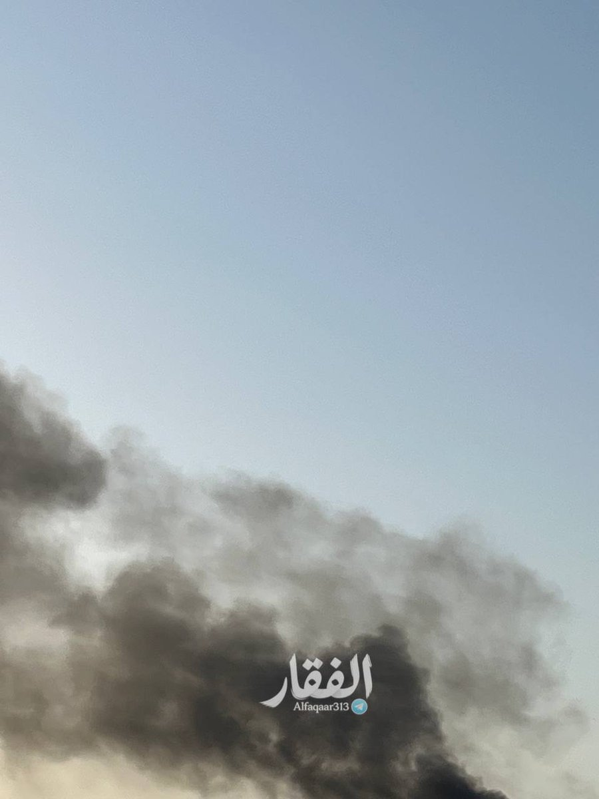
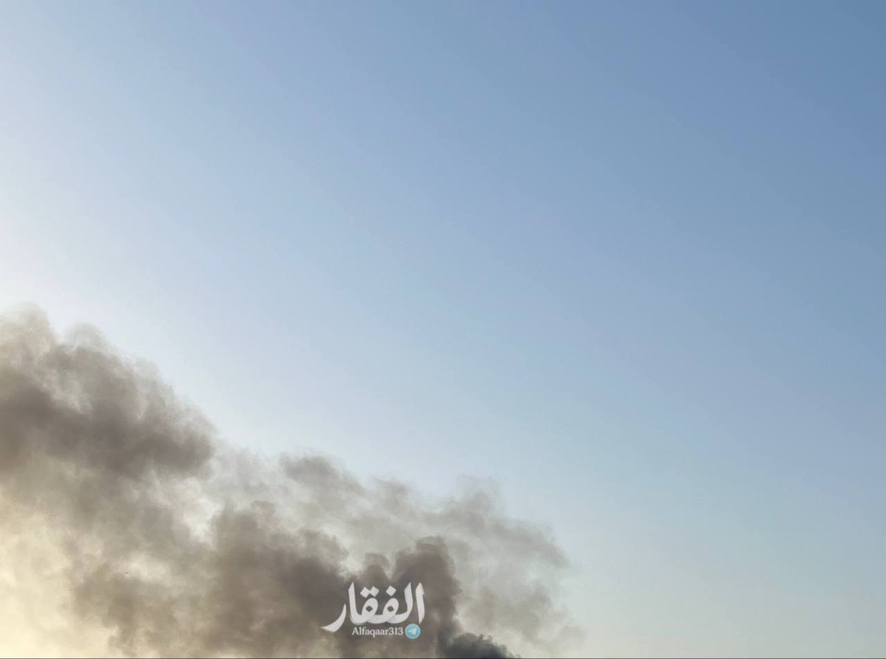
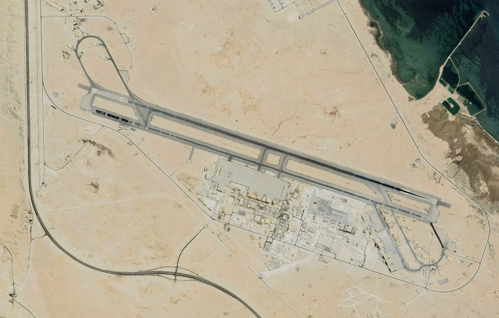
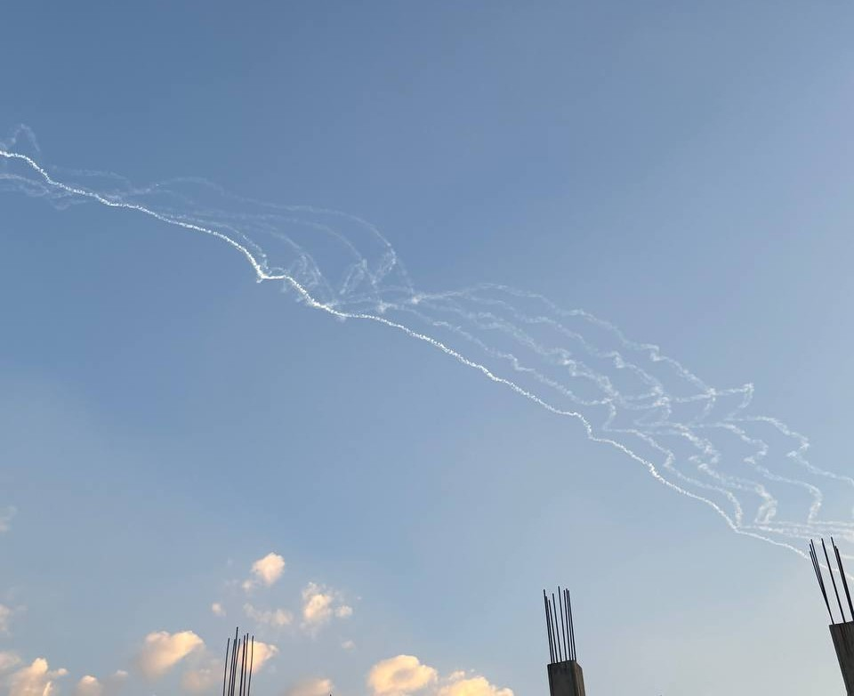
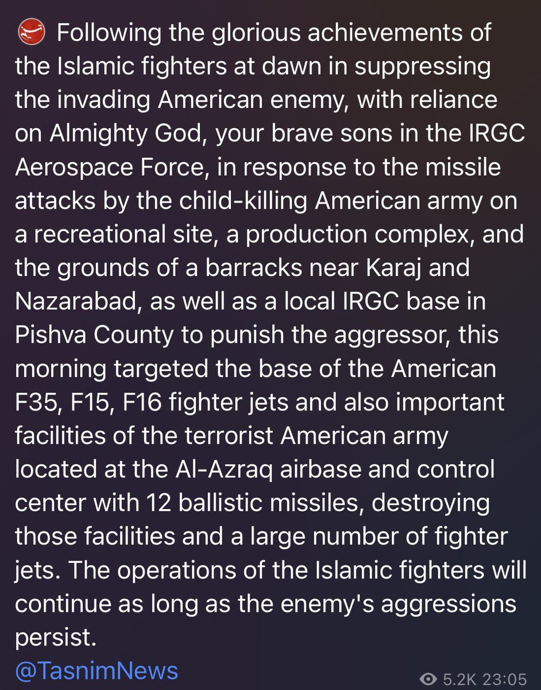
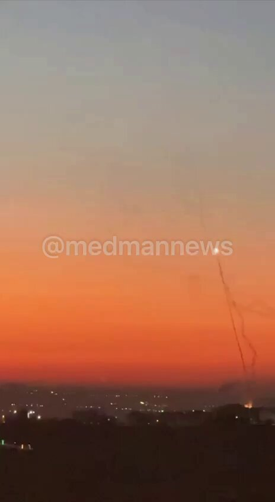
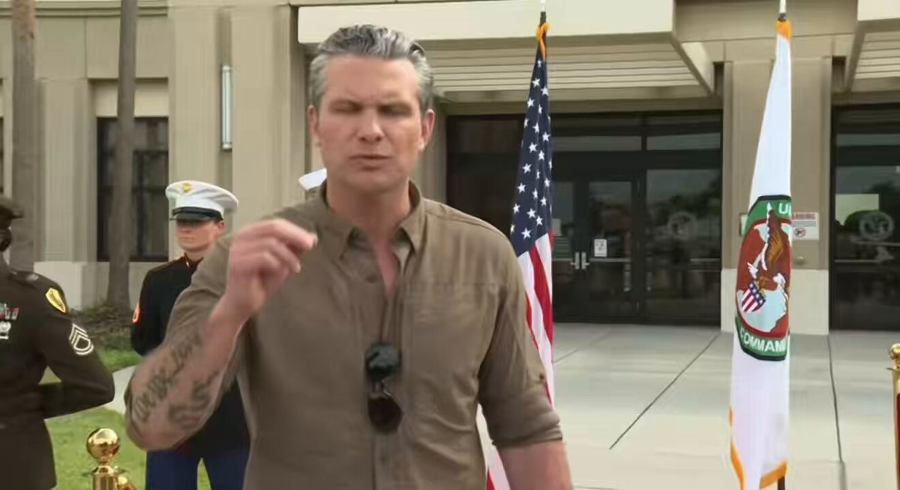
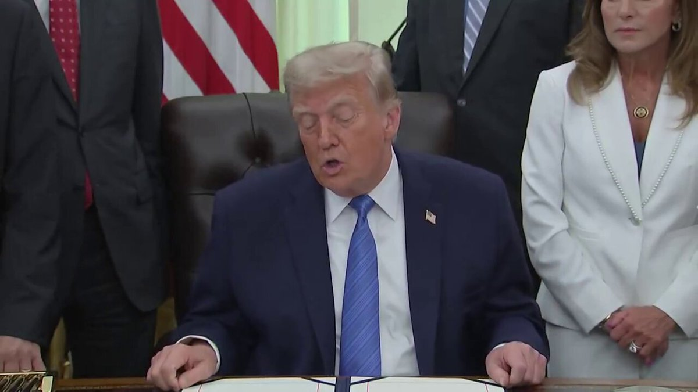
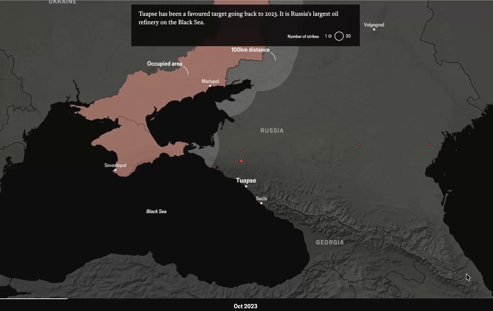
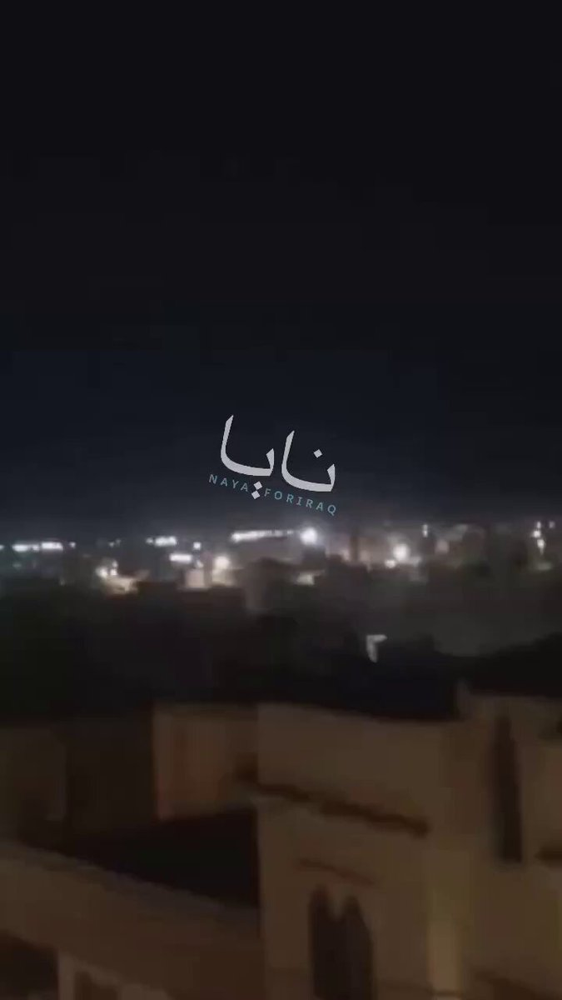

# Twitter Timeline Export

## Entry 1
### Nicole Grajewski
- Username: @NicoleGrajewski
- Tweet ID: `2064997971834343535`
- Date: [2026-06-11 09:07 UTC](https://x.com/NicoleGrajewski/status/2064997971834343535)

RT @shashj: Very troubling choice of target. "Strikes early Wednesday destroyed what appears to be a drinking-water facility on Iran’s sout…

**Reposted:**
> ### Shashank Joshi
> - Username: @shashj
> - Tweet ID: `2064996736611877132`
> - Date: [2026-06-11 09:02 UTC](https://x.com/shashj/status/2064996736611877132)
> 
> Very troubling choice of target. "Strikes early Wednesday destroyed what appears to be a drinking-water facility on Iran’s southern coast, near the Strait of Hormuz, according to an analysis by The New York Times." https://t.co/xt9NpmdNIr
> 

---

## Entry 2
### Nicole Grajewski
- Username: @NicoleGrajewski
- Tweet ID: `2064997941471793485`
- Date: [2026-06-11 09:07 UTC](https://x.com/NicoleGrajewski/status/2064997941471793485)

RT @HannaNotte: "How the FSB cut Russia off from the internet"

Great reporting by @maxseddon and @NastyaStognei 

https://t.co/e0J0ReWemI

**Reposted:**
> ### Hanna Notte
> - Username: @HannaNotte
> - Tweet ID: `2064980985972678880`
> - Date: [2026-06-11 08:00 UTC](https://x.com/HannaNotte/status/2064980985972678880)
> 
> "How the FSB cut Russia off from the internet"
> 
> Great reporting by @maxseddon and @NastyaStognei 
> 
> https://t.co/e0J0ReWemI
> 

---

## Entry 3
### Nicole Grajewski
- Username: @NicoleGrajewski
- Tweet ID: `2064971653172675040`
- Date: [2026-06-11 07:23 UTC](https://x.com/NicoleGrajewski/status/2064971653172675040)

RT @walberque: When Etienne writes about French nuclear forces, you better pay attention. Here he updates us on Macron's March 2026 "Forwar…

**Reposted:**
> ### William Alberque
> - Username: @walberque
> - Tweet ID: `2064746880186143084`
> - Date: [2026-06-10 16:29 UTC](https://x.com/walberque/status/2064746880186143084)
> 
> When Etienne writes about French nuclear forces, you better pay attention. Here he updates us on Macron's March 2026 "Forward Deterrence Initiative" and how it interacts with NATO nuclear deterrence and the security of Europe. Enjoy.
> 
> **Quoted Forward:**
> > ### Etienne Marcuz
> > - Username: @Etienne_Marcuz
> > - Tweet ID: `2064606258296922473`
> > - Date: [2026-06-10 07:11 UTC](https://x.com/Etienne_Marcuz/status/2064606258296922473)
> > 
> > ☢️ How France's forward deterrence strengthens NATO ? ☢️
> > 
> > The Forward Deterrence Initiative, announced by the French President on March 2, 2026, in his Île Longue speech, is often presented as an alternative to the U.S. "nuclear umbrella". However, it is not intended to replace
> > 

---

## Entry 4
### Nicole Grajewski
- Username: @NicoleGrajewski
- Tweet ID: `2064934771688390820`
- Date: [2026-06-11 04:56 UTC](https://x.com/NicoleGrajewski/status/2064934771688390820)

RT @EGYOSINT: Iran’s IRGC has also struck the U.S. Navy’s Fifth Fleet headquarters in Bahrain, with footage circulating from pro-Iranian me…

**Reposted:**
> ### Egypt's Intel Observer
> - Username: @EGYOSINT
> - Tweet ID: `2064905530531860510`
> - Date: [2026-06-11 03:00 UTC](https://x.com/EGYOSINT/status/2064905530531860510)
> 
> Iran’s IRGC has also struck the U.S. Navy’s Fifth Fleet headquarters in Bahrain, with footage circulating from pro-Iranian media allegedly showing fires raging at the facility after a reported direct hit. https://t.co/9ASmYJApQb
> 
> 
> 
> 
> **Quoted Forward:**
> > ### Egypt's Intel Observer
> > - Username: @EGYOSINT
> > - Tweet ID: `2064879052159098943`
> > - Date: [2026-06-11 01:15 UTC](https://x.com/EGYOSINT/status/2064879052159098943)
> > 
> > Iranian missiles and drones reportedly targeted Bahrain's Sheikh Isa Air Base, a key facility hosting U.S. military personnel and assets, including several U.S. Navy P-8A Poseidon maritime patrol aircraft. https://t.co/QQy7F2ekka
> > 
> > 
> > 

---

## Entry 5
### Nicole Grajewski
- Username: @NicoleGrajewski
- Tweet ID: `2064934764994245103`
- Date: [2026-06-11 04:56 UTC](https://x.com/NicoleGrajewski/status/2064934764994245103)

RT @CENTCOM: https://t.co/06XEfevOgs

**Reposted:**
> ### U.S. Central Command
> - Username: @CENTCOM
> - Tweet ID: `2064876360259043642`
> - Date: [2026-06-11 01:04 UTC](https://x.com/CENTCOM/status/2064876360259043642)
> 
> https://t.co/06XEfevOgs
> 

---

## Entry 6
### Nicole Grajewski
- Username: @NicoleGrajewski
- Tweet ID: `2064920845915418851`
- Date: [2026-06-11 04:01 UTC](https://x.com/NicoleGrajewski/status/2064920845915418851)

RT @mhmiranusa: My two cents: These 5 Iranian ballistic missiles out of Tabriz were all aiming for one exact same spot:
The F-35 ramp at Mu…

**Reposted:**
> ### Mehdi H.
> - Username: @mhmiranusa
> - Tweet ID: `2064907489447903324`
> - Date: [2026-06-11 03:08 UTC](https://x.com/mhmiranusa/status/2064907489447903324)
> 
> My two cents: These 5 Iranian ballistic missiles out of Tabriz were all aiming for one exact same spot:
> The F-35 ramp at Muwaffaq Salti Air Base in Jordan. https://t.co/vVHpARAjDS
> 
> 
> 

---

## Entry 7
### Nicole Grajewski
- Username: @NicoleGrajewski
- Tweet ID: `2064920807680209352`
- Date: [2026-06-11 04:00 UTC](https://x.com/NicoleGrajewski/status/2064920807680209352)

RT @sentdefender: Iran’s Islamic Revolutionary Guard Corps (IRGC) has announced that its Missile Forces carried out an attack earlier on Mu…

**Reposted:**
> ### OSINTdefender
> - Username: @sentdefender
> - Tweet ID: `2064915193998578153`
> - Date: [2026-06-11 03:38 UTC](https://x.com/sentdefender/status/2064915193998578153)
> 
> Iran’s Islamic Revolutionary Guard Corps (IRGC) has announced that its Missile Forces carried out an attack earlier on Muwaffaq Salti Air Base in Jordan using 12 medium-range ballistic missiles, as retaliation for last night’s wave of U.S. strikes against Iran, with the attack https://t.co/Ln6HqNwCgk
> 
> 
> 

---

## Entry 8
### Nicole Grajewski
- Username: @NicoleGrajewski
- Tweet ID: `2064920765015671109`
- Date: [2026-06-11 04:00 UTC](https://x.com/NicoleGrajewski/status/2064920765015671109)

RT @Osinttechnical: Footage of an engagement between an American PATRIOT SAM battery and incoming Iranian medium-range ballistic missiles o…

**Reposted:**
> ### OSINTtechnical
> - Username: @Osinttechnical
> - Tweet ID: `2064896599575208350`
> - Date: [2026-06-11 02:24 UTC](https://x.com/Osinttechnical/status/2064896599575208350)
> 
> Footage of an engagement between an American PATRIOT SAM battery and incoming Iranian medium-range ballistic missiles over Jordan this morning. https://t.co/nCT7YhSTeD
> 
> 
> 

---

## Entry 9
### Nicole Grajewski
- Username: @NicoleGrajewski
- Tweet ID: `2064827211346305296`
- Date: [2026-06-10 21:49 UTC](https://x.com/NicoleGrajewski/status/2064827211346305296)

U.S. Launches Fresh Wave of Strikes Against Iran https://t.co/KOoYP8ldES

---

## Entry 10
### Nicole Grajewski
- Username: @NicoleGrajewski
- Tweet ID: `2064817234229219622`
- Date: [2026-06-10 21:09 UTC](https://x.com/NicoleGrajewski/status/2064817234229219622)

RT @Osinttechnical: Hegseth indicates the US will strike Iran tonight, potentially tomorrow, says that bombs will be dropped on “key facili…

**Reposted:**
> ### OSINTtechnical
> - Username: @Osinttechnical
> - Tweet ID: `2064813374936916090`
> - Date: [2026-06-10 20:54 UTC](https://x.com/Osinttechnical/status/2064813374936916090)
> 
> Hegseth indicates the US will strike Iran tonight, potentially tomorrow, says that bombs will be dropped on “key facilities.” https://t.co/twieToXdlS
> 
> 
> 

---

## Entry 11
### Nicole Grajewski
- Username: @NicoleGrajewski
- Tweet ID: `2064742035387498622`
- Date: [2026-06-10 16:10 UTC](https://x.com/NicoleGrajewski/status/2064742035387498622)

RT @Osinttechnical: President Trump says that the US is “going to hit [Iran] hard again today” https://t.co/TqVCrN7hOU

**Reposted:**
> ### OSINTtechnical
> - Username: @Osinttechnical
> - Tweet ID: `2064739426220019906`
> - Date: [2026-06-10 16:00 UTC](https://x.com/Osinttechnical/status/2064739426220019906)
> 
> President Trump says that the US is “going to hit [Iran] hard again today” https://t.co/TqVCrN7hOU
> 
> 
> 

---

## Entry 12
### Nicole Grajewski
- Username: @NicoleGrajewski
- Tweet ID: `2064739471690530948`
- Date: [2026-06-10 16:00 UTC](https://x.com/NicoleGrajewski/status/2064739471690530948)

RT @TreyYingst: NEW: President Trump says the United States will strike Iran again today.

**Reposted:**
> ### Trey Yingst
> - Username: @TreyYingst
> - Tweet ID: `2064738878796304702`
> - Date: [2026-06-10 15:58 UTC](https://x.com/TreyYingst/status/2064738878796304702)
> 
> NEW: President Trump says the United States will strike Iran again today.
> 

---

## Entry 13
### Nicole Grajewski
- Username: @NicoleGrajewski
- Tweet ID: `2064736123025310065`
- Date: [2026-06-10 15:47 UTC](https://x.com/NicoleGrajewski/status/2064736123025310065)

RT @shashj: My colleagues model the growing spread and depth of Ukrainian strikes inside Russia. 
https://t.co/Wtkxs60Jsx https://t.co/dxVm…

**Reposted:**
> ### Shashank Joshi
> - Username: @shashj
> - Tweet ID: `2064656099748229271`
> - Date: [2026-06-10 10:29 UTC](https://x.com/shashj/status/2064656099748229271)
> 
> My colleagues model the growing spread and depth of Ukrainian strikes inside Russia. 
> https://t.co/Wtkxs60Jsx https://t.co/dxVmmaDYtC
> 
> 
> 

---

## Entry 14
### Nicole Grajewski
- Username: @NicoleGrajewski
- Tweet ID: `2064725841750216788`
- Date: [2026-06-10 15:06 UTC](https://x.com/NicoleGrajewski/status/2064725841750216788)

RT @hdagres: What the US wants Iran to agree to in MOU:

- Lengthy suspension of uranium enrichment
- Enriched uranium stockpile be diluted…

**Reposted:**
> ### Holly Dagres
> - Username: @hdagres
> - Tweet ID: `2064682792810692896`
> - Date: [2026-06-10 12:15 UTC](https://x.com/hdagres/status/2064682792810692896)
> 
> What the US wants Iran to agree to in MOU:
> 
> - Lengthy suspension of uranium enrichment
> - Enriched uranium stockpile be diluted, or “downblended”
> - Dismantle its nuclear sites
> - Allow “snap” inspections
> https://t.co/g6pUVZsewd
> 

---

## Entry 15
### Nicole Grajewski
- Username: @NicoleGrajewski
- Tweet ID: `2064718799840969163`
- Date: [2026-06-10 14:38 UTC](https://x.com/NicoleGrajewski/status/2064718799840969163)

RT @FT: Iran says 20,000 people left without water after US hits reservoir tanks https://t.co/k7n7ODtvQJ

**Reposted:**
> ### Financial Times
> - Username: @FT
> - Tweet ID: `2064682151988154473`
> - Date: [2026-06-10 12:12 UTC](https://x.com/FT/status/2064682151988154473)
> 
> Iran says 20,000 people left without water after US hits reservoir tanks https://t.co/k7n7ODtvQJ
> 

---

## Entry 16
### Nicole Grajewski
- Username: @NicoleGrajewski
- Tweet ID: `2064693811893117321`
- Date: [2026-06-10 12:58 UTC](https://x.com/NicoleGrajewski/status/2064693811893117321)

RT @TreyYingst: NEW: President Trump tells me he "may keep going" with strikes against Iran and is getting closer to targeting Iranian powe…

**Reposted:**
> ### Trey Yingst
> - Username: @TreyYingst
> - Tweet ID: `2064674792733548647`
> - Date: [2026-06-10 11:43 UTC](https://x.com/TreyYingst/status/2064674792733548647)
> 
> NEW: President Trump tells me he "may keep going" with strikes against Iran and is getting closer to targeting Iranian power plants and bridges.
> 
> The President also spoke about the U.S. military helicopter that was downed saying that an Iranian drone lodged between the two https://t.co/j5aQEIzi9s
> 
> 
> 

---

## Entry 17
### Nicole Grajewski
- Username: @NicoleGrajewski
- Tweet ID: `2064650079131111769`
- Date: [2026-06-10 10:05 UTC](https://x.com/NicoleGrajewski/status/2064650079131111769)

RT @AntonJaegermm: Wrote about Kojève's grave in Brussels and the idea of a European geopolitics for @nytopinion 

https://t.co/1Os3DoCAST

**Reposted:**
> ### Anton Jäger
> - Username: @AntonJaegermm
> - Tweet ID: `2064244674500477375`
> - Date: [2026-06-09 07:14 UTC](https://x.com/AntonJaegermm/status/2064244674500477375)
> 
> Wrote about Kojève's grave in Brussels and the idea of a European geopolitics for @nytopinion 
> 
> https://t.co/1Os3DoCAST
> 

---

## Entry 18
### Nicole Grajewski
- Username: @NicoleGrajewski
- Tweet ID: `2064642641166233813`
- Date: [2026-06-10 09:35 UTC](https://x.com/NicoleGrajewski/status/2064642641166233813)

RT @jillrussia: Ukraine builds cheap alternative to Patriot missiles via @FT
 https://t.co/Eq0aIPLP7O

**Reposted:**
> ### Jill Dougherty
> - Username: @jillrussia
> - Tweet ID: `2064596334141735416`
> - Date: [2026-06-10 06:31 UTC](https://x.com/jillrussia/status/2064596334141735416)
> 
> Ukraine builds cheap alternative to Patriot missiles via @FT
>  https://t.co/Eq0aIPLP7O
> 

---

## Entry 19
### Nicole Grajewski
- Username: @NicoleGrajewski
- Tweet ID: `2064635673206731181`
- Date: [2026-06-10 09:07 UTC](https://x.com/NicoleGrajewski/status/2064635673206731181)

RT @Entekhab_News: فرماندار شهرستان قشم: 

انفجاری در قشم رخ نداده است و صدای انفجار شنیده شده مربوط به قشم نیست.

ساعتی پیش صدای انفجار از…

**Reposted:**
> ### انتخاب
> - Username: @Entekhab_News
> - Tweet ID: `2064633191642673504`
> - Date: [2026-06-10 08:58 UTC](https://x.com/Entekhab_News/status/2064633191642673504)
> 
> فرماندار شهرستان قشم: 
> 
> انفجاری در قشم رخ نداده است و صدای انفجار شنیده شده مربوط به قشم نیست.
> 
> ساعتی پیش صدای انفجار از سمت دریا در قشم شنیده شده است اما هنوز هیچ منبع رسمی منشاء و مکان انفجار را تائید نکرده است. / صداوسیما
> 

---

## Entry 20
### Nicole Grajewski
- Username: @NicoleGrajewski
- Tweet ID: `2064635274118721685`
- Date: [2026-06-10 09:06 UTC](https://x.com/NicoleGrajewski/status/2064635274118721685)

Video of Iranian missiles fired towards Azraq Air Base in Jordan https://t.co/uEzMs6Q5Un

---
